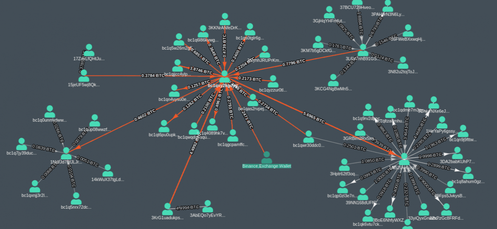
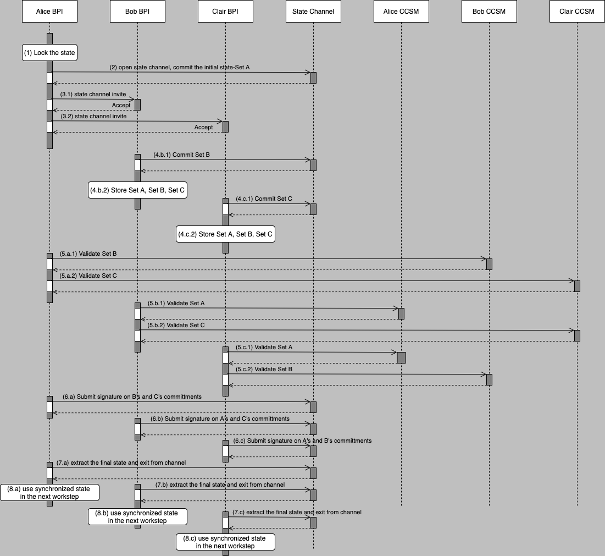

-------

# Baseline Core Version 1.0

## Project Specification Draft (V0.1)

## 23 September 2021, Final Editor's Draft Version 11 October 2021, First Release as Draft Specification on 17 November 2021

<!-- URI list start (commented out except during publication by OASIS TC Admin)

#### This stage:
https://docs.oasis-open.org/baseline/baseline-core/v1.0/psd01/baseline-core-v1.0-psd01.md (Authoritative) \
https://docs.oasis-open.org/baseline/baseline-core/v1.0/psd01/baseline-core-v1.0-psd01.html \
https://docs.oasis-open.org/baseline/baseline-core/v1.0/psd01/baseline-core-v1.0-psd01.pdf

#### Previous stage:
N/A

#### Latest stage:
https://docs.oasis-open.org/baseline/baseline-core/v1.0/baseline-core-v1.0.md (Authoritative) \
https://docs.oasis-open.org/baseline/baseline-core/v1.0/baseline-core-v1.0.html \
https://docs.oasis-open.org/baseline/baseline-core/v1.0/baseline-core-v1.0.pdf

URI list end (commented out except during publication by OASIS TC Admin) -->

#### Open Project:
[Baseline](https://www.baseline-protocol.org/), an initiative of [EEA Community Projects](https://entethalliance.org/eeacommunityprojects/)

#### Project Chair:
John Wolpert (john.wolpert@mesh.xyz), [ConsenSys Mesh](https://mesh.xyz/) 

#### Editors:
Dr. Andreas Freund (a.freundhaskel@gmail.com) \
Kyle Thomas (kyle@provide.services), [Provide](https://provide.services/) \
Yoav Bittan (yoav.bittan@mesh.xyz), [ConsenSys Mesh](https://mesh.xyz/) \
Chaals Nevile (chaals@entethalliance.org), [EEA](entethalliance.org)

<!--
#### Additional artifacts:
This prose specification is one component of a Work Product that also includes:
* XML schemas: (list file names or directory name)
* Other parts (list titles and/or file names)
* `(Note: Any normative computer language definitions that are part of the Work Product, such as XML instances, schemas and Java(TM) code, including fragments of such, must be (a) well formed and valid, (b) provided in separate plain text files, (c) referenced from the Work Product; and (d) where any definition in these separate files disagrees with the definition found in the specification, the definition in the separate file prevails. Remove this note before submitting for publication.)`
 -->

#### Related work:

<!--
This specification replaces or supersedes:
* _Baseline Protocol Version 1.0_ - 
* Specifications replaced by this specification (include hyperlink, preferably to HTML format)
 -->

This specification is related to:    

**[baseline-api-v1.0]** _Baseline API and Data Model Version 0.1_. Edited by Dr. Andreas Freund, Anais Ofranc and Kyle Thomas. 17 November 2021. OASIS Standard. https://docs.oasis-open.org/baseline/baseline-api/v1.0/psd01/baseline-api-v1.0-psd01.html . Latest stage: https://docs.oasis-open.org/baseline/baseline-api/v1.0/psd01/baseline-api-v1.0-psd01.html. [**FIX LINKS**]


**[baseline-dlt-v1.0]** _Baseline CCSM Requirements Version 0.1_. Edited by Dr. Andreas Freund, Anais Ofranc and Kyle Thomas. 17 November 2021. OASIS Standard. https://docs.oasis-open.org/baseline/baseline-dlt/v1.0/psd01/baseline-dlt-v1.0-psd01.html. Latest stage: https://docs.oasis-open.org/baseline/baseline-dlt/v1.0/baseline-dlt-v1.0.html. [**FIX LINKS**]


#### Abstract:
This document describes the minimal set of business and technical prerequisites, functional and non-functional requirements, together with a reference architecture that when implemented ensures that two or more Systems of Record can synchronize their system state over a Consensus Controlled State Machine (CCSM) network with little or no trust assumptions.

#### Status:
This document is under active development and implementers are advised against implementing the specification unless they are directly involved with the Baseline TC team.

<!--
was last revised or approved by Baseline, part of the Ethereum OASIS Open Project, on the above date. The level of approval is also listed above. Check the "Latest stage" location noted above for possible later revisions of this document. Any other numbered Versions and other technical work produced by the Open Project (OP) are listed at [TBD].
-->

Comments on this work can be provided by opening issues in the project repository or by sending an email to the project’s public comment list baseline@lists.oasis-open-projects.org.

#### Keywords:
The keywords "MUST", "MUST NOT", "REQUIRED", "SHALL", "SHALL NOT", "SHOULD", "SHOULD NOT", "RECOMMENDED", "NOT RECOMMENDED", "MAY", and "OPTIONAL" in this document are to be interpreted as described in [[RFC2119](#rfc2119)] when, and only when, they appear in all capitals, as shown here.

#### Citation format:
When referencing this specification the following citation format should be used:

**[baseline-core-v1.0]** _Baseline Core Specification Version 1.0_. Edited by Dr. Andreas Freund, Anais Ofranc and Kyle Thomas. 23 September 2021. OASIS Standard. https://docs.oasis-open.org/baseline/baseline-core/v1.0/psd01/baseline-core-v1.0-psd01.html. Latest stage: https://docs.oasis-open.org/baseline/baseline-core/v1.0/baseline-core-v1.0.html. [**FIX LINKS**]

-------

## Notices
Copyright © OASIS Open 2021. All Rights Reserved.

Distributed under the terms of the OASIS [IPR Policy](https://www.oasis-open.org/policies-guidelines/ipr).

For complete copyright information please see the Notices section in the Appendix.

-------

# Table of Contents
[1 Introduction](#1-introduction) \
&nbsp;&nbsp;&nbsp;&nbsp;[1.1 Overview](#11-overview) \
&nbsp;&nbsp;&nbsp;&nbsp;[1.2 Glossary](#12-glossary) \
&nbsp;&nbsp;&nbsp;&nbsp;[1.3 Typographical Conventions](#13-typographical-conventions) \
&nbsp;&nbsp;&nbsp;&nbsp;&nbsp;&nbsp;[1.3.1	Requirement Ids](#131-requirement-ids) \
[2 Design and Architecture](#2-design-and-architecture) \
&nbsp;&nbsp;&nbsp;&nbsp;[2.1 Agreement](#21-agreement) \
&nbsp;&nbsp;&nbsp;&nbsp;[2.2 State Object](#22-state-object) \
&nbsp;&nbsp;&nbsp;&nbsp;[2.3 Transacting Counterparties](#23-transacting-counterparties) \
&nbsp;&nbsp;&nbsp;&nbsp;[2.4 Commercial Agreements](#24-commercial-agreements) \
&nbsp;&nbsp;&nbsp;&nbsp;&nbsp;&nbsp;[2.4.1	Contract](#241-contract) \
&nbsp;&nbsp;&nbsp;&nbsp;&nbsp;&nbsp;[2.4.2 Commercial Documents](#242-commercial-documents) \
&nbsp;&nbsp;&nbsp;&nbsp;[2.5 Consensus Controlled State Machine](#25-consensus-controlled-state-machine) \
&nbsp;&nbsp;&nbsp;&nbsp;[2.6 Baseline Protocol Instance](#26-baseline-protocol-instance) \
&nbsp;&nbsp;&nbsp;&nbsp;[2.7 High-Level Functional Requirements](#27-high-level-functional-requirements) \
&nbsp;&nbsp;&nbsp;&nbsp;&nbsp;&nbsp;[2.7.1 Functional Requirements on commercial counterparties](#271-functional-requirements-on-commercial-counterparties) \
&nbsp;&nbsp;&nbsp;&nbsp;&nbsp;&nbsp;[2.7.2 CCSM Lifecycle Processes](#272-ccsm-lifecycle-processes) \
&nbsp;&nbsp;&nbsp;&nbsp;[2.8 Baseline Protocol Reference Architecture](#28-baseline-protocol-reference-architecture) \
&nbsp;&nbsp;&nbsp;&nbsp;&nbsp;&nbsp;[2.8.1 State Synchronization](#281-state-synchronization) \
&nbsp;&nbsp;&nbsp;&nbsp;&nbsp;&nbsp;[2.8.2 Considerations on BPI and CCSM Abstraction Layers and the CCSM Layer](#282-considerations-on-bPI-and-ccsm-abstraction-layers-and-the-ccsm-layer) \
&nbsp;&nbsp;&nbsp;&nbsp;&nbsp;&nbsp;[2.8.3	External Applications](#283-external-applications) \
&nbsp;&nbsp;&nbsp;&nbsp;&nbsp;&nbsp;[2.8.4	Baseline Protocol Stack Detailed Reference Architecture Layers and Components](#284-baseline-protocol-stack-detailed-reference-architecture-layers-and-components) \
[3 Identifiers, Identity and Credential Management](#3-identifiers-identity-and-credential-management) \
&nbsp;&nbsp;&nbsp;&nbsp;[3.1 Introduction and High-Level Requirements](#31-introduction-and-high-level-requirements) \
&nbsp;&nbsp;&nbsp;&nbsp;[3.2 BPI Identifiers, Identities and Credentials, and their Management](#32-bpi-identifiers-identities-and-credentials-and-their-management) \
&nbsp;&nbsp;&nbsp;&nbsp;&nbsp;&nbsp;[3.2.1 BPI Identifiers](#321-bpi-identifiers) \
&nbsp;&nbsp;&nbsp;&nbsp;&nbsp;&nbsp;[3.2.2 BPI Identities and Credentials](#322-bpi-identities-and-credentials) \
[4 BPI Abstraction Layers](#4-bpi-abstraction-layers) \
&nbsp;&nbsp;&nbsp;&nbsp;[4.1 BPI Abstraction Scope and Components](#41-bpi-abstraction-scope-and-components) \
&nbsp;&nbsp;&nbsp;&nbsp;[4.2  BPI Abstraction Layer Security and Integration](#42-bpi-abstraction-layer-security-and-integration) \
[5  Middleware, Communication and Interoperability](#5-middleware-communication-and-interoperability) \
&nbsp;&nbsp;&nbsp;&nbsp;[5.1 BPI Subject Capabilities](#51-bpi-subject-capabilities) \
&nbsp;&nbsp;&nbsp;&nbsp;[5.2 BPI Subject Account](#52-bpi-subject-account) \
&nbsp;&nbsp;&nbsp;&nbsp;[5.3 BPI Service Orchestration](#53-bpi-service-orchestration) \
&nbsp;&nbsp;&nbsp;&nbsp;[5.4 BPI Communication](#54-bpi-communication) \
&nbsp;&nbsp;&nbsp;&nbsp;[5.5 BPI Integration](#55-bpi-integration) \
&nbsp;&nbsp;&nbsp;&nbsp;&nbsp;&nbsp;[5.5.1 Resolvable Identifiers for BPI Interoperability Services](#551-resolvable-identifiers-for-bpi-interoperability-services) \
&nbsp;&nbsp;&nbsp;&nbsp;&nbsp;&nbsp;[5.5.2 Discoverable Authentication and Authorization Capabilities for BPI Interoperability Services](#552-discoverable-authentication-and-authorization-capabilities-for-bpi-interoperability-services) \
&nbsp;&nbsp;&nbsp;&nbsp;&nbsp;&nbsp;[5.5.3 Discoverable and Negotiable BPI Interoperability Services](#553-discoverable-and-negotiable-bpi-interoperability-services) \
&nbsp;&nbsp;&nbsp;&nbsp;&nbsp;&nbsp;[5.5.4 Bi- and Multi-directional and Mono-directional BPI Interoperability Services](#554-bi--and-multi-directional-and-mono-directional-bpi-interoperability-services) \
&nbsp;&nbsp;&nbsp;&nbsp;&nbsp;&nbsp;&nbsp;&nbsp;[5.5.4.1 Mono-directional BPI services](#5541-mono-directional-bpi-services) \
&nbsp;&nbsp;&nbsp;&nbsp;&nbsp;&nbsp;&nbsp;&nbsp;[5.5.4.2 Bi- or Multi-directional BPI services](#5542-bi--or-multi-directional-bpi-services) \
&nbsp;&nbsp;&nbsp;&nbsp;[5.6 Standardized Set of BPI Interoperability APIs](#56-standardized-set-of-bpi-interoperability-apis) \
&nbsp;&nbsp;&nbsp;&nbsp;[5.7 BPI Interoperability: Discoverable Standard Transport Security](#57-bpi-interoperability-discoverable-standard-transport-security) \
[6 Agreement Execution](#6-agreement-execution)  \
&nbsp;&nbsp;&nbsp;&nbsp;[6.1 BPI Workstep](#61-bpi-workstep) \
&nbsp;&nbsp;&nbsp;&nbsp;[6.2 BPI Workflow](#62-bpi-workflow) \
&nbsp;&nbsp;&nbsp;&nbsp;[6.3 BPI Workgroup](#63-bpi-workgroup) \
&nbsp;&nbsp;&nbsp;&nbsp;[6.4 BPI Account](#64-bpi-account) \
&nbsp;&nbsp;&nbsp;&nbsp;[6.5 BPI Transactions](#65-bpi-transactions) \
&nbsp;&nbsp;&nbsp;&nbsp;[6.6 BPI Transaction Lifecycle](#66-bpi-transaction-lifecycle) \
[7 General BPI Storage Capabilities](#7-general-bpi-storage-capabilities) \
&nbsp;&nbsp;&nbsp;&nbsp;[7.1 BPI Storage Security](#71-bpi-storage-security) \
&nbsp;&nbsp;&nbsp;&nbsp;[7.2 BPI Storage Privacy](#72-bpi-storage-privacy) \
&nbsp;&nbsp;&nbsp;&nbsp;[7.3 BPI Data Orchestration](#73-bpi-data-orchestration) \
&nbsp;&nbsp;&nbsp;&nbsp;[7.4 BPI-External Storage: Edge Storage](#74-bpi-external-storage-edge-storage) \
&nbsp;&nbsp;&nbsp;&nbsp;[7.5 BPI-Internal Storage](#75-bpi-internal-storage) \
&nbsp;&nbsp;&nbsp;&nbsp;&nbsp;&nbsp;[7.5.1 BPI Storage: Centralized Deployment](#751-bpi-storage-centralized-deployment) \
&nbsp;&nbsp;&nbsp;&nbsp;&nbsp;&nbsp;[7.5.2 BPI Storage: Decentralized Deployment](#752-bpi-storage-decentralized-deployment) \
[8 BPI External Data Inputs](#8-bpi-external-data-inputs) \
&nbsp;&nbsp;&nbsp;&nbsp;[8.1 Internal Authoritative Data for BPIs](#81-internal-authoritative-data-for-bpis) \
&nbsp;&nbsp;&nbsp;&nbsp;[8.2 External Authoritative Data for BPIs](#82-external-authoritative-data-for-bpis) \
&nbsp;&nbsp;&nbsp;&nbsp;[8.3 External Non-authoritative, Non-deterministic Data for BPIs](#83-external-non-authoritative-non-deterministic--data-for-bpis) \
&nbsp;&nbsp;&nbsp;&nbsp;&nbsp;&nbsp;[8.3.1 Data Trustworthiness](#831-data-trustworthiness) \
&nbsp;&nbsp;&nbsp;&nbsp;&nbsp;&nbsp;[8.3.2 External Non-authoritative, Non-deterministic BPI Input Data Variance](#832-external-non-authoritative-non-deterministic-bpi-input-data-variance) \
[9 Conformance](#9-conformance) \
&nbsp;&nbsp;&nbsp;&nbsp;[9.1 Conformance Targets](#91-conformance-targets) \
&nbsp;&nbsp;&nbsp;&nbsp;[9.2 Conformance Levels](#92-conformance-levels)\
[Appendix A - References](#appendix-a---references)\
&nbsp;&nbsp;&nbsp;&nbsp;[A.1 Normative References](#a1-normative-references) \
&nbsp;&nbsp;&nbsp;&nbsp;[A.2 Non-Normative References](#a2-non-normative-references) \
[Appendix B - Security Considerations](#appendix-b---security-considerations) \
&nbsp;&nbsp;&nbsp;&nbsp;[B.1 Data Privacy](#b1-data-privacy) \
&nbsp;&nbsp;&nbsp;&nbsp;[B.2 Production Readiness](#b2-production-readiness) \
[Appendix C - Acknowledgments](#appendix-c---acknowledgments)\
[Appendix D - Revision History](#appendix-d---revision-history)\
[Appendix E - Notices](#appendix-e---notices)

 

-------
# 1 Introduction

The Baseline Protocol is an open-source initiative that combines advances in cryptography, messaging, and Consensus Controlled State Machines (CCSMs) often referred to as blockchains or distributed ledger technology (DLT) to deliver secure and private business processes at low cost -- event ordering, data consistency, and workflow integrity. The Baseline Protocol provides a framework that allows Baseline Protocol Implementations (BPIs) to establish a common (business) frame of reference enabling confidential and complex (business) collaborations between enterprises without moving any sensitive data between traditional Systems of Record. The work is an [Ethereum Community Project](https://github.com/ethereum/oasis-open-project), which is managed by [OASIS](https://oasis-open-projects.org/).

## 1.1 Overview

An illustrative example of the use of a BPI is a Buyer placing an order to a Seller. Normally a Buyer system creates an Order and transmits it to the Seller system through some preestablished messaging system without providing any proof that the Order created is correct, forcing the Seller's systems to validate the order, and more often than not, finding data inconsistencies between the Seller system and the Order. This then leads to a time-consuming, and often expensive, back and forth between Seller and Buyer to rectify the issue. 

In the case that a BPI is used, the Buyer action of creating an order and submitting it to the BPI creates a cryptographic proof on the BPI that the order conforms (or not) to the agreed-upon commercial contract terms and current contract state between Buyer and Seller stored on the BPI, whereupon verification, the commercial contract state on the BPI is updated based on the order details. Subsequently, the cryptographic proof of order correctness is attached to the order and sent to the Seller using either established integrations or the BPI. The Seller can then directly validate the proof without having to check the correctness of the Order against its System of Record anymore. A valid cryptographic proof ensures that the order will be correctly formulated the first time avoiding errors, and thus saving time and money -- a more detailed example is provided in section [2.8.1 State Synchronization](#281-commercial-state-synchronization). A BPI, therefore, enforces the synchronization of Systems of Record between Buyer and Seller. 

At a high level a BPI's benefits and characteristics can be summarized as follows:
* BPI usage avoids rework between contract counterparties due to improperly applied business logic because cryptographic proofs of correctness ensure that Systems of Record remain synchronized, and that rework is minimized or even completely avoided.
* Existing integrations can continue to be used with only minimal augmentation of cryptographic proofs that contractual business logic and data such as discounts are properly applied. 
* Service request validation such as that of an order against the service request receiver's System of Record is no longer necessary.

In the following, this document lays out the requirements on a BPI to achieve above described benefits and characteristics in several sections:
* **Section 2: Design and Architecture** with definitions, key concepts, and overviews of the components of a compliant Baseline Protocol Implementation as delineated in the following subsections:
    * State Object
    * Transacting Counterparties
    * Commercial Agreements
    * Consensus Controlled State Machine (CCSM)
    * Baseline Protocol Instance
    * High-Level Functional Requirements
    * Baseline Protocol Reference Architecture
* **Section 3: Identifiers, Identity and Credential Management** with definitions, key concepts, and overviews of identifiers, identities, and credentials necessary in a compliant Baseline Protocol Implementation as delineated in the following subsections: 
    * Introduction and high-level Requirements
    * BPI Identifiers, Identities and Credentials, and their Management 
* **Section 4: BPI Abstraction Layers** with definitions, concepts, scope, and security considerations for BPI Abstraction Layers:
    * BPI Abstraction Scope and Components
    * BPI Abstraction Layer Security and Integration
* **Section 5: Middleware, Communication, and Interoperability** with definitions, key concepts, and overviews of BPI Subject Capabilities and Accounts, service orchestration, communication, BPI Interoperability with its APIs, and Transport Security:  
    * BPI Subject Capabilities
    * BPI Subject Account
    * BPI Service Orchestration
    * BPI Communication
    * BPI Integration
    * Standardized Set of BPI Interoperability APIs
    * BPI Interoperability: Discoverable Standard Transport Security
* **Section 6: Agreement Execution** with definitions, key concepts, and overviews of the BPI Processing Layer components necessary in a compliant Baseline Protocol Implementation as delineated in the following subsections:
    * BPI Workstep
    * BPI Workflow
    * BPI Workgroup
    * BPI Account
    * BPI Transactions
    * BPI Transaction Lifecycle
* **Section 7: General BPI Storage Capabilities** with definitions, key concepts, and overviews of BPI Storage components applicable to all BPI layers and necessary in a compliant Baseline Protocol Implementation as delineated in the following subsections: 
    * BPI Storage Security
    * BPI Storage Privacy
    * BPI Data Orchestration
    * BPI-External Storage: Edge Storage
    * BPI-Internal Storage
* **Section 8: BPI External Data Inputs** with definitions, key concepts, and overviews of BPI External Data Input components necessary in a compliant Baseline Protocol Implementation as delineated in the following subsections:
    * Internal Authoritative Data for BPIs
    * External Authoritative Data for BPIs
    * External Non-authoritative, Non-deterministic Data for BPIs
* **Section 9: Conformance** with a specification of conformance 
tests for each requirement and definitions of the different levels of conformance of a BPI to this standard.
    * Conformance Targets
    * Conformance Levels

## 1.2 Glossary

**Anti-Money Laundering:**

Anti-money laundering (AML) refers to a set of laws, regulations, and procedures intended to prevent criminals from disguising illegally obtained funds as legitimate income.  

International Monetary Fund, Reference Guide to Anti-Money Laundering and Combating the Financing of Terrorism Second Edition and Supplement on Special Recommendation IX, 2006.

**Baseline Protocol:**

The Baseline Protocol is a set of methods that enable two or more state machines to achieve and maintain data consistency, and workflow continuity by using a network as a common frame of reference. 

**Baseline-Bridge:**

A mechanism for one Workflow to use the proof generated by a different Workflow.
For instance a proof generated in a Workflow executed by Workgroup A to be used as input to a Workflow executed by Workgroup B.

**Baseline-Connector:**

An interface connecting and synchronizing a baseline stack and system of record.

**Byzantine Fault Tolerant (BFT):**

Given a network or system of n components, t of which are dishonest, and assuming only point-to-point channels between all the components, then whenever a component A tries to broadcast a value x such as a block of transactions, the other components are permitted to discuss with each other and verify the consistency of A's broadcast, and eventually settle on a common value y. The system is then considered to resist Byzantine faults if a component A can broadcast a value x, and then:
* If A is honest, then all honest components agree on the value x.
* If A is dishonest, all honest components agree on the common value y.

"The Byzantine Generals Problem", Leslie Lamport, Robert E. Shostak, Marshall Pease, ACM Transactions on Programming Languages and Systems, 1982.

**Circuit Breaker:**

The ability of a Party to immediately cease all their active Workflows across all of their Workgroups within a Baseline-compliant implementation, and, if required, exit a Baseline-compliant implementation with all their data without any 3rd party being able to prevent the exit.

**Common Frame of Reference:**

A Common Frame of Reference as used in this document refers to achieving and maintaining data consistency between two or more Systems of Record using a consensus-controlled state machine. This enables workflow and data continuity and integrity between two or more counterparties.

**Consensus Controlled State Machine:**

A Consensus Controlled State Machine (CCSM) is a network of replicated, shared, and synchronized digital data spread across multiple sites connected by a peer-to-peer and utilizing a consensus algorithm. There is no central administrator or centralized data storage.

**Data Orchestration:** 

An automated process for taking siloed data from multiple storage locations, combining and organizing it, and making it available for analysis.

**Electronic Record:**

Information captured through electronic means, and which may or may not have a paper record to back it up.

Bulletin of the American Society for Information Science and Technology, Electronic Records Research Working Meeting: A Report from the Archives Community, May 28‐30, 1997.

**Identity:**

The condition of being the same with something described or asserted, per Merriam-Webster Dictionary.

A concretization of the above used in this document: Identity is the combination of one or more unique identifiers with data associated with this/these identifier(s). Identity-associated data consists of signed certificates or credentials such as verifiable credentials and other unsigned, non-verifiable data objects generated by or on behalf of the unique identifier(s).

[Merriam-Webster Dictionary](https://www.merriam-webster.com/dictionary/identity)

**Interoperability:**

The ability of a Party operating Workflows on a baseline-compliant implementation A to instantiate and operate one or more Workflows with one or more Parties on a baseline-compliant implementation B without the Parties on either implementation A or B having to know anything of the other Parties’ implementation.

**Legal Entity:**

An individual, organization, or company that has legal rights and obligations.

**Low latency:**

A latency that does not Materially Impact the overall system latency of the BPI.

**Liveness:**

In concurrent computing, liveness refers to a set of properties of concurrent systems that require a system to make progress, despite its concurrently executing components ("processes") may have to "take turns" in critical sections, parts of the program that cannot be simultaneously run by multiple processes. Liveness guarantees are important properties in operating systems and distributed systems.

Alpern B, Schneider FB (1985) Defining liveness. Inf Proc Lett 21:181-185

**Master Services Agreement (MSA):**

A legal contract that defines the general terms and conditions governing the entire scope of products commercially exchanged between the parties to the agreement.

**Material Impact:**

In the context of certain requirements, such as [**[R96]**](#r96), something that causes the underlying business requirements of the BPI not to be met. For example in some deployment situations, a 5-second delay can cause transactions to fail or introduce instability to the system, while in other circumstances a 5-minute delay in processing makes no difference to the system as a whole.

**Non-Repudiable:**

Refers to a situation where a statement's author cannot successfully dispute its authorship or the validity of an associated contract. The term is often seen in a legal setting when the authenticity of a signature is being challenged. In such an instance, the authenticity is being "repudiated".

**Party:**

An entity participating in the execution of one or more given Workflows within a Workgroup. A Workgroup is set up and managed by one Party that invites other entities as Parties to join as workgroup participants. 

**Portability:**

The ability of a Party to migrate and re-baseline its existing Workflows and data from one baseline-compliant implementation to another baseline-compliant implementation without any 3rd party being able to prevent the migration.

**Principal Owner**

An entity controlling the public key(s) which control the identity and its identifiers.

**Privacy Assurance Mechanism:**

A way of ensuring the privacy of Workflow data represented on a consensus controlled state machine (CCSM) network.

**Proof of Correctness:**

A Proof of Correctness is a mathematical proof that a computer program or a part thereof will, when executed, yield correct results, i.e. results fulfilling specific requirements. Before proving a program correct, the theorem to be proved must, of course, be formulated. The hypothesis of such a correctness theorem is typically a condition that the relevant program variables must satisfy immediately before the program is executed. This condition is called the precondition. The thesis of the correctness theorem is typically a condition that the relevant program variables must satisfy immediately after the execution of the program. This latter condition is called the post-condition. The thesis of a correctness theorem may be a statement that the final values of the program variables are a particular function of their initial values.

"Encyclopedia of Software Engineering",
Print ISBN: 9780471377375| Online ISBN: 9780471028956| DOI: 10.1002/0471028959,
(2002), John Wiley & Sons, Inc.

**Succinct:**

Verification of a zero-knowledge proof by any 3rd party in a time that is sublinear to the size of the prover system that generated the proof.

**System of Record:**

The integrity of the data in data architecture is established by what can be called the “system of record.” The system of record is the one place where the value of data is definitively established. Note that the system of record applies only to detailed granular data. The system of record does not apply to summarized or derived data.

W.H. Inmon, Daniel Linstedt and Mary Levins, "Data Architecture", 2019, Academic Press, ISBN: 978-0-12-816916-2.

**Trust Model:**

Collection of entities and processes that entities rely on to help preserve security, safety, and privacy of data and which is predicated on the use of a CCSM implementation.

Marsh S. (1994). "Formalizing Trust as a Computational Concept". Ph.D. thesis, University of Stirling, Department of Computer Science and Mathematics.

**Verifiably Secure:**

A Process that enables a computer to offload the computation of some function to other perhaps untrusted clients, while maintaining verifiable, and, thus, secure results. The other clients evaluate the function and return the result with proof that the computation of the function was carried out correctly. The proof is not absolute but is dependent on the validity of the security assumptions used in the proof. For example, a blockchain consensus algorithm where the proof of computation is the nonce of a block. Someone inspecting the block can assume with virtual certainty that the results are correct because the number of computational nodes that agreed on the outcome of the same computation is defined as sufficient for the consensus outcome to be secure in the consensus algorithm’s mathematical proof of security. 

Gennaro, Rosario; Gentry, Craig; Parno, Bryan (31 August 2010). Non-Interactive Verifiable Computing: Outsourcing Computation to Untrusted Workers. CRYPTO 2010. doi:10.1007/978-3-642-14623-7_25. 

**Workflow:**

A process made up of a series of Worksteps between all or a subset of Parties in a given Workgroup.

**Workgroup**

A workgroup is a set of Parties, also referred to as BPI Subjects, who are the authorized users of a BPI. The Parties use Workflows to synchronize their Systems of Record through one or more worksteps in the workflow. 

**Workstep:**

A workstep is characterized by input, the deterministic application of a set of logic rules and data to that input, and the generation of a verifiably deterministic and verifiably correct output. A set of Worksteps used to synchronize the outcomes in two or more Systems of Record within a Workgroup is called a Workflow.


## 1.3 Typographical Conventions


### 1.3.1 Requirement Ids

A requirement is uniquely identified by a unique ID composed of its requirement level followed by a requirement number, as per convention **[RequirementLevelRequirementNumber]**. 
There are four requirement levels that are coded in requirement ids as per below convention: 

**[R]** - The requirement level for requirements which IDs start with the letter _R_ is to be interpreted as **MUST** as described in [RFC2119](###-RFC2119). \
**[D]** - The requirement level for requirements which IDs start with the letter _D_ is to be interpreted as **SHOULD** as described in RFC2119. \
**[O]** - The requirement level for requirements which IDs start with the letter _O_ is to be interpreted as **MAY** as described in RFC2119. 

Note that requirements are uniquely numbered in ascending order within each requirement level.

Example: It should be read that [R1] is an absolute requirement of the specification whereas [D1] is a recommendation and [O1] is truly optional.


-------

# 2 Design and Architecture

This section provides definitions, key concepts, and overviews of the components of a Baseline Protocol Implementation compliant with the requirements of this document. This section intends to provide implementers with guidance to be able to build and operate implementations of the Baseline Protocol not only in an informal but also in a very formal, highly regulated context. The latter context in particular requires implementers to prove that compliance with this standard not only does not violate regulatory frameworks but rather enables meeting regulatory requirements throughout the entire stack.

The key concepts, definitions, and associated requirements underpinning a Baseline Protocol Implementation (BPI) which will be discussed in this section are:
* State Object
* Transacting Counterparties
* Commercially and Legally Binding Documents
* Consensus Controlled State Machine
* Baseline Protocol Instance
* High-Level Functional Requirements
* Baseline Protocol Reference Architecture 

## 2.1 Agreement

An agreement is a manifestation of mutual assent by two or more parties to one another see [Cornell Law School](https://www.law.cornell.edu/wex/agreement). An Agreement between two or more Counterparties allows for transactions between them dealing with, for example, commercial items such as products. An Agreement, therefore, governs and defines all transactions between counterparties.

## 2.2 State Object

A State Object is an item that can be exchanged between counterparties to an agreement, the state of which the counterparties have agreed on, and which is defined in an agreement. In the context of this standard, a State Object is assumed to be a document derived from an agreement and representing a specific state of either an asset, a product offering or a service offering transacted between counterparties.

Examples include, but are not limited to, a:
* Quote
* Order
* Invoice referencing for example:
  * Digital Services
  * Physical Products
  * Financial Assets
 
## 2.3 Transacting Counterparties

A transacting counterparty, or simply counterparty, that requests one or more State Objects from another counterparty is the Requester concerning the State Object. The Requester can also be the final recipient of one or more State Objects.

A counterparty that provides one or more State Objects to another counterparty is the Provider concerning the provided State Objects. The Provider is accountable to the Requester for all the State Objects it provides to the Requester. 

A Requester may request State Objects from multiple Providers, and in the context of a supply chain of State Objects, a Provider of one State Object may also play the role of a Requester of other State Objects.

#### **[R1]**
Transacting counterparties MUST have an agreement specifying minimally the transactions to be performed between the transacting counterparties before a transactable state of an agreement can be instantiated within a BPI.

*Note, that an agreement in the context of this document may or may not be a commercial agreement as defined in [24-Commercial-Agreements](#24-commercial-agreements) below.*

[[R1]](#r1) Testability: Functional terms of an agreement between counterparties are always implementable as transactions within a Baseline Protocol system because they are logical constraints which can always be represented in code. For example, payment term of 15 days can be checked whether the payment invoice is larger or smaller than the payment term. 

## 2.4 Commercial Agreements

If transacting counterparties, also being referred to as Requester(s) and Provider(s) (“the parties”) in this document, intend to establish a business and operational environment for commercial transactions, they will sign one or more agreements that commercially bind the parties, also known as Commercial Agreements. The aforementioned is only to be understood within the context of this document. 

Such commercial, and thus presumably legally enforceable, documents may be presented as a combination of one or more of the following: 
* Master Services Agreement
* Specific Terms and Conditions
* Order

#### **[R2]**	
The parties to a Commercial Agreement MUST have signed commercial documents with each other before a transactable state of a commercial agreement can be instantiated within a BPI.

[[R2]](#r2) Testability: A commercial agreement represents a state that has been agreed on in specific terms between two or more counterparties. Such an agreement with all its elements including its counterparty signatures can be implemented into a baseline protocol implementation (BPI) through a Merkle Tree structure stored in database where each agreement element represented a Merkle Tree leaf. Merkle Trees can be readily implemented. A secure, offchain Merkle Tree library with tests can be found [here](https://github.com/Tierion/merkle-tools). 

### 2.4.1 Contract

This section details the prerequisites required to be fulfilled by a legal contract, also referred to as a Commercial Agreement in this document, between the parties, and defines the general terms and conditions in the legal contract governing commercial transactions between these parties. These prerequisites are to be understood only within the context of this document and are meant to be general and not specific to particular legal and regulatory frameworks.

A contract will typically govern all commercial transactions between its parties and includes, but is not limited to, sections defining the Governing Law, the Legal Jurisdiction, Indemnity, Liability, Force Majeure, Charges and Taxes, Term, Obligations, definitions of commercially relevant elements such as locations, equipment, and products, as well as any other terms and conditions that apply to the entire scope of commercial and legal relations between the parties. Other legal documents, such as an order, typically reference the contract for its general terms and conditions and might contain more specific terms and conditions, such as rates and discounts and other commercial information, relevant for the specific context of the legal document. These specific terms and conditions can expand or override the original contract and are intentionally not specified in the original contract. The contract is the legal document from which specific commercial documents, such as a Quote or an Order, are derived.

#### **[R3]**	
There MUST be a legally binding contract, however simple and temporary, before a commercial transaction — such as an order — between parties takes place. 

*For example, the contract and the order can be combined into a single document for a single transaction. However, there must be a legal framework in place to provide context for monies that are exchanged and settled. The functional part of the contract forms the basis of a Baseline Protocol Implementation (BPI) defined in section [2.6 Baseline Protocol Instance](#26-baseline-protocol-instance). The requirements below are to be understood solely within the context of this document. They are not meant to be generalized beyond this context.*

[[R3]](#r3) Testability: A legally binding contract between parties can be implemented in a baseline system referencing the suggested [Order example](#commercial-agreement-as-verifiable-credential) as a W3C Verifiable Credential with its [test suite](https://github.com/w3c/vc-test-suite).

#### **[D1]**  
The contract SHOULD be in an electronic form.

[[D1]](#d1) Testability: A legally binding contract between parties can be implemented in a baseline system referencing the suggested [Order example](#commercial-agreement-as-verifiable-credential) as a W3C Verifiable Credential with its [test suite](https://github.com/w3c/vc-test-suite).

#### **[D2]**   
The functional terms of the contract SHOULD be represented on a BPI between the counterparties.

*For example, a Payment Term such as N30, a discount value, agreed upon product numbers, Service Level Agreements (SLAs) etc.*

[[D2]](#d2) Testability: Legally binding functional terms of a contract between parties can be implemented in a Baseline Protocol Implementation using for example [a Merkle Tree](#Storing-an-Agreement-as-State-Object-in-Merkle-Tree), as well as the funcional terms represented as a Zero Knowledge Circuit [Example](#Functional-Terms-Implemented-as-Zero-Knowledge-Circuit).

#### **[D3]**	 
The contract SHOULD be an MSA between the contract parties. 

*An MSA is preferable since it allows a proliferation of contract-based BPI workflows and worksteps between the parties reducing complexity and potential errors.*

[[D3]](#d3) Testability: MSAs between counterparties can be implemented in the same way as a legally binding contract between parties, referencing the suggested Merkle Tree [Example](#Storing-an-Agreement-as-State-Object-in-Merkle-Tree), as well as the funcional terms represented as a Zero Knowledge Circuit [Example](#Functional-Terms-Implemented-as-Zero-Knowledge-Circuit).

#### **[CR1]<[D3]** 	
There MUST be only one MSA between contract parties covering commercial transactions for a given set of products, services, or assets.

*This requirement is intended to disambiguate which terms cover which part of a commercial relationship between parties.*

*Specific Terms and Conditions (“Specific T&Cs”) defines the terms and conditions governing a specific product, service, or asset or set thereof offered and delivered by Provider(s) to Requester(s).*

[[CR1]<[D3]](#cr1d3) Testability: Business logic can be expressed in software code, and software code can be tested, and since BPI logic can ensure only unique combinations of an MSA, unique identifier, and an agreement type exists between two or more counterparties, the requirement is testable.

#### **[D4]**	
Each specific product, service, asset, or set thereof offered and delivered by Provider(s) to Requester(s) SHOULD have its specific T&C document.

*This would allow the fine-graining and consistent application of commercial State-Object-specific business rules and data.*

[[D4]](#d4) Testability: Since a T&C document is part of a contract and a contract can be represented in a testable manner per the testability statement of [[R3]](#r3), requirement [[D4]](#d4) is testable.

### 2.4.2 Commercial Documents 

Commercial documents, a category of commercial State Objects, refer to the state of a specific product/service/asset or set thereof, which may or may not be modified from an original offering to meet the Requester requirements and includes operational and commercial details. A commercial document is an abstract construct representing mutual commitments based on a legally binding contract.

#### **[R4]**	
A commercial State Object to be transacted on MUST be based on a specific commercial document.

[[R4]](#r4) Testability: Since the testability statement in [[R2]](#r2) represents a commercial agreement with commercial documents and is testable as stated, this requirement is testable as well.

#### **[R5]**  
A commercial document MUST be derived from a legally binding contract.

[[R5]](#r5) Testability:  A legally binding contract outside of a BPI can be translated into a commercial document on the BPI as given in this [example](#commercial-agreement-as-verifiable-credential) of a legally binding contract expressed as a W3C Verifiable Credential which can be tested following the W3C Verifiable Credential test suite approach.

#### **[R6]**	
A commercial document MUST be represented as an electronic record on a BPI between the counterparties.

[[R6]](#r6) Testability: Since the testability statement in [[R5]](#r5) represents an electronic version of a commercial document and is testable as stated, this requirement is testable as well.

#### **[R8]**	
A commercial document MUST be authorized by legal representatives of the parties or their legal delegates.

[[R8]](#r8) Testability: A digital signature of an authorized user of the BPI state object associated with the commercial document can be extracted from the proof section of this [Example](#commercial-agreement-as-verifiable-credential), validated and compared to the key identified in the verification method.

#### **[D5]**	
The definition of a commercial document authorization SHOULD be stated in the legal contract underlying the commercial document.

*Authorizations for commercial transactions are a foundational element in the context of this document, as they are in paper based agreements. Therefore, any legal authorization agreements relevant to the commercial agreement between commercial counterparties, and thus to commercial transactions between them, are important to be represented in a BPI to ensure mitigating the risk of unauthorized signatures.*

[[D5]](#d5) Testability: Given is an [a W3C Verifiable Credential Example](#commercial-agreement-as-verifiable-credential) showing the definition of a commercial document authorization by identifying “the buyer” and “the issuer” of the contract. A test to validate the "buyer" and "issuer" requirements can be written following the W3C Verifiable Credential test suite approach.

#### **[D6]**	
The representatives and their authorized delegates who can perform commercial document authorizations SHOULD be explicitly listed or inferred from the stated legal delegation rules of the counterparties in the contract underlying any commercial document. 

[[D6]](#d6) Testability: Given is an [a W3C Verfiaible Credential Example](#commercial-agreement-as-verifiable-credential) showing the definition of a commercial document authorization by identifying “the buyer” and “the issuer” of the contract. A test to validate the "buyer" and "issuer" requirements can be written following the W3C Verifiable Credential test suite approach.

#### **[R9]**	
A commercial document MUST be non-repudiable.

*Note that while non-repudiation in the physical world is most often tied to a physical signature of a Legal Entity on a legal document, in the digital world a digital signature over a digital legal document such as an Order or an Invoice belonging to a known and verifiable digital identity of a counterparty serves the same purpose.*

*Example: A Buyer ("Requester") and Seller ("Provider") may agree that a signed Order requires a signed original paper copy, or a digitally signed electronic Order Form, in addition to an Order being digitally signed and recorded within a BPI.*

[[R9]](#r9) Testability: The non-repudiation of a commercial document can be achieved through the verification of the digital signatures from both parties over the contract. An [Example](#commercial-agreement-as-verifiable-credential) of this is given, where in the “proof” section two digital signatures can be found. 


## 2.5 Consensus Controlled State Machine

A Consensus Controlled State Machine (CCSM) is a network of replicated, shared, and synchronized digital data spread across multiple sites connected by a peer-to-peer and utilizing a consensus algorithm. There is no central administrator or centralized data storage. 

A CCSM with no or limited trust assumptions is the foundational enabler of a BPI.

For specificity, the popular words "Blockchain" or "DLT" are a particular form of CCSM design.

## 2.6 Baseline Protocol Instance

Baseline Protocol Instances or Implementations (BPIs) are logical constructs shared between transacting counterparties of Requesters and Providers and implemented on a CCSM. They are used to either validate or reconcile transactions between Requesters and Providers related to all State Objects transacted between them. The nature of bi- or multi-lateral transactions is such that two or more parties may transact to/from each other interchangeably. 

Abstractly, a BPI consists of:
* The private messaging between Agreement Counterparties about the state, or the requested or finalized state changes, of the State Objects between them
* The representation of an agreement and documents and their business rules and data as distinct workflows and worksteps between transacting counterparties organized into workgroups based on the stipulations of the agreement
* The deterministic processing and finalization of state change requests based on documents between the transacting counterparties as stipulated by the agreement
* The preservation of the privacy of all transacting counterparties and their data from other 3rd parties

BPIs are strongly dependent on the security and privacy capabilities of the CCSM used to implement a BPI because BPIs without a CCSM are a single point of failure, whereas with a CCSM, there is no longer a single point of failure for the state of a BPI because a CCSM has no single-point-of-failure by its very definition.

#### **[R10]**	
A BPI MUST utilize a CCSM.

[[R10]](#r10) Testability: The implementation of a BPI using, for example, an [Ethereum Client Transaction Crafting Function](#ethereum-client-transaction-crafting-function) demonstrates how a CCSM transaction is created, signed and sent to a CCSM client, and is therefore utilzing a CCSM.

*Since security and privacy requirements of a BPI are key, and are strongly dependent on the security and privacy assurances the CCSM on which the BPI is implemented can provide, BPIs need to take great care to avoid the following two situations:*

*1. Weaken the security assurances of the underlying CCSM by increasing the CCSM attack surface. Such an expansion of the attack surface can occur through, for example, the concentration of value-at-risk in one or more BPIs above the value used to economically secure the underlying CCSM. This situation would provide an economic incentive to attack, and subvert, the underlying CCSM to extract the value in one or more BPIs.* *2. Increase the existing attack surface of a CCSM such that the security assurances of the BPI become significantly weaker than the underlying CCSM. An example of such a situation can occur when a commercial State Object such as a Financing contract or an Order in BPI A is dependent on a commercial State Object such as an invoice as collateral in BPI B, and when BPI B has weaker transaction finality assurances than either BPI A or the underlying CCSM. In that scenario, the commercial State Object in BPI A cannot provably rely on the invoice as collateral in BPI B since the invoice might be reverted, and it would then no longer be suitable collateral.*

Hence, this document enumerates the following requirements below:

#### **[R11]**	
A BPI MUST have the same security assurances as to the CCSM it utilizes.

[[R11]](#r11) Testability: The three security assurances given by the CCSM (Data Immutability, Provable Time Linearization, and Double Spend Protection) are automatically extended to the BPI data and, therefore, the BPI itself, when a BPI commits the Zero Knowledge Proof, the Public Input of the Proof, and the New State Commitment to, as an example, the [Shield Smart Contract](https://github.com/eea-oasis/baseline/blob/main/core/contracts/contracts/privacy/Shield.sol) on the CCSM because all the data to verify the BPI state are on the CCSM.

#### **[R12]**	
A BPI MUST support cryptographic algorithms that have public libraries with verifiable security audits and are recommended by public security authorities such as the US National Institute of Standards and Technology (NIST).

*For information, please refer to appendix [A.2 Non-Normative References](#a2-non-normative-references) for the cryptographic libraries that successfully passed the NIST Cryptographic Module Verification Program [[CVMP]](#cvmp).*

[[R12]](#r12) Testability: The [A.2 Non-Normative References](#a2-non-normative-references) for the cryptographic libraries that successfully passed the NIST Cryptographic Module Verification Program [[CVMP]](#cvmp) are testable. 

#### **[R13]**	
If a BPI utilizes a Peer-to-Peer (P2P) message protocol, the protocol MUST support end-to-end encryption.

[[R13]](#r13) Testability: This can be accomplished through a number of protocols, examples of P2P suitable messaging protocols include libp2p, NATS, or DIDCOmm that offers the ability to encrypt messages, for example through onion encryption and routing where the relays use layers of encryption around the original encrypted payload. Using an encrypted JSON web token (JWE) for the original message payload is recommended. 

#### **[R14]**	
A BPI MUST support cryptographic key management incl. backup and recovery that adheres to established industry security standards such as the US Federal Information Processing Standard [(FIPS)](#FIPS) or [ISO 27001](#ISO27001).

[[R14]](#r14) Testability: US Federal Information Processing Standard [(FIPS)](#FIPS) or [ISO 27001](#ISO27001) are testable. 

#### **[R15]**	
State changes of a BPI MUST be verifiable on the CCSM it utilizes.

*Verifiable in this context means that a 3rd party can verify, via a cryptographic proof on the CCSM, that a transaction changed the state of a State Object in the BPI correctly, based on agreed-upon business rules - for example changing the Order status from open to completed.*

[[R15]](#r15) Testability: This can be achieved through the use of Zero-Knowledge Proof verification in a smart contract, such as this [example](https://github.com/eea-oasis/baseline/blob/master/core/contracts/contracts/privacy/Shield.sol)

#### **[D7]**	
A BPI SHOULD have at least the same Liveness properties as the CCSM it utilizes.

*Liveness means that if a CCSM does not require counterparties to constantly monitor its state to ensure that the state of the CCSM is correct, then the BPI should not require constant observation of its state either.*

[[D7]](#d7) Testability: For a BPI to have the same Liveness properties as the CCSM it utilizes, you could, for example, store the relevant business information such as the Zero Knowledge Proof, the Public Input, and State commitment in a smart contract on the CCSM, giving the stored data the CCSM Liveness property. 


#### **[R16]**	
A BPI MUST be censorship-resistant.

*Censorship-resistant means that a transacting counterparty can terminate a transaction at any time without another transacting counterparty, or any Node of the CCSM used to implement the BPI, being able to stop the termination of the transaction.*

<!-- TODO: Find similar censorship-resistant requirement in other standards and review their testability statement -->
[[R16]](#r16) Testability: A simple way to implement the described censorship resistance in a testable manner is to define a revocation commitment that allows undoing an in-process transaction as is for example specified in the [DID Sidetree specification](https://identity.foundation/sidetree/spec/#commitment-schemes) with its [test vectors](https://identity.foundation/sidetree/spec/#test-vectors).   

#### **[R17]**	
A BPI MUST be able to provide privacy of the transacting counterparties' data.

[[R17]](#r17) Testability: Asymmetric encryption of the data by encrypting to a shared key between BPI users and BPI requires both parties two decrypt the data, one party is not enough. 

#### **[R18]** 
A BPI MUST implement date, time and timestamps according to [IETF RFC 3339](#rfc3339).

[[R18]](#r18) Testability: All requirements for [IETF RFC 3339](#rfc3339) are testable.

## 2.7 High-Level Functional Requirements

This section describes the prerequisites and high-level general operational framework requirements: 
* Functional Requirements on commercial counterparties
* CCSM-based Lifecycle Processes

### 2.7.1 Functional Requirements on commercial counterparties

This section states the commercial and operational functionalities required from commercial counterparties.

#### **[R19]**	
Commercial Counterparties MUST ensure that utilized BPIs allow them to meet all required legal, compliance, and business reporting requirements as it relates to their BPI activities. 

*This comprises, e.g., fraud or tax audit requirements based on commercial transactions on a BPI.*

[[R19]](#r19) Testability: Legal, compliance, and business reporting requirements are always implementable based on commercial transactions within a Baseline Protocol Instance. Adherence to these requirements can be verified by third parties utilizing Zero Knowledge Proofs.

#### **[R20]**	
Commercial Counterparties MUST support the Reference Architecture defined in section [2.8 Baseline Protocol Reference Architecture](#28-baseline-protocol-reference-architecture).

[[R20]](#r20) Testability: All requirements for [2.8 Baseline Protocol Reference Architecture](#28-baseline-protocol-reference-architecture) are testable.

#### **[R21]**	
Commercial Counterparties MUST use the BPI APIs to transact on a commercial State Object -- see the [specification of the BPI APIs](https://github.com/eea-oasis/baseline-standard/blob/main/api/baseline-api-v1.0.0.yaml).

*An ability of a Requester to request products, services, or assets, in other words, commercial State Objects, through an instance of the Baseline Protocol's APIs do not necessarily imply the ability to provide products, services, and assets through an instance of the Baseline Protocol APIs and vice versa.*

*Commercial counterparties need to know the level of conformity other commercial counterparties have with the Baseline Protocol Standard.*

[[R21]](#r21) Testability: All requirements for [specification of the BPI APIs](https://github.com/eea-oasis/baseline-standard/blob/main/api/baseline-api-v1.0.0.yaml) are testable.

#### **[R22]**	
Commercial Counterparties MUST publish their level of conformity (self-declaration or certification) with the Baseline Protocol Standard in a publicly accessible manner.

Publicly accessible in the context of this document means that there exists a URI or URL pointing to a publication specifying the level of conformity with this document that is accessible through the public internet. 

[[R22]](#r22) Testability: Counterparties can publish their level of conformity as a W3C verifiable credential in a well-known location at the root level of their internet domain, public CCSM or IPFS.

### 2.7.2 CCSM Lifecycle Processes

Commercial Counterparties must comply with requirements of regulatory frameworks, e.g., Office of Foreign Assets Control ("OFAC") of the US Department of the Treasury when employing new operational and commercial frameworks as laid out in this standard. This means BPI participants and BPI operators must be able to provide compliance reports to authorities derived from a BPI that demonstrate compliance with the applicable regulatory rules such as Suspicious Activity Reports as required by the US Bank Secrecy Act of 1970.  

#### **[R23]**	
If required to meet particular third-party requirements, (e.g., privacy or regulatory frameworks in different jurisdictions), a commercial counterparty MUST record a pseudonymous map of the supply chain that is required to fulfill the provisioning of a request's commercial State Object (products, services or assets) transacted on a BPI.

*Note, that in principle every product, service, or asset, or sets thereof has a supply chain. This requirement aims at situations where the product, service, or asset or sets thereof cannot be solely supplied by the Provider without sourcing components from other Providers.*

*Requesters are only aware of the identity and commercial data of their Provider(s), but not of the other participants in the supply chain. However, Requesters can cryptographically verify that a given set of claims by Providers about the supply chain are true, for example, that all supply chain participants are not located in an embargoed country.*

*Therefore, a pseudonymous map of a supply chain is a cryptographically connected and verifiable list of proofs about the relationships of participants and integrity of supply chain events that does not disclose identifying details of Providers and their commercial data.*

*This allows enforcement of conformance with regulations, additional legal and technical requirements without disclosure of confidential information.*

An example of a pseudonymous map is given in the figure below:
<div align="center">
<figure>
  
  <figcaption>Figure 0: Illustrative example of a pseudonymous map using the example of Bitcoin transactions. Source: [Bitquery](https://bitquery.io/blog/trace-bitcoin-transaction-and-address)</figcaption>
</figure>
</div>

In the context of a supply chain in a BPI, the bitcoin values could be replaced by recursive zero-knowledge proofs. The map allows the BPI to validate the conformity of all the inputs and business rules of the supply chain that goes into a BPI State Object with a single proof.

[[R23]](#r23) Testability: A pseudonymous map, such as the example above, is naturally created by recursively proving the validity of a chain of commercial transactions using recursive zero-knowledge proof schemes such as PLONK used in the [Aztec Barretenberg Library](https://github.com/AztecProtocol/barretenberg) and its tests.

## 2.8 Baseline Protocol Reference Architecture

This section describes the components of the Baseline Reference Architecture: 
* State Synchronization
* CCSMs and BPI/CCSM Abstraction Layers
* External Applications
* Baseline Protocol Stack Detailed Reference Architecture Layers and Components

### 2.8.1 State Synchronization

A BPI can be used as a common frame of reference for business processes that can be used in a complementary way to existing System-of-Record integrations.

#### Illustrative High-Level Example

A Master Services Agreement (MSA) between a Requester (Buyer) and a Provider (Seller) is implemented on a BPI and contains billing terms, pricing, discounts, and Seller information such as billing address, etc. Once established and agreed upon by Buyer and Seller, the BPI provides state synchronization between Buyer and Seller since the ERP systems for Buyer and Seller can now refer to mutually agreed-upon data as a common frame of reference. Based on this mutually agreed-upon state in the MSA, the Buyer creates an Order in the business workflow based on the MSA and a cryptographic proof (in zero-knowledge) that confirms not only the correct application of business logic but also the correct application of commercial data in the Order creation. This proof is submitted together with the Order through the BPI and then validated by the Seller without having to utilize its System of Record for validation using the BPI. If the proof is validated, the Seller accepts the proposed state change by generating its cryptographic proof confirming its acceptance of the state change. The Seller then updates the state of the business workflow in the BPI and sends the new proof to the Buyer. 

The figure below visually demonstrates high-level Buyer and Seller Order generation and acceptance assuming that an MSA between Buyer and Seller already exists and is recorded on a BPI and that the commercial state has been synchronized up to this workstep in the commercial business workflow.
<div align="center">
<figure>
  
  <figcaption>Figure 1: Schematic diagram illustrating how the commercial state between Buyer and Seller is synchronized and an Order created.</figcaption>
</figure>
</div>

Without a BPI, both Buyer and Seller must assume that the MSA between them and all its values are correctly represented in the other party’s respective Systems-of-Record. If an order is created based upon the MSA but does not comply with the MSA, it will likely result in extensive manual interactions between Seller and Buyer at one stage or another to resolve the problem to their mutual satisfaction.  

#### **[R24]**	
The transacting counterparties MUST agree on the business process rules which are represented in the business workflows and worksteps in the BPI. 

[[R24]](#r24) Testability: A BPI can ensure both counterparties agree on business rules and business data required to validate the agreement by, for example, utilizing a [payment term agreement](#functional-terms-implemented-as-zero-knowledge-circuit) between two parties.

#### **[R25]** 	
The transacting counterparties MUST validate the correctness of a State Object based on a state change against the transaction business logic in the applicable BPI workflow and workstep.

[[R25]](#r25) Testability: A BPI can validate the correctness of a State Object based on a state change against transaction logic by verifying a zero-knowledge proof of the state change in the BPI, and ultimately on the utilized CCSM. Reference back to [[R16]](#r16) to understand the verification of a zero-knowledge proof in a smart contract. 

#### **[R26]** 	
The transacting counterparties MUST generate a Proof of Correctness of a State Object based on a state change that can be validated against the BPI transaction business logic.

[[R26]](#r26) Testability: This can be accomplished by creating a [privacy package](https://github.com/eea-oasis/baseline/tree/main/core/privacy) with Zero-Knowledge Circuits generating Zero-Knowledge Proofs of the State changes of a State Object. 

#### **[R27]** 	
Any new state between counterparties MUST be recorded on the BPI between them.

[[R27]](#r27) Testability: This can be accomplished by creating a new entry in the storage of the BPI for the new State, such as in this [example](#Storing-an-Agreement-as-State-Object-in-Merkle-Tree), which can be queried. 

#### **[R28]** 	
Any transacting counterparty having received a Proof of Correctness of a state change MUST be able to validate that Proof of Correctness against the BPI between the counterparties.

[[R28]](#r28) Testability: Including a zero-knowledge proof, public input, and state commitment, together with the prover scheme, and if required the common reference string, inside the message payload would enable counterparties to validate the Proof of Correctness on their own utilizing known libraries for the prover scheme such a PLONK or Groth16.

#### **[R29]** 	
A transacting counterparty MUST include a Proof of Correctness of the State Object generated by the state change in the BPI Messages between the transacting counterparties.

[[R29]](#r29) Testability: A Proof of Correctness of the State Object can be stored and shared inside a Merkle tree, such as in this [example](#storing-an-agreement-as-state-object-in-merkle-tree).

### 2.8.2 Considerations on BPI and CCSM Abstraction Layers and the CCSM Layer

<div align="center">
<figure>
  
  <figcaption>Figure 2: CCSM and BPI Abstraction Architecture</figcaption>
</figure>
</div>

To maintain modularity in the reference architecture, this document introduces the concept of CCSM and BPI Abstraction. A CCSM or BPI Abstraction expressed through a BPI or CCSM Abstraction Layer, constitutes technology applications that wrap capabilities of CCSMs and BPIs such that these capabilities can be exposed to applications above the CCSM or BPI Abstraction Layers in a manner that minimizes the dependency of these applications on the details of a CCSM and BPI – Figure 2. 

The Client CCSM API as an external BPI API is implementation-specific and will not be discussed further.

#### **[R30]**	
CCSMs used in the implementation of a BPI MUST support bilateral and multi-lateral digital representations of contracts as defined in [Section 2.4.1](#241-contract).

[[R30]](#r30) Testability: Testability: All requirements in [Section 2.4.1](#241-contract) are testable.

#### **[D8]**	
A CCSM or BPI Abstraction Layer used in a BPI SHOULD support more than one CCSM instance.

[[D8]](#d8) Testability: Support for this can come from the utilization of an adapter, such as in the example code for a simple Ethereum Adapter given in [[R11]](#r11).


#### **[D9]** 
A CCSM or BPI Abstraction Layer used in a BPI SHOULD support more than one CCSM type.

*This approach avoids lengthy discussions about which CCSM protocol to utilize for a BPI, simplifying the decision-making process considerably if most common CCSMs are incorporated.*

*Note that irrespective of whether one is in a public or private CCSM scenario, the protocol settings such as block time, consensus model, type of execution framework, etc. needs to be agreed upon by operating entities in some fashion either informally such as in [Ethereum](https://ethereum.org/en/) or formally such as in the Trade Finance consortium [Komgo](https://www.komgo.io/).*

*The agreement on the governance entity, its rules, and its method of achieving interval synchronization consensus, as well as the definition of acceptable governance structures and their rules is beyond the scope of this document.*

[[D9]](#d9) Testability: This can be achieved through the implementation of a new adapter program for each CCSM to add a CCSM into a BPI. Each adapter program will be different for each CCSM though all adapter programs will have a constructTx and a sendTransaction function, which was given in the example in [[R11]](#r11). 


#### **[R31]**	
The transacting counterparties MUST agree on which BPI is to be used.

[[R31]](#r31) Testability: In order for counterparties to transact on the same BPI instance, this requirement must have been fulfilled.  

### 2.8.3 External Applications

#### **[R32]**	
Application/s providing transaction functionality such as billing to counterparties, and are, therefore, external concerning the BPI, MUST be independent of any BPI.

*Note, this requirement is motivated by reducing the dependency of counterparty internal systems on the BPI and vice versa.*

[[R32]](#r32) Testability: In an implementation, counterparties only interact with the BPI utilizing the APIs as defined by the Baseline Protocol Standard, and not through the integration of functionalities of external systems directly into a BPI, for example integrating an API of an ERP system into a BPI.

### 2.8.4 Baseline Protocol Stack Detailed Reference Architecture Layers and Components

<div align="center">
<figure>
  
  <figcaption>Figure 3: Detailed Baseline Reference Architecture Layers and Components</figcaption>
</figure>
</div>

A Baseline Protocol Stack Reference Architecture as depicted above in Figure 3 is comprised of the following layers and in the following order:

* **Baseline Protocol (BPI) Abstraction Layer**: This layer enables accessing all externally available BPI functions through APIs as defined in the Baseline Protocol API Standards document 
* **Middleware Layer**: This layer manages all counterparties to an agreement and its associated workflows and worksteps with business rules and business data as well as all counterparty delegates. In addition, it manages all messaging between counterparties to an agreement and instantiation of processing layers based on newly created or updated agreements and their workflows, worksteps, business rules, and business data.  
* **Processing Layer**: Manages, properly sequences, and deterministically processes and finalizes in a privacy-preserving, cryptographically verifiable manner all state change requests from counterparties to agreements represented in the BPI.  
* **CCSM Abstraction Layer**: This layer enables accessing all required BPI functions implemented on one or more CCSMs through APIs as defined in the Baseline Protocol API Standards document. 
* **CCSM Layer**: This layer manages, properly sequences, and deterministically processes in a privacy-preserving, cryptographically verifiable manner all transactions from the Processing Layer as well as either deterministically or probabilistically finalizes on the CCSM all CCSM state transitions based on said transactions.

Below this document lists and defines the components of each layer as depicted in Figure 3. The detailed requirements for each component will be discussed in later sections of this document.

* **BPI Abstraction layer**
    * **API Gateway**: An API gateway that exposes all required functionality to the counterparties to an agreement and enforces all necessary authentication and authorization of API calls as well as properly directs the API calls within the Baseline Protocol Stack
    * **Application**: The application logic which manages the pre-processing and routing of all API requests, as well as the enforcement of authentication and authorization protocols and rules.
* **Middleware Layer**
    * **Workflows**: A Business Process Management engine that allows for the definition, management, and instantiation of workflows and worksteps and associated business rules and data based on agreements between counterparties
    * **Identity/Accounts/Workgroups**: A capability that allows for the identification and management of counterparties and their delegates as well as members of workflows and worksteps organized in workgroups that are derived from the counterparties to an agreement. 
    * **Messaging**: A messaging capability that allows the exchange of secure and privacy-preserving messages between counterparties to an agreement to communicate and coordinate an agreement on proposed state changes. 
* **Processing Layer**
    * **Transaction Pool**: one or more transaction pools that hold, properly sequence, preprocess and batch for processing by the Virtual State Machine all requested state change transactions of a BPI.
    * **Virtual State Machine**: one or more Virtual State Machines which deterministically process and finalize in a privacy-preserving, cryptographically verifiable manner all state change request transactions.
    * **Storage**: A storage system for the cryptographically linked current and historical state of all agreements in a BPI.
* **CCSM Abstraction Layer** 
    * **API Gateway**: An API gateway that enables accessing all required BPI functions implemented on one or more CCSMs, and properly directs the requests within the CCSM Abstraction layer to the proper CCSM API application logic.
    * **Application**: The CCSM API application logic manages the pre-processing, as well as the proper usage of the underlying CCSM and BPI authentication and authorization.
*  **CCSM Layer** 
    * **Messaging**: A messaging capability that allows the exchange of messages between CCSM nodes that comprise either received transactions or a new proposed CCSM state.
    * **Transaction Pool:** A transaction pool holds, properly sequences, pre-processes, and batches for processing by the CCSM Virtual State Machine all submitted CCSM transactions.
    * **Virtual State Machine**: A Virtual State Machine deterministically processes in a cryptographically verifiable manner all submitted transactions for CCSM state changes.
    * **Storage**: A storage system for the cryptographically linked current and historical state of all CCSM State Objects.

-------

# 3 Identifiers, Identity and Credential Management

## 3.1 Introduction and High-Level Requirements

Currently, 3rd parties such as [Domain Name Services (DNS) registrars](https://www.icann.org/en/accredited-registrars?filter-letter=a&sort-direction=asc&sort-param=name&page=1), Internet Corporation for Assigned Names and Numbers [[ICANN]](#whois), X.509 Certificate Authorities (see [[X.509]](#x509) and [[CA]](#ca)), or social media companies are responsible for the creation and management of online identifiers and the secure communication between them. 

As evidenced over the last 20+ years, this design has demonstrated serious usability and security shortcomings.

When DNS and X.509 Public Key Infrastructure (PKIX) [[NIST SP 800-32](#nist-sp-800-32)] was designed, the internet did not have a way to reliably agree upon the state of a registry (or database) with no trust assumptions. Consequently, standard bodies designated trusted 3rd parties (TTP) to manage identifiers and public keys. Today, virtually all Internet software relies on these authorities. These trusted 3rd parties, however, are central points of failure, where each is capable of compromising the integrity and security of large portions of the Internet. Therefore, once a TTP has been compromised, the usability of the identifiers it manages is also compromised. 

As a result, companies spend significant resources fighting security breaches caused by CAs, and public internet communications that are both truly secure and user-friendly are still out of reach for most.

Given the above, the Baseline Protocol Standard identity approach is as follows: Every identity is controlled by its Principal Owner and not by a 3rd party unless the Principal Owner has delegated control to a 3rd party. 

A Principal Owner is defined as the entity controlling the public key(s) which control the identity and its identifiers.

The Baseline Protocol Standard defines identity in the context of this document to mean the following:

```
Identity = <Identifier(s)> + <associated data>
```
where associated data refers to data describing the characteristics of the identity that is associated with the identifier(s). An example of such associated data could be an X.509 issued by a CA. 

This approach requires a decentralized, or at least strongly federated, infrastructure as expressed in the requirements below. 

#### **[D10]**	
The Public Key Infrastructure (PKI) of a BPI SHOULD have no single point of failure, and SHOULD NOT require pre-existing trust relationships between participants.*

#### **[R33]**	
The PKI of a BPI MUST be strongly federated.

*Strongly federated in this context means that there is a known, finite number of participants, without a single point of failure in the PKI. However, collusion of a limited number of participants in the federated infrastructure may still lead to a compromised PKI. The consensus thresholds required for a change in the infrastructure are out of scope for this document.*

#### **[R34]**	
The identifiers and identity utilized in a BPI MUST be controlled by its Principal Owner.

*For a BPI to properly operate, communication must be trusted and secure. Communications are secured through the safe delivery of public keys tied to identities. The Principal Owner of the identity uses a corresponding secret private key to both decrypt messages sent to them, and to prove they sent a message by signing it with its private key.*

*PKI systems are responsible for the secure delivery of public keys. However, the commonly used X.509 PKI (PKIX) undermines both the creation and the secure delivery of these keys.*

*In PKIX services are secured through the creation of keys signed by CAs. However, the complexity of generating and managing keys and certificates in PKIX has caused companies to manage the creation and signing of these keys themselves, rather than leaving them to their clients. This creates major security concerns from the outset, as it results in the accumulation of private keys at a central point of failure, making it possible for anyone with access to that repository of keys to compromise the security of connections in a virtually undetectable way.*

*The design of X.509 PKIX also permits any of the thousands of CAs to impersonate any website or web service. Therefore, entities cannot be certain that their communications are not being compromised by a fraudulent certificate allowing a PITM (Person-in-the-Middle) attack. While workarounds have been proposed, good ones do not exist.*

*Decentralized Public Key Infrastructure (DPKI) has been proposed as a secure alternative. The goal of DPKI is to ensure that, unlike PKIX, no single third-party can compromise the integrity and security of a system employing DPKI as a whole.* 

*Within DPKI, a Principal Owner can be given direct control and ownership of a globally readable identifier by registering the identifier for example in a CCSM. Simultaneously, CCSMs allow for the assignment of arbitrary data such as public keys to these identifiers and permit those values to be globally readable in a secure manner that is not vulnerable to the PITM attacks that are possible in PKIX. This is done by linking an identifier’s lookup value to the latest and most correct public keys for that identifier. In this design, control over the identifier is returned to the Principal Owner. Therefore, it is no longer trivial for any one entity to undermine the security of the entire DPKI system or to compromise an identifier that is not theirs, thus, overcoming the challenges of typical PKI.*

*Furthermore, DPKI requires a public registry of identifiers and their associated public keys that can be read by anyone but cannot be compromised. As long as this registration remains valid, and the Principal Owner can maintain control of their private key, no 3rd party can take ownership of that identifier without resorting to direct coercion of the Principal Owner.*

#### **[D11]** 
A BPI SHOULD utilize a DPKI.

#### **[CR1]>[D11]**	
Any Principal Owner in a DPKI system utilized by a BPI MUST be able to broadcast a message if it is well-formed within the context of the DPKI.

*Other peers in the system do not require admission control. This implies a decentralized consensus mechanism naturally leading to the utilization of systems such as CCSMs.*

#### **[CR2]>[D11]**	
Given two or more histories of DPKI updates, any Principal Owner within a BPI MUST be able to determine which one is preferred due to security by inspection.

*This implies the existence of a method of ascertaining the level of resources backing a DPKI history such as the hash power in Bitcoin based on difficulty level and nonce.*

*Requirements of Identifier registration in DPKI are handled differently from DNS. Although registrars may exist in DPKI, these registrars must adhere to several requirements that ensure that identities belong to the entities they represent. This is achieved the following way:*

#### **[CR3]>[D11]**	
Private keys utilized in a BPI MUST be generated in a manner that ensures they remain under the Principal Owner’s control. 

#### **[CR4]>[D11]** 
Generating key pairs in a BPI on behalf of the Principal Owner MUST NOT be allowed.

#### **[CR5]>[D11]**	
Principal Owners in a BPI MUST always be in control of their identifiers and the corresponding public keys. 

#### **[O1]**	
Principal Owners MAY extend control of their identifier to third parties.

*For example for recovery purposes.*

#### **[CR6]<[O1]** 
Extension of control of identifiers to 3rd parties in a BPI MUST be an explicit, informed decision by the Principal Owner of such identifiers.

#### **[R35]**	
Private keys MUST be stored and/or transmitted securely.

*No mechanism should exist that would allow a single entity to deprive a Principal Owner of their identifier without their consent. This implies that:*

#### **[CR7]<[D11]**	
Once a namespace is created within the context of a DPKI, it MUST NOT be possible to destroy it.

#### **[CR8]<[D11]**	
Namespaces in a DPKI utilized by a BPI MUST NOT contain blacklisting mechanisms that would allow anyone to invalidate identifiers that do not belong to them.

#### **[CR9]<[D11]**	
The rules for registering and renewing identifiers in a DPKI utilized by a BPI MUST be transparent and expressed in simple terms.

#### **[R36]**	
If registration is used as security to an expiration policy, the Principal Owner MUST be explicitly and timely warned that failure to renew the registration on time could result in the Principal Owner losing control of the identifier.

#### **[CR10]>[D11]**	
Once set, namespace rules within a DPKI utilized by a BPI MUST NOT be altered to introduce any new restrictions for renewing or updating identifiers.

*Otherwise, it would be possible to take control of identifiers away from Principal Owners without their consent.*

#### **[CR11]>[D11]**	
Within a DPKI utilized by a BPI, processes for renewing or updating identifiers MUST NOT be modified to introduce new restrictions for updating or renewing an identifier, once issued.

#### **[CR12]>[D11]**	
Within a DPKI utilized by a BPI, all network communications for creating, updating, renewing, or deleting identifiers MUST be sent via a non-centralized mechanism.

*This is necessary to ensure that a single entity cannot prevent identifiers from being updated or renewed.*

## 3.2 BPI Identifiers, Identities and Credentials, and their Management

Building on the requirements in section [3.1 Introduction and High-Level Requirements](#31-introduction-and-high-level-requirements), this section focuses on identifiers, identities, and credentials used within a BPI or a network of BPIs. Note that BPI interoperability - which will be discussed in section [5  Middleware, Communication and Interoperability](#5-middleware-communication-and-interoperability) - is predicated on known, discoverable, and identifiable approaches to how identifiers and credentials are created, updated, revoked, and deleted and how standardized identity frameworks are related to those identifiers and credentials utilized in one or more BPIs.

In the following, this document will use Requester and Provider as established in this document to refer to the entities making and those receiving requests. 

### 3.2.1 BPI Identifiers

Uniqueness and security of BPI identifiers are very important to unambiguously identify entities interacting with and through one or more BPIs and keep those interactions secure. Furthermore, to facilitate automation and real-time interactions within and through a BPI, the discovery of identifiers and an ability to resolve them to the underlying public keys that secure them is also critical. 

#### **[R37]** 
Requester and Provider interacting with and through a BPI, as well as any BPI Operator, MUST each have a unique identifier.

#### **[R38]** 
Any unique identifier utilized within a BPI MUST be associated with a set of public keys.

#### **[R39]** 
Any unique identifier utilized within a BPI MUST be discoverable by any 3rd party within said BPI.

#### **[R40]** 
Any unique identifier utilized within a BPI MUST be resolvable to its associated public keys used for cryptographic authentication of the unique identifier.

#### **[R41]** 
Any unique identifier utilized within a BPI MUST be resolvable to an endpoint as a URI that identifies the Baseline Protocol Standard as a supported protocol including the supported version(s).

#### **[R42]** 
Any unique identifier utilized within a BPI MUST be resolvable to an endpoint as a URI that allows for BPI messaging.

#### **[D12]** 
Any unique identifier utilized within a BPI SHOULD follow the W3C DID Core specification [[W3C DID](#w3c-did)].

### 3.2.2 BPI Identities and Credentials

After having discussed the minimal set of requirements on identifiers utilized in a BPI, it is important to discuss how these relate to identity and claims about facts relevant to Requester, Provider, and BPI Operator, also called credentials. 

Before this document can discuss requirements it needs to establish the scope of identity and credential management within the context of a BPI.

In the figure below, this document establishes the context and scope of identity and credential management for a BPI.

<div align="center">
<figure>
  
  <figcaption>Figure 4: Schematic delineation of the Identity and Credential scope of a BPI; Source: Oliver Terbu (ConsenSys)</figcaption>
</figure>
</div>  

As depicted, identities and credentials are established outside of the context, and, therefore, the scope of a BPI. Hence, it is incumbent on BPI participants -- Requesters, Providers, and, if distinct, Operators -- to establish the trust context of acceptable identities and credentials for a BPI. This statement also applies to a network of BPIs which are to interoperate with one another.

#### **[D13]** 
A unique identifier utilized within one or more BPIs SHOULD be linked to an entity accepted by BPI participants through a cryptographically signed, cryptographically verifiable, and cryptographically revocable credential based on the public keys associated with the unique identifier of the credential issuer.

*An entity can be a Legal Entity where Legal Entity is an individual, organization, or company that has legal rights and obligations.*

*Note that credentials utilized within one or more BPIs may be self-issued. The acceptance of self-issued credentials is up to the BPI participants that need to rely on the claim(s) within a self-issued credential.*

#### **[R43]** 
The unique identifier of the (Legal) Entity MUST be the subject of the credential.

#### **[R44]** 
The unique identifier of the issuer of the (Legal) Entity credential utilized in one or more BPIs MUST have a credential linking the unique identifier of the issuer to an (Legal) Entity accepted by the participants within aforementioned BPIs.

#### **[D14]** 
A credential utilized within one or more BPIs SHOULD follow the W3C Verifiable Credential Standard [[W3C VC](#w3c-vc)].

#### **[R45]** 
A credential utilized within one or more BPIs MUST itself have a unique and resolvable identifier.

*Note, that the unique and resolvable identifier of a credential does not have to be associated with any cryptographic keys.*

#### **[R46]** 
If present, the status of a credential utilized within one or more BPIs MUST be discoverable by a party verifying the credential, the credential verifier.

*In the context of this document, a credential verifier is defined per the W3C Verifiable Credential Standard [[W3C VC]](#w3c-vc).*

#### **[D15]** 
A credential utilized within one or more BPIs SHOULD be discoverable by a participant in said BPI(s).

*Credential discoverability in the context of this document means that a BPI Subject can discover credentials of other BPI Subjects utilized within a BPI or across BPIs, if relevant for BPI interoperability.*

*Note that discoverability can be restricted based on privacy and / or security rules within a given BPI. Discoverability could be achieved for example through a credential registry within a BPI or by listing a credential access endpoint in the DID document of a BPI Subject.*  

#### **[R47]** 
The presentation of a credential utilized within one or more BPIs MUST be cryptographically signed by the presenter of the credential, also known as the holder.

*See the W3C Verifiable Credential Standard [[W3C VC]](#w3c-vc) for a definition of credential holder [[Holder](#w3c-holder-definition)].*

#### **[R48]** 
If a credential holder is a BPI participant, the holder MUST have a unique identifier that has been established within the context the holder operates in.

*As discussed in section [3.1 Introduction and High-Level Requirements](#31-introduction-and-high-level-requirements), BPIs require either decentralized or strongly federated identifier/identity providers that have been agreed to by the participants in a BPI context of one or more BPIs.*  

<div align="center">
<figure>
  
  <figcaption>Figure 5: Example of a Delineation of the Identity and Credential issuing authorities used in a BPI and their management within a BPI using Decentralized Identity Verifiers and OpenID Connect Relying Party as examples; Source: Oliver Terbu (ConsenSys)</figcaption>
</figure>
</div>  

As depicted in Figure 5 above, the accepted Entity identity credentials, or other credentials from Identity providers, that are presented by a BPI participant need to be verified by the BPI against the issuing providers. Once validated, credentials are stored in the BPI.

OpenId Connect Identity Provider [[OIDC]](#oidc) is an example for a federated identity provider and a DID or Verifiable Credentials Registry which is typically built using a CCSM as an example of a decentralized identity provider.

For a BPI to achieve these objectives, the following requirements need to be met:

#### **[R49]** 
A unique identifier utilized in a BPI MUST be stored by the BPI.

#### **[R50]** 
The Principal Owner or their delegates MUST prove control over a unique identifier utilized in a BPI every time said unique identifier is used in the BPI by the Principal Owner or their delegates.

#### **[R51]** 
Every time a unique identifier utilized in a BPI is used in the BPI by the Principal Owner or their delegates, the BPI MUST verify that the Principal Owner or their delegates are in control of said unique identifier.

*Note that proof of control might be performed by a relying party if authority has been delegated.*

*In the context of this document, a relying party is defined per the W3C Verifiable Credential Standard] [[W3C VC]](#w3c-vc).*

#### **[D16]** 
A credential utilized in a BPI SHOULD be stored in the BPI.

*This avoids the re-presentation of the credential after the initial presentation as long as those credentials are valid.*

#### **[R52]** 
A credential holder MUST prove control over a credential utilized in a BPI every time said credential is presented to the BPI or a BPI Participant.

#### **[R53]** 
Every time a credential utilized in a BPI is used in the BPI by its holder, the BPI MUST verify credential integrity, schema conformance, and that the credential holder is in control of said credential.

*Note that credential content verification can only be done through the inspection of underlying documentation or verification by the issuer such as an OpenId Connect Identity Provider [[OIDC]](#oidc).*

*This document will discuss further, more detailed management requirements in the context of BPI participant account management in section [5  Middleware, Communication and Interoperability](#5-middleware-communication-and-interoperability).*

-------

# 4 BPI Abstraction Layers

BPI Abstraction Layers are the critical umbilical cords of a BPI to its underlying CCSM and external applications such as System of Records or other BPIs.

It is, therefore, critical to carefully craft the requirements on these layers of a BPI in such a way that allows implementers sufficient flexibility, while leveraging established standards and ensuring interoperability through a well-defined, minimal set of interfaces and capabilities.

Since a BPI has two abstraction layers -- the BPI and the CCSM Abstraction Layer -- the document will define a set of common requirements and differentiate between the two where necessary.

## 4.1 BPI Abstraction Scope and Components

The Abstraction layers define common standards and processes such as Information Models, APIs and API formats, Process Flows, Roles, Responsibilities, Events, etc. for exposing and managing all BPI capabilities that represent individual steps of the BPI lifecycle processes. This includes but is not limited to:
1. Specifying BPI functional capabilities aligned with already existing common API definitions
2. Onboarding, publishing, upgrading, and retiring BPI APIs and BPI capabilities
3. Coexistence and interoperability with legacy platforms and different BPI stacks

This document defines an Abstraction Layer within the context of a BPI as a set of functions and procedures allowing the interaction of BPI-enabled applications that access the features or data of an operating system, application, or other services with BPI capabilities.

#### **[R54]**	
BPI Abstraction Layers MUST support Operational Monitoring of an API system.

*In the context of this document, an operational monitoring system of BPI APIs refers to the practice of monitoring APIs, most commonly in production, to gain visibility into performance, availability, and functional correctness. These types of systems are designed to help a BPI operator analyze the performance of BPI applications and improve performance. Examples are measurements of how long a service takes to execute, how often it is called, where it is called from, and how much of the total time is spent executing the service.*

#### **[R55]**	
BPI Abstraction Layers MUST support an API Portal for provisioning.

*A BPI API portal in the context of this document is defined as a visual or a programmatic presentation that provides information about an API at every stage of its lifecycle. A BPI API portal allows operators to expose, document, provision access, and otherwise enable their APIs, and users of those APIs to register applications, reset credentials,  provide API feedback, report bugs, etc. A non-normative example of a minimal set of functionalities can be found here [[API Portal Functionality](#api-portal)]*

#### **[R56]**	
BPI Abstraction Layers MUST support an API Gateway that does not have Material Impact on BPI latency. 

*In the context of this document, an API gateway is an application or software pattern that sits in front of an API or a collection of microservices, facilitating requests and delivery of data and services. Its main function is to act as a single entry point and standardized process for interactions between a BPI and its data and services and external/internal users. An API gateway may perform various other functions to support and manage API usage, from authentication to rate limiting to analytics.*

*In the context of this document, Material Impact refers to something that causes the underlying business requirements of the BPI not to be met. For example in some deployment situations, a 5-second delay can cause transactions to fail or introduce instability to the system, while in other circumstances a 5-minute delay in processing makes no difference to the system as a whole.*

#### **[D17]**	
BPI Abstraction Layers SHOULD support Virtualized APIs.

*In the context of this document, virtualized APIs are defined as a production sandbox for continuous integration testing and continuous deployment of APIs.*

#### **[D18]**	
A BPI Abstraction Layer SHOULD support a content delivery network (CDN) (not applicable for a CCSM Abstraction Layer).

*In the context of a BPI, a content delivery network is a geographically distributed proxy server network providing high availability and delivery performance of content such as large data files or video streams.*

#### **[CR13]>[D18]** 
A CDN utilized in a BPI Abstraction Layer and operated by a 3rd party MUST support BPI subject-specific and time-based content access control. 

#### **[CR14]>[D18]** 
A CDN utilized in a BPI Abstraction Layer and operated by a 3rd party MUST support time-based, automated content removal.

#### **[R57]**	
BPI Abstraction Layers MUST support integration with internal, as defined in section [5  Middleware, Communication and Interoperability](#5-middleware-communication-and-interoperability), and/or external BPI Subject identity access management (IAM) or identity provider (IdP) systems. 

*See Figure 4 as to the meaning of an IdP in a BPI context, and Figure 5 in this document as to the meaning of external IAM and its interplay with BPI IAM discussed in section [5  Middleware, Communication and Interoperability](#5-middleware-communication-and-interoperability).*

#### **[R58]**	
BPI Abstraction Layers MUST support API delivery utilizing the service orchestration capabilities of the BPI Middleware Layer defined in section [5  Middleware, Communication and Interoperability](#5-middleware-communication-and-interoperability).

#### **[R59]**	
BPI Abstraction Layers MUST support facilitating the discovery and negotiation of capabilities and subsequent integration between a BPI and Legacy Systems/other BPIs as defined in section [5  Middleware, Communication and Interoperability](#5-middleware-communication-and-interoperability) (for BPI Abstraction Layer only).

#### **[R60]**	
BPI Abstraction Layers MUST support the integration of CCSM specific transaction interfaces, transaction crafting, and CCSM specific smart contract management. 

*Smart Contract management comprises full lifecycle management from testing, initial deployment, updates, and deactivation (for CCSM Abstraction Layer only).*

Figure 6 below shows the reference architecture for a BPI or CCSM Abstraction Layer. 

<div align="center">
<figure>
  
  <figcaption>Figure 6: High-Level Reference Architecture of a BPI Layer.</figcaption>
</figure>
</div>

## 4.2 BPI Abstraction Layer Security and Integration

The security requirements of this section are distinct from the security requirements of the other BPI layers or any custom APIs because the external systems which are invoking services exposed by the BPI or CCSM Abstraction Layer should not be assumed to be a trusted service without authentication. This is because this standard does not define the operating model of external systems or a BPI or any of the BPI layers, and, therefore, must necessarily prescribe requirements assuming a 100% adversarial environment.

#### **[R61]**	
Abstraction Layers utilized in a BPI MUST be compatible with widely used external authentication services. 

*Non-normative examples of such authentication technologies are OAUTH [[OAuth-2.0](#oauth-20)] , SAML [[SAML](#saml)] , OIDC [[OIDC](#oidc)], AD/LDAP [[ActiveDirectory](#activedirectory)].*
#### **[R62]**	
Abstraction Layers utilized in a BPI MUST support roles & access management.

Roles management means that a BPI has the ability to define different roles and associated attributes for BPI Subjects, for example, the role of a "Workgroup Administrator" together with associated attributes such as "Add Workgroup Participant" or "Remove Workgroup Participant".

This document utilizes the NIST definition of Access Management [[NIST SP 1800-21B](#-NIST-SP-1800-21B)]: The set of practices that enables only those permitted the ability to perform an action on a particular resource.

The most common access management approaches are:
- Role Based Access Management (RBAC) tying access rights to a system defined roles and its attributes
- Access Control List (ACL) tying access rights to a table listing the permissions attached to computing resources
- Attribute Based Access Control (ABAC) tying access rights to an evaluation of a set of rules and policies to manage access rights according to specific attributes, such as environmental, system, object, or BPI Subject information

#### **[R63]**	
Abstraction Layers utilized in a BPI MUST support security policy management.

Security policy is defined as a statement of required protection for (a set of) information objects [[NIST SP 800-192](#-NIST-SP-800-192)]. An example of a security policy is that only workgroup participants can initiate a workstep within a workflow that is associated with the workgroup.

#### **[R64]**	
Abstraction Layers utilized in a BPI MUST support Single-Sign-On (SSO). 

*See [[SSO](#sso)] also for the recommendations of the National Institute of Standards and Technology (NIST Guide to Secure Web Services).*

#### **[R65]**	
Abstraction Layers utilized in a BPI MUST support multi-factor authentication.

*See the link here for the NIST definition adopted in this document [MFA](https://csrc.nist.gov/glossary/term/mfa).*

#### **[R66]**	
Abstraction Layers utilized in a BPI MUST support hardware security modules (HSM)

*This document adopts the [NIST definition](https://csrc.nist.gov/glossary/term/hardware_security_module_hsm) and for further information, refer to [[HSM](#hsm)].*

-------

# 5 Middleware, Communication, and Interoperability

This section of the document focuses on the concepts and requirements that describe the key capabilities to connect the BPI Abstraction Layer to the BPI Processing Layer and the correctness preserving integration of different BPIs. This section has the following structure:
* BPI Subjects -- describing the key capabilities required for access authentication to a BPI, and access authorization of BPI functionality, and BPI- or -BPI Subject-specific data within a BPI.
* BPI Service Orchestration -- describing the middleware capability enabling the invocation of key BPI capabilities through the BPI Abstraction Layer.
* BPI Communication -- describing the key capability of how BPI subjects can communicate with one another within a workgroup, within a BPI, and, also, across BPIs.
* BPI Integration -- describing the necessary capabilities to ensure the correct intersection of multiple workflows between different BPIs with correctly advanced state across intersecting workflows with minimal or no trust assumptions.   

## 5.1 BPI Subject Capabilities

A BPI Subject is defined through the capability requirements of section [3 Identifiers, Identity and Credential Management](#3-identifiers-identity-and-credential-management). Note that there are two types of BPI Subjects:
* An external BPI Subject that only consumes BPI capabilities
* An internal BPI Subject that manages the provisioning of BPI capabilities to external BPI Subjects, and the integration with other BPIs

This section describes the capabilities of a BPI Subject in the context of a BPI. Unless otherwise differentiated, this document refers to both external and internal BPI Subjects as a BPI Subject. 

The minimal set of BPI Subject capabilities are as follows:

#### **[R67]**	
A BPI Subject MUST be capable of performing all of the following cryptographic key management functionalities:
* Creation
* Derivation
* Storage
* Revocation / rotation
* Backup / recovery

#### **[R68]**	
A BPI Subject MUST be capable of performing encryption and decryption operations based on BPI specified cryptographic algorithms.

#### **[R69]**	
A BPI Subject MUST be capable of performing cryptographic hashing operations based on BPI specified cryptographic algorithms.

#### **[R70]**	
A BPI Subject MUST be capable of performing cryptographic digital signature creation and verification based on BPI specified cryptographic algorithms.

#### **[R71]**	
A BPI Subject MUST be capable of performing cryptographic multi-digital-signature creation and verification based on BPI specified cryptographic algorithms.

#### **[R72]**	
A BPI Subject MUST be capable of performing cryptographic secret sharing based on BPI specified cryptographic algorithms between two or more BPI Subjects.

*An example of cryptographic secret sharing is called "Shamir Secret Sharing" see [[Shamir](#shamir)].*

#### **[R73]** 
An external BPI Subject MUST at least be able to create, read, update and delete the following BPI core components following business rules for each component that were established by the BPI operator and agreed to by BPI Subjects:
* A BPI Account belonging to the BPI Subject. Note that a BPI Account as defined in section [6.4 BPI Account](#64-bpi-account) is different from a BPI Subject Account as defined in section [5.2 BPI Subject Account](#52-bpi-subject-account)
* A BPI Workgroup as defined in section [6.3 BPI Workgroup](#63-bpi-workgroup) 
* A BPI Workflow as defined in section [6.2 BPI Workflow](#62-bpi-workflow) 
* A BPI Workstep as defined in section [6.1 BPI Workstep](#61-bpi-workstep)
* A BPI Transaction as defined in section [6.5 BPI Transactions](#65-bpi-transactions)

*There may be other BPI components such as role definitions or security policies. The enablement of additional components in a BPI beyond this standard is left to each specific implementation.*
#### **[R74]** 
An internal BPI Subject MUST be able to create, read, update and delete all components of a BPI.

#### **[R75]** 
A BPI Subject MUST be able to send and receive BPI messages from other BPI subjects using the BPI Communication capability as defined in section [5.3 BPI Service Orchestration](#53-bpi-service-orchestration).

#### **[R76]** 
A BPI Subject MUST be able to create, read, and delete BPI messages from other BPI subjects to said BPI Subject using the BPI Communication capability as defined in section [5.3 BPI Service Orchestration](#53-bpi-service-orchestration).

*Note that when a BPI Subject executes these capabilities they are understood to be enabled by services under the direct custody of the BPI Subject. However, the BPI Subject may delegate these capabilities to the BPI in which the BPI subject operates.*
#### **[R77]** 
A BPI Subject MUST be able to delegate one or more BPI Subject capabilities to a 3rd party that is also a BPI Subject.

## 5.2 BPI Subject Account

A BPI Subject Account is a key component of a BPI because it is the anchor point for all important BPI functions -- authentication and authorization, messages, workgroups, workflows, worksteps, transactions etc. Without the notion of a cryptographically verifiable state of a BPI Subject within a BPI -- afforded by a BPI Subject Account -- no other BPI functions will be able to operate successfully, since all functions are predicated on cryptographically verifiable counterparties that maintain a referable and verifiable state within a BPI.  

The following requirements on a BPI Subject Account assume that all identifiers and credentials referring to a BPI Subject are compliant with the requirements in section [3 Identifiers, Identity and Credential Management](#3-identifiers-identity-and-credential-management).

#### **[R78]** 
A BPI Subject Account MUST NOT contain any personal identifiable information (PII).

*This requirement facilitates compliance with privacy laws in different jurisdictions.*

#### **[R79]** 
A BPI Subject Account MUST NOT be created by an external BPI Subject.

*This requirement ensures that only a BPI operator can create a BPI Subject Account to avoid account creation spamming and implementation of KYC processes required in certain jurisdictions.*

#### **[R80]** 
A BPI Subject Account MUST have at least the following data properties:
1. A unique, resolvable, and cryptographically verifiable identifier
2. One or more security policies including authentication and authorization policies
3. A cryptographically verifiable credential establishing the (legal) identity of a BPI Subject, and utilized by a BPI in the creation of the BPI Subject Account
4. A BPI Subject Account recovery key that can be only derived by the BPI Subject owning the BPI Subject Account, and is independent of the private key(s) associated with the BPI Subject Account identifier.
5. A list of all BPI Accounts related to the BPI Subject Account

*This minimal set of requirements ensures:*
* *that access to a BPI Subject account can be cryptographically verified ([R80.1]),*
* *that a BPI account can fine-grain access and authorization requirements for the BPI Subject ([R80.2]),*
* *that other BPI Subjects can independently verify the identity used to establish the BPI Subject Account ([R80.3]),*
* *that a BPI Subject can independently recover a BPI Subject Account even if their private key was compromised, and ensure forward security ([R80.4]), and*
* *that there is a provable relationship with BPI Accounts connected to BPI state objects connected to the BPI Subject Account owner ([R80.5]).*  

#### **[R81]** 
A BPI Subject Account MUST have a cryptographically verifiable audit trail from BPI Subject Account inception to its closure.

*This is a critical audit requirement to ensure ease of compliance with regulatory statutes across jurisdictions. Audit trail in the context of this document refers to the time sequenced capture of the state of a data structure within a BPI such as a BPI Subject Account from state instantiation to state deletion or archiving including all successful and unsuccessful state changes. An audit trail is said to be cryptographically verifiable if the audit trail includes auxiliary cryptographic information that allows 3rd parties to verify an audit trail as consistent. Creating a linked chain of hashes of each audit trail entry such as a Merkle proof is an example of such auxiliary cryptographic information.*

#### **[R82]** 
A BPI Subject Account MUST be encrypted to and decrypted by a cryptographic key only known to the BPI Subject Account owner.

#### **[D19]** 
A BPI Subject Account SHOULD be encrypted when not in active use by the BPI Subject that owns the BPI Subject Account.

*[**[R82]**](#r82) and [**[D19]**](#d19) ensure that a compromised BPI does not expose BPI Subject Account information. A BPI may use the BPI Subject Account unique identifier or another unique identifier such as an account number known to the BPI Subject Account holder as an unencrypted identifier of the BPI Subject Account stored within the BPI.*

#### **[R83]** 
The BPI Subject Account owner MUST be able to perform the following operations on its BPI Subject Account: read, update and delete.

#### **[R84]** 
An internal BPI Subject MUST be able to perform the following operations on its BPI Subject Account: create, read, update and delete.

#### **[R85]** 
An internal BPI Subject MUST be able to perform the following operations on other BPI Subject Accounts: create, read, update and delete provided that there exist one or more security policies authorizing these capabilities to said internal BPI Subject.

#### **[R86]** 
A BPI Subject Account owner MUST be notified by a BPI of any changes to a BPI Subject Account or BPI Accounts associated with a BPI Subject Account.

## 5.3 BPI Service Orchestration

This document defines service orchestration as the sequence and conditions organized in an interaction pattern that one or more service agents must follow, and in which one service invokes other services to achieve its desired goal.

BPI service orchestration is intended to operate in a business environment with high service volume (many BPI service requests), low system latency (fast completion of BPI service requests by a BPI required), and where BPI service requests change BPI data often. It is key to achieve a flexible, loosely-coupled architecture as described in section [2.8 Baseline Protocol Reference Architecture](#28-baseline-protocol-reference-architecture). BPI service orchestration is geared towards high-volume, Low Latency environments with many data changes.

#### **[R87]** 
BPI service orchestration utilized in a BPI MUST be able to identify the actions to be completed by services based on message context and content, and successfully orchestrate the desired action.

#### **[R88]** 
BPI service orchestration utilized in a BPI MUST NOT introduce additional points of failure.

In the context of this document, a point of failure is defined as any non-redundant part of a BPI that, if not operational, would cause a BPI to fail.

#### **[R89]** 
BPI service orchestration utilized in a BPI MUST have source consistency preservation.

*This means that the content of a message/service request cannot be altered after it has been created by the BPI service orchestration capability.* 

#### **[R90]** 
BPI service orchestration utilized in a BPI MUST avoid having the orchestration consumers see partial and/or inconsistent data. 

*Note that transaction boundaries, i.e., a single service's action, may trigger atomic updates.*

#### **[R91]** 
BPI service orchestration utilized in a BPI MUST capture the exact order in which operations happened. 

In the context of this document, operations in a BPI service orchestration do not necessarily have to be causally connected to be ordered by the BPI service orchestration. For example, if operation 1, the creation of an invoice between Alice and Bob in a BPI, is received by the BPI service orchestration of a BPI before operation 2, the creation of a shipping notice of a purchase order between Bob and Claire, then the operation identifiers assigned to operation 1 and operation 2 must reflect that order through for example a deterministic nonce as the operation's identifier.

#### **[R92]** 
BPI service orchestration utilized in a BPI MUST preserve a consistent state.

#### **[R93]** 
BPI service orchestration utilized in a BPI MUST perform the computation triggered by the state change outside the state machine. 

*This ensures that there is less load and more stability of the orchestration stack and that subscribers are decoupled from the state machine, such that they can independently scale.*

#### **[R94]** 
BPI service orchestration utilized in a BPI MUST NOT make assumptions about consumer uptime.

#### **[R95]** 
BPI service orchestration utilized in a BPI MUST isolate between data source and data consumers.

#### **[R96]** 
BPI service orchestration MUST not have a Material Impact on the overall system latency of the BPI.

#### **[R97]** 
BPI service orchestration utilized in a BPI MUST NOT have a Material Impact on BPI scalability and BPI availability. 

*This requirement ensures that overall system latency is not impacted when volume meaningfully and rapidly changes (scalable) at any given point in time (highly available).*

## 5.4 BPI Communication

The BPI Communication capability is a foundational element of any BPI to facilitate workflows in workgroups. Therefore, it is supposed to meet: 
* the workflow communication and workflow orchestration requirements between BPI Subjects, and
* the highly asynchronous nature of BPI transactions originating from such workflows. 

This leads to the following core capability requirements within a BPI:

#### **[R98]** 
BPI communication protocols MUST be message-based.

#### **[R99]** 
BPI communication protocols MUST be asynchronous.

#### **[R100]** 
BPI communication protocols MUST be simplex. 

*Simplex is a communication mode in which only one message is transmitted, and always going in the same direction.*

*An example of the three requirements above is as follows: BPI Subject X sends a message over channel A at time T0 to BPI Subject Y. It may receive a response from BPI Subject Y over channel B at a later time T1.*

#### **[R101]** 
BPI communication protocols MUST be based on established communication protocol standards.

*Non-normative examples include, but are not limited to, NATS [[NATS](#nats)], AMQP [[AMQP](#amqp-core-complete-v10)], and DIDComm [[DIDCOMM](#didcomm)].*

*Note that typically, and in the context of this document, a communication protocol encompasses four layers:*
*	*Semantic layer*
*	*Routing layer*
*	*Cryptographic layer*
*	*Transport layer*

The layers are defined as follows, and note that some requirements refer to communication between BPIs as noted within the relevant requirement:
* Transport Layer
  - #### **[R102]**	
    - A BPI MUST utilize the well established TLS 1.2 [[RFC5246](#rfc5246)] or 1.3 [[RFC8446](#rfc8446)] protocol to transport messages between BPIs.
  - #### **[R103]**	
    - For synchronous BPI messaging between BPIs, a BPI MUST utilize HTTPS [[RFC2818](#rfc2818)].
  - #### **[R104]**	 
    - For asynchronous BPI messaging between BPIs or messaging within a BPI, a BPI MUST utilize established asynchronous protocols such as Websockets or AMQP. 

Note that while messaging within a BPI must be asynchronous, the communication between two BPIs can be either synchronous to asynchronous depending on the use case.

* Cryptographic Layer: This layer deals with the BPI message envelope and the BPI message payload authenticity. However, it does not deal with authorization. Authorization is assumed to be validated based on security policies in the BPI core components such as workgroups. 
  - #### **[R105]**	
    All BPI envelope level formats MUST be achieved through JOSE-based structures see **[R106]** and **[R107]**. 
    
    *Note that JOSE stands for JSON Object Signing and Encryption.*
  - #### **[R106]**	
    The encrypted message formats MUST use an Encrypted JSON Web Token (JWE) structure [[RFC7516](#rfc7516)].
  - #### **[R107]** 
    The signed unencrypted format MUST use a Signed JSON Web Token (JWS) structure following [[RFC7519](#rfc7519)] and following [[RFC7515](#rfc7515)] for its digital signature. 
  - #### **[D20]**	
    BPI messages SHOULD always use JWEs with the ciphertext containing a signed payload. 
    
      *A JWS may be used for initial authentication and authorization between BPIs.*
  - #### **[D21]** 
      The digital signature used for the JWS and JWE of a BPI Message SHOULD be based on the public keys associated with a W3C DID in the W3C DID document as defined in [[W3C DID](#W3C-DID)]. 
        
      *This simplifies the authentication of the message without having to rely on a 3rd party identity provider to validate the digital certificate issued to the BPI Subject. Non-normative examples of W3C DID Documents can be found in [[W3C DID](#W3C-DID)]*
  - #### **[R108]** 
    BPI Message authenticity and proof of control of the private keys MUST be established through a cryptographic challenge-response scheme utilizing a shared secret and the public keys of the involved BPI Subject. 

An example of a challenge-response system is given in the figure below.

<div align="center">
<figure>
  
  <figcaption>Figure 7: Example of a cryptographic Challenge-Response system between a User, Web Client, Web Server, and a Data Vault based on the DIDAuth protocol using a selective disclosure response (sdr) to the challenge; Source: RSKSmart at https://rsksmart.github.io/rif-identity-docs/ssi/specs/did-auth.html </figcaption>
</figure>
</div>

* Routing Layer:  A BPI is a “gated community”, hence, all BPI capabilities and BPI Subject services are known, or at least directly discoverable, and, therefore, directly addressable within a BPI. Therefore, there is no unknown path between sender and receiver, and, thus, routing is not required as it would be in a public network with an unknown number of participants of unknown identity. The scenario of a BPI Subject with an unknown communication endpoint will be addressed in Section 5.5 BPI Integration.

  - #### **[R109]** 
    Any BPI Capability addressable using a BPI Message MUST be discoverable by a BPI Subject utilizing resolvable URIs of said BPI capabilities.
  
    *An example of such a URI would be a BPI API endpoint.*

  - #### **[R110]** 
    Any BPI Subject within a BPI MUST be discoverable by any other BPI Subject within a BPI.

    *For example, a BPI Subject DID can be resolved to its DID document containing a BPI communication endpoint in its "service" section that is directly addressable through the BPI Communication capability.*

* Semantic Layer: The semantic layer specifies how a message payload needs to be structured to be both BPI capability/service and BPI Subject friendly. Note that the content level refers to the content and message inside the message envelope. For the semantic layer, this document specifies how messages are identified and processed.

  - #### **[R111]**	
    Every BPI message MUST contain a message type that allows the context of the message to be established, the content structure to be verified against the context, and the content to be correctly processed.

   *Message identification does not merely identify the message. The message type also identifies the associated processing protocol such as the specification for a particular zero-knowledge prover scheme. A processing protocol is essentially a group of related messages that are required to achieve a multi-step business process.*

  - #### **[R112]**	
    A BPI message MUST contain a unique message identifier that is generated by the sender.

    *This allows unique identification of the message through its lifecycle.*

  - #### **[D22]**	
    A BPI message SHOULD contain one or more message decorators.

*In general, decorators in messages at a content level allow for the support of reusable conventions that are present across multiple messages to handle the same functionality consistently. A relevant analogy for decorators is that they are like HTTP headers in an HTTP request. The same HTTP header is often reused as a convention across multiple requests to achieve cross-domain functionality.*

*An initial set of useful message decorators that can be used are, but are not limited to:*
  * *~Thread: provide request/reply and threading semantics to allow for maintaining state within, and also across messages*
  *	*~Timing: timestamps, expiration, elapsed time*
  *	*~L10n: localization support*

  - #### **[R113]**	
    All content level BPI messages MUST be represented in JSON format [[RFC7159](#rfc7159)].

  - #### **[R114]**	
    BPI Messages MUST be either a valid JSON-LD document, or a JSON document that can be interpreted as JSON-LD by associating a context through HTTP headers, as described in the section "Interpreting JSON as JSON-LD" of the JSON-LD standard [[JSONLD](#jsonld)].

  *Note that BPI Messages may fully, and directly support JSON-LD.*

## 5.5 BPI Integration

BPI Integration or BPI Interoperability, meaning the ability of two or more BPIs to functionally interoperate with one another, is important to generate network effects. 

This document defines BPI Interoperability as follows: BPI A and BPI B are said to be interoperable if Alice can advance the state of one or more of her state objects from BPI A by synchronizing said state object(s) with one or more of Bob's state objects on BPI B. The synchronization is achieved by creating a joint state between Alice and Bob without having to exit the state objects of either participant to the underlying CCSM. The joining of states must occur in an, ideally, censorship-resistant manner and such that neither Alice, nor Bob, nor one of their delegates can maliciously alter and finalize the state of the joint state object at any point before, during, and after the state change of the joint state object on either of the participating BPIs or the (permissionless) CCSMs used by either BPIs. 

Note, that the above definition refers to "East-West" or horizontal interoperability between BPIs. In other words the ability of Alice on BPI A to functionally interact with Bob on BPI B, such as issuing an invoice. North-South interoperability, in other words, the vertical interoperability of components such as transaction processing or storage within a BPI, is out of scope for the current version of the standard.

A BPI East-West interoperability solution in the context of this document has but is not limited to the following characteristics in no particular order:

* Resolvable, public key controlled identifiers for all participants following established standards such as W3C DIDs to enable portability across BPIs. Resolvable refers to the identifier being used to discover its controlling keys and other control, authorization, and service attributes of an identifier. For example, an Ethereum address can function as a resolvable public key controlled identifier. See for example the specification of an Ethereum based DID method (did:ethr).

* Discoverable authentication/authorization capabilities based on common, well-established frameworks such as OAuth2 [[OAUTH-2.0](#oauth-20)], OpenIDConnect [[OIDC](#oidc)], SIOP DID AuthN (OIDC compatible DID Auth) [[SIOP](#siop)] to avoid reinventing the wheel and also signaling openness to enterprises.

* Discoverable and negotiable services such as Authentication and Authorization endpoints, a price oracle endpoint, etc. In this context, a service has consumers, providers, input and output parameters, and associated business logic that transforms the input into the output parameters. Discoverable in this context means that a Service Consumer can find a Service Provider and what the capabilities of the service are as well as the required input and output parameters. Negotiable in this context means that the Service Consumer and Provider can negotiate how the service is delivered. This is required to be able to automate interoperability processes between BPIs.

* Bi-or Multi-directional and mono-directional services where bi-/multi-directional services in this context refer to direct and either synchronous or asynchronous service-consumer-to-service-provider or vice versa state object synchronizations and advancements via APIs. Mono-directional in this context refers to services that either export state objects from or deliver state objects to a BPI via APIs. Alice and Bob might want to exchange or synchronize state objects across BPIs or just extract and keep their state objects locked in their environment before committing to another BPI.

* Standardized set of APIs such as REST representing common asset functionalities 
  - with defined API endpoint functionalities such as transfer, lock, unlock, exit, deliver, swap
  - standardized API envelopes consisting of for example BPI origin and target metadata, security parameters, etc. 
  - standardized asset payloads describing the assets and their current state; a current state can consist of for example a (zero-knowledge) proof set (state-object-history, state-object-locks, state-object-state) and state object meta-data such as state-object type, state-object ID, state-object owner, anchor contract(s) for proof verification(s) -- See also related work [here](https://ethereum-magicians.org/t/outlining-a-standard-interface-for-cross-domain-erc20-transfers/6151). It is critical to have the same “words and grammar” to be able to talk to one another.

* Discoverable Standard Transport security such as JOSE with JWS/JWE or DIDComm is critical to ensure security and privacy at all times, and beyond HTTPS. See also related work [here](https://ethereum-magicians.org/t/a-standard-interface-for-arbitrary-message-bridges-between-chains-layers/6163).

Before outlining the requirements for BPI Interoperability this document wants to provide a concrete, detailed, and real-world non-normative example of BPI Interoperability.

One of the most common processes occurring every day across the world is the importing of goods into a country, and delivering them to a customer in that country. This involves a shipper of the goods, Alice, an importer of the goods, Bob, and a country customs organization, Claire.

This scenario has, therefore, 3 workflows intersecting which are independent yet related to one another: Alice has her shipping workflow of containers coming into a harbor with goods that Bob with his importing workflow wants to pass through Claire's custom workflow to deliver it to his customer. 

**Some BPI Workflow Interoperability Prerequisites:**

In the context of these 3 BPIs having to interoperate, Alice, Bob, and Claire must provide at least the following:  

1. Alice has identified Bob and Claire as required counterparties for the next workstep in Alice's shipping workflow (container customs processing).

2. Neither Bob nor Claire is part of Alice's BPI.

3. Alice, Bob, and Clair have W3C DIDs with communication service endpoints such that they can send and receive messages from one another.

4. Alice, Bob, and Clair have agreed upon a zero-knowledge prover scheme and one or more worksteps expressed through human-readable predicates that allow them to synchronize their respective workflow states and deterministically advance the joint state.

4. Alice has the following data set available from the last workstep of her shipping workflow, called Set A -- a ZK proof, associated public input data, proof-verification key, a verification endpoint for the ZK proof verification, and a predicate as a human-readable version of the ZK Proof.

5. Bob has the following data set available from the last workstep of his import workflow, called Set B -- a ZK proof, associated public input data, proof-verification key, a verification endpoint for the ZK proof verification, and a predicate as a human-readable version of the ZK Proof.

6. Claire has the following data set available from the last workstep of her customs workflow, called Set C -- a ZK proof, associated public input data, proof-verification key, a verification endpoint for the ZK proof verification, and a predicate as a human-readable version of the ZK Proof.

The usage of ZK proofs is required since the counterparties will not be able to see sensitive information that has entered either of the workflows. For example, intelligence service information about a particular load in a shipping container cannot be shared with Alice and Bob, or the identity of the ultimate load recipient cannot be disclosed to Alice by Bob.

Furthermore, and for the simplicity of the example here, it is assumed that the ZK proofs in the workflow for each participant are recursive. This means that a verification of the ZK proof of the last workstep in a workflow proves the correctness and integrity of the entire workflow up to the last workstep for which a valid ZK proof was constructed.

**Example BPI Interoperability Workflow -- See Figure 8 below:**

1. Alice locks the state of her current Workflow’s Workstep on her BPI

2. Alice opens a state channel committing an initial state consisting of Set A

    Note, any singleton state machine such as a state channel, sidechain, or other Layer 2 solution may be employed.

3. Alice sends state channel invites to Bob and Claire based on their communication endpoints in their DID documents, creating the equivalent of a temporary Workgroup. The invite must include the state information both Bob and Clair need to submit to the state channel, Set B and set C, and the required agreement criteria e.g. 2 of 3 digital signatures over the joined state of the ZK proofs in the form of an agreement predicate. The predicate would be a ZK prover circuit with specified private and public inputs that can be run by Bob and Claire to generate ZK proofs proving correct state updates. In this case, simple signatures over the ZK-proofs are chosen.  

4. After accepting the invites, Bob and Claire commit their states to the state channel in the following manner -> newStateRoot = H(H(Alice state, Bob State),H(Claire State)) and also store the inputs (Alice state, Bob State, Claire State)

5. Each participant validates each other's proofs on their respective CCSMs (e.g. Alice checks Bob's and Claire's ZK-proofs) utilizing the supplied verification endpoints.

6. Each participant then signs over the other's submitted signatures (e.g. Bob over Alice's submitted signature over her ZK proof/public data) and submits those signatures as state updates into the state channel.

    For example, Bob goes first and submits his signatures (Alice State, Bob New State = Bob Old State + Signature over Alice State + Signature of Claire State, Claire State) with the newStateRoot = H(H(Alice State, Bob New State), H(Claire State)), then Claire (Alice State, Bob New State, Claire New State = Claire Old State + Claire Sig over Bob's Sig over Alice's Sig + Claire's Sig over Bob's original Sig) with a new state root, then Alice, and so forth until all signatures are submitted and all original states have been attested to by the counterparties. This creates a new final state of a synchronized state between the three workflows.

7. Alice, Bob, and Claire each extract the final state from the state channel and exit the channel.

8. Alice, Bob, and Claire can now use this (synchronized) new state as an input in the next worksteps in their respective workflows.

Because the state advancement in the state channel is strictly deterministic and dependent on the defined exit criteria, each workflow has now properly synchronized inputs for their next worksteps in their respective workflows.

<div align="center">
<figure>
  
  <figcaption>Figure 8: Illustrative example of BPI Interoperability Workflow. Source: Mehran Shakeri (SAP)</figcaption>
</figure>
</div>

### 5.5.1 Resolvable Identifiers for BPI Interoperability Services

Resolvable identifiers utilized within a BPI are of equivalent importance for interactions between BPIs. 

#### **[R115]** 
Identifiers and Credentials utilized in BPI Interoperability MUST satisfy all requirements in section [3 Identifiers, Identity and Credential Management](#3-identifiers-identity-and-credential-management). 

### 5.5.2 Discoverable Authentication and Authorization Capabilities for BPI Interoperability Services

Similar to a BPI itself, the interactions between BPIs through BPI Interoperability services must follow a similar, albeit slightly reduced set of requirements around BPI Subject authentication and authorization as a BPI.

#### **[R116]**	
BPI Interoperability Services MUST be compatible with widely used external authentication services. 

*Non-normative examples of such authentication technologies are OAUTH [[OAUTH-2.0](oauth-20)] , SAML [[SAML](#saml)] , OIDC [[OIDC](#oidc)], AD/LDAP [[ActiveDirectory](#activedirectory)].*

#### **[R117]**	
BPI Interoperability Services MUST support roles & access management.

*Role and Access Management in this context refers to the required roles of BPI Subjects and their authority to access and execute BPI functionality across multiple BPIs.*

#### **[R118]**	
BPI Interoperability Services MUST support policy management.

*Policy Management in this context refers to the management of authentication and authorization rules to access and execute BPI functionality for roles of BPI Subjects across multiple BPIs.*

### 5.5.3 Discoverable and Negotiable BPI Interoperability Services

The discovery of BPI Interoperability services is facilitated through BPI identifiers representing BPI Operator identities resolvable to BPI Interoperability services URIs of a BPI as described in section [3 Identifiers, Identity and Credential Management](#3-identifiers-identity-and-credential-management).

To facilitate ease of discovery, a BPI may publish a verifiable and non-repudiable list of its BPI Subjects. Ideally, each entry consists of W3C verifiable credentials establishing the membership of a BPI Subject in a BPI with credential subjects resolvable to the offered BPI services. 

#### **[R119]**	
The service endpoint specification of the resolvable BPI identifier MUST list BPI service endpoints that allow for further BPI service discovery and the establishment of a secure channel between either BPIs or BPI Subjects.

#### **[D23]** 
Each BPI service SHOULD be defined by an identifier that corresponds to the resolvable BPI identifier and its associated signing key(s) that offer this BPI service. 

#### **[D24]** 
Each BPI service SHOULD be minimally specified by the following elements:
* A BPI service domain such as “BPIStateProcessing”
* A BPI service description
* A BPI service version,
* The BPI service provider,
* The BPI Service endpoint(s),
* The BPI Service endpoint-specification endpoint(s),
* The Cryptographic Prover system,
* The Cryptographic Prover system specification. 

#### **[R120]**	
To ensure a BPI service specification timeline, the BPI service specification MUST include “created” and “updated” timestamps, and the full history of "updated" timestamps.

#### **[R121]**	
After a BPI service endpoint has been discovered by a BPI or BPI Subject, the exact specification of the BPI service endpoint MUST be negotiated between the different BPIs and their BPI Subjects. 

*Negotiation in the context of this document is the process of two or more BPIs presenting each other with and then agreeing to a way to fulfill BPI service requests amongst each other.*  

*Based upon published BPI service capabilities, a BPI service requester may present the BPI service provider with one or more service requests expressed using one of the published specifications of the requested BPI service. Such requirements may include BPI Service Version, List of BPIs offering a BPI service, etc.*

#### **[R122]**	
A BPI service requester MUST present the BPI service provider with one or more service requirements expressed using one of the published specifications of the requested BPI service.

#### **[O2]**	
The service provider MAY respond to one of the requirements.

*Example of this could be a JSON object with a response e.g. the standard HTTP response 200 or 403*

#### **[CR15]<[O2]** 
If the BPI service provider has not responded to any of the BPI service requests by a BPI, the BPI service provider MUST refuse the service request.

### 5.5.4 Bi- and Multi-directional and Mono-directional BPI Interoperability Services

Mono-directional BPI services are important in the context of a BPI because they allow a BPI Subject to extract or export state objects, their history, and associated metadata from a BPI and subsequently import them into another BPI. To avoid subsequent altering of a state object within a BPI, the state object needs to be provably locked or immobilized on the BPI it came from before it can be exported, and, if required, subsequently imported to another BPI. 

Bi-or-multi-directional BPI services facilitate the synchronization of state objects between BPIs as explained at the beginning of this section, and are, therefore, crucially important to avoid the formation of BPI processing islands which would hamper adoption due to vendor lock-in.

First, the document lists the requirements common to mono-directional BPI services and Bi-/Multi-directional services before specifying requirements unique to each type of service.

**Requirements common to mono-directional and bi-/multi-directional BPI Services**

#### **[R123]** 
Each state object utilized in one or more mono-directional and bi-/multi-directional BPI Services MUST have a cryptographic zero-knowledge proof of correctness.

*More details on cryptographic zero-knowledge proofs of correctness in the context of a BPI are given in section [6 Agreement Execution](#6-agreement-execution) when discussing worksteps. Also, note that the requirements below are very similar to the ones given in section [6.1 BPI Workstep](#61-bpi-workstep).*

#### **[R124]** 
The zero-knowledge proof of correctness of a state object utilized in one or more mono-directional and/or bi-/multi-directional BPI Services MUST be succinct.

Succinct in the context of zero-knowledge proofs means that a zero-knowledge proof is verifiable by any 3rd party in a time that is sublinear to the size of the prover system that generated the proof.

#### **[R125]** 
The zero-knowledge proof of correctness of a state object utilized in one or more mono-directional and/or bi-/multi-directional BPI Services MUST be individually available on the CCSM utilized by the BPI after it has been finalized on the BPI (Liveness).

*The zero-knowledge proof of correctness can be a cryptographic aggregator of proofs of correctness that would allow multiple proofs to be represented and provable within one proof.* 

#### **[R126]** 
The zero-knowledge proof of correctness of a state object utilized in one or more mono-directional and/or bi-/multi-directional BPI Services MUST be verifiable by any 3rd party on the CCSM utilized by the BPI (censorship-resistant individual proof verifiability). 

#### **[R127]** 
The zero-knowledge proof of correctness of a state object utilized in one or more mono-directional and/or bi-/multi-directional BPI Services MUST NOT be able to be used in more than one mono-directional and/or bi-/multi-directional BPI Services event at any time.

*This requirement is necessary to avoid the usage of the same output as collateral in more than one state-altering event, such as tokenization.*

*A state object will have to be included in a cryptographic commitment that the state object is locked on the BPI. Note that this only restricts the usage of pledged outputs to the CCSM utilized in a given BPI.*

#### **[R128]** 
A BPI MUST lock a state object utilized in one or more mono-directional and/or bi-/multi-directional BPI Services as a succinct, efficient, non-interactive zero-knowledge proof of the lock commitment (privacy preservation of an output pledged in a commercial value-creation event). 

*Note that a lock can contain more than one state object.*

#### **[R129]** 
The lock commitment MUST be committed to the CCSM utilized by the BPI (Liveness).

#### **[R130]** 
The lock commitment MUST be verifiable by any 3rd party on the CCSM utilized by the BPI (censorship-resistant proof verifiability).

#### **[R131]** 
The lock commitment MUST be updatable.

*State objects are normally imported back into a BPI at which point the lock commitment on the CCSM needs to be updated. Also, for scalability reasons, the lock commitment should represent more than one locked asset on a CCSM, while individual lock commitments can remain on a BPI.*

#### **[R132]** 
The lock commitment MUST only be updated by the owners of the state object.

*The requirements below will specify public URIs for BPI Interoperability services. Therefore, we have additional requirements for those public URIs.*

#### **[R133]** 
A public validation URI for BPI Interoperability services MUST be resolvable to the underlying target resource.

#### **[D25]** 
A public validation URI for BPI Interoperability services SHOULD be independent of the originating BPI.

#### **[R134]** 
The system processing the BPI Interoperability service MUST notify the requesting BPI Subject with human-readable reasoning about either success or failure.

#### **[R135]** 
All BPI Interoperability services MUST be cryptographically secured and privacy-preserving.

*“Cryptographically secured” in this context means that all communications follow a common authentication and authorization framework, as previously discussed. Privacy-preserving in this context means that all communications are end-to-end encrypted independent of the security properties of the transportation layer.*

#### 5.5.4.1 Mono-directional BPI services

Mono-directional BPI services in the context of BPI interoperability, not regular BPI transactions as specified in section [6.5 BPI Transactions](#65-bpi-transactions) and section [6.6 BPI Transaction Lifecycle](#66-bpi-transaction-lifecycle), need only to perform two operations -- export and import. These operations have to encompass cryptographic material and URIs that allow independent verification of the cryptographic material presented to 3rd parties such as an auditor or another BPI.

#### **[R136]** 
Mono-directional BPI services in the context of BPI interoperability MUST support at least two operations -- export and import.

#### **[R137]** 
In the context of BPI interoperability, the BPI export operation MUST provide at least the following elements to the invoking BPI Subject:
* The State Object
* Zero-Knowledge Proof(s) of Correctness of the state object and its history
* All public input data to the Zero-Knowledge Proof(s) of Correctness of the state object and its history required to validate the proofs
* All private input data to the Zero-Knowledge Proof(s) of Correctness of the current state object
* Verification Keys for the Zero-Knowledge Proof(s) of Correctness of the state object and its history
* Specification of the prover system of the Zero-Knowledge Proof(s) of Correctness of the state object and its history
* A validation URI of the originating BPI that allows a 3rd party to independently verify the Zero-Knowledge Proof(s) of Correctness of the state object and its history
* A lock commitment of the current state object
* The public input data to the lock commitment
* All private input data to the lock commitment
* The Verification Keys for the lock commitment
* Specification of the prover system of the lock commitment
* A validation URI of the originating BPI that allows a 3rd party to independently verify the lock commitment

#### **[R138]** 
In the context of BPI interoperability, the BPI import operation MUST provide at least the following elements by the invoking BPI Subject to the target BPI:
* The State Object
* Zero-Knowledge Proof(s) of Correctness of the state object and its history
* All public input data to the Zero-Knowledge Proof(s) of Correctness of the state object and its history required to validate the proofs
* Verification Keys for the Zero-Knowledge Proof(s) of Correctness of the state object and its history
* Specification of the prover system of the Zero-Knowledge Proof(s) of Correctness of the state object and its history
* A public validation URI of the originating BPI that allows a 3rd party to independently verify the Zero-Knowledge Proof(s) of Correctness of the state object and its history
* A lock commitment of the current state object
* The public input data to the lock commitment 
* The Verification Keys for the lock commitment
* Specification of the prover system of the lock commitment
* A public validation URI of the originating BPI that allows a 3rd party to independently verify the lock commitment

#### 5.5.4.2 Bi- or Multi-directional BPI services

Bi- and Multi-directional BPI services in the context of BPI Interoperability enable dynamic processes between BPIs.

In the following, the standard introduces the concept of a State Synchronization and Advancement Predicate for BPI Interoperability (processes). A predicate in the context of this document is understood as an assertion that may be true or false, depending on the values of the variables that occur in it and the logical, well-formed connections between those variables. A State Synchronization and Advancement Predicate is a definition of an Interoperability Virtual State Machine (IVSM) based on a set of agreed-upon business rules and business data that is deterministic. It synchronizes and advances the state of committed state objects of participants in the BPI Interoperability process. An IVSM is an implementation of a State Synchronization and Advancement Predicate. One can think of an IVSM as a stripped-down version of a BPI with a single workgroup that can process only one workstep.

#### **[R139]** 
Bi- or Multi-directional BPI services in the context of BPI interoperability MUST support at least the following operations:
* Create State Synchronization and Advancement Predicate
* Update State Synchronization and Advancement Predicate
* Launch IVSM
* Remove IVSM 
* Commit State
* Invite Participants to BPI Interoperability Process
* Accept/Reject Invite
* Add/Remove BPI Subject
* Verify State
* Verify Lock Commitment
* Update State
* Accept/Reject State Update
* Exit BPI Interoperability

*In the different sections below, this document defines the requirements for each operation. Each section will have*
* *Prerequisites*
* *Required data properties of the operations*
* *Validity requirements of an operation's data properties*
* *Operation execution requirements* 

**Create State Synchronization and Advancement Predicate**

As mentioned above, a State Synchronization and Advancement Predicate defines and provides an implementation of an enforcement mechanism of the required rules and data to synchronize multiple state objects from different BPIs, and if required, advance this synchronized, joint state to a new joined state. The joint state is subsequently usable in the BPI workflows in the different participating BPIs. 

#### **[R140]** 
A State Synchronization and Advancement Predicate MUST be a mathematically well-formed, deterministic formula that can be evaluated to true or false as one or more functions of the values of the variables that occur in it.

#### **[R141]** 
A State Synchronization and Advancement Predicate MUST at least contain the following elements:
* A unique identifier for the predicate which may be resolvable
* The unique identifier of the BPI Subject within the context of the originating BPI who creates the predicate
* A creation date
* An update date
* The content of the State Synchronization and Advancement Predicate in a human-readable format
* The specification of the rules to synchronize participating BPI state objects
* The specification of the input data to synchronize participating BPI state objects both private and public
* The specification of the output objects of the application of the State Synchronization and Advancement Predicate to the input data to synchronize participating BPI state objects
* The specification of the rules to advance the state of synchronized, participating BPI state objects
* The specification of the input data to advance the state of synchronized, participating BPI state objects both private and public
* The specification of the output objects of the application of the State Synchronization and Advancement Predicate to the input data to advance the state of synchronized, participating BPI state objects
* The specification of the cryptographically verifiable joint state between the participating BPIs and their storage
* The specification of a deterministic program and its runtime environment applying the State Synchronization and Advancement Predicate rules and data to its input data and generating its output objects 
* The specification of the cryptographic prover system utilized in verifying the correct application of the State Synchronization and Advancement Predicate to its input data
* The specification of the required cryptographic material for the cryptographic prover system
* A digital signature over the predicate content tied to a public key associated with the BPI Subject creating the predicate

*The unique predicate identifier allows for the disambiguation of predicates in case a system is processing more than one predicate at a time. The BPI Subject identifier assures the assignability of the originator for audit and disambiguation purposes. A human-readable format ensures that in the case of business-sensitive operations both business owners and auditors can understand and analyze the intent of the predicate. For a system to be able to process the predicate, the rules as well as input and output data for both state synchronization and advancement, together with the processing program, state storage, and output validation, need to be specified such that they can be implemented in a system through an automated process. The last element ensures predicate non-repudiability in case of disputes.*

#### **[R142]** 
The output objects of the application of the State Synchronization and Advancement Predicate MUST be cryptographic assertions in zero-knowledge that evaluate to either true or false by a verifying party.

#### **[R143]** 
For BPI Interoperability, the "Create State Synchronization and Advancement Predicate" operation a BPI invokes MUST create an object conformant to the requirements [**[R140]**](#r140) - [**[R142]**](#r142).

#### **[R144]** 
The input data to the "Create State Synchronization and Advancement Predicate" operation MUST enable a BPI to generate a State Synchronization and Advancement Predicate per [**[R141]**](#r141).

#### **[R145]** 
A "Create State Synchronization and Advancement Predicate" operation MUST satisfy the following conditions to be valid:
* The invoking BPI Subject's digital signature must be valid
* The digital signature's public key is cryptographically tied to the unique identifier of the invoking BPI Subject
* A State Synchronization and Advancement Predicate conformant with [**[R141]**](#r141).

**Update State Synchronization and Advancement Predicate**

In case requirements change, a State Synchronization and Advancement Predicate may have to be updated. Such an update process needs to be conformant to the following requirements.

#### **[R146]** 
A State Synchronization and Advancement Predicate MUST NOT be updated when the predicate is used in an active IVSM.

#### **[R147]** 
An update operation to a State Synchronization and Advancement Predicate MUST be conformant to [**[R140]**](#r140) - [**[R142]**](#r142).

#### **[R148]** 
For BPI Interoperability, the "Update State Synchronization and Advancement Predicate" operation a BPI invokes MUST create an object conformant to the requirements [**[R140]**](#r140) - [**[R142]**](#r142).

#### **[R149]** 
The input data to the "Update State Synchronization and Advancement Predicate" operation MUST enable a BPI to generate a State Synchronization and Advancement Predicate per [**[R141]**](#r141).

#### **[R150]** 
An "Update State Synchronization and Advancement Predicate" operation MUST satisfy the following conditions to be valid:
* The invoking BPI Subject's digital signature must be valid
* The digital signature's public key is cryptographically tied to the unique identifier of the invoking BPI Subject
* A State Synchronization and Advancement Predicate conformant with [**[R141]**](#r141).

**Launch IVSM**

As mentioned above, the IVSM represents an implementation of the State Synchronization and Advancement Predicate.
To properly implement an IVSM, the standard defines the following requirements.

#### **[R151]** 
The "Launch IVSM" operation a BPI invokes MUST contain the following elements:
* A unique identifier for the IVSM
* The unique identifier of the BPI Subject within the context of the originating BPI invoking the operation
* A creation date
* A State Synchronization and Advancement Predicate
* A list of BPI Subject unique identifiers authorized to invoke the IVSM operations.
* A digital signature over the content of the operation input tied to a public key associated with the BPI Subject invoking the operation

#### **[R152]** 
A "Launch IVSM" operation MUST satisfy the following conditions to be valid:
* The BPI Subject's digital signature must be valid
* The digital signature's public key is cryptographically tied to the unique identifier of the invoking BPI Subject
* The submitted State Synchronization and Advancement Predicate is conformant to [**[R140]**](#r140) - [**[R142]**](#r142).

#### **[R153]** 
An IVSM MUST implement a State Synchronization and Advancement Predicate conformant to [**[R140]**](#r140) - [**[R142]**](#r142).

#### **[R154]** 
An IVSM MUST implement the following BPI Interoperability operations that can be invoked by BPI Subjects conformant to the requirements of said operations:
* Commit State
* Add/Remove BPI Subject
* Verify State
* Verify Lock Commitment
* Update State
* Reject State Update
* Finalize State
* Exit BPI Interoperability

*This represents the minimal set of operations required to synchronize or advance joint state objects by an IVSM.*

#### **[R155]** 
For BPI Interoperability, a  valid "Launch IVSM" operation a BPI invokes MUST 
* Instantiate an operational IVSM conformant to [**[R153]**](#r153) and [**[R154]**](#r154)
* Include the list of BPI Subjects as part of the target IVSM joint state object
* Commit the initial state of an IVSM as a valid, succinct, and efficient zero-knowledge proof of correctness of the initial state on the CCSM together with its public input and verification key
* Return a list of target IVSM endpoints as URIs for the operations listed in [**[R154]**](#r154)
* Return a cryptographically secured and masked secret for the invoking BPI Subject

*In the context of this document, cryptographically secured and masked means that an attacker cannot unmask the secret without the cryptographic material used to secure and mask the secret, such as a cryptographic secret used in a key exchange protocol.*

#### **[R156]** 
The valid zero-knowledge proof of correctness of the initial joint state MUST be publicly verifiable on the CCSM the IVSM utilizes. 

**Remove IVSM**

Once the IVSM has met the defined finalization criteria of the joint state it can be stopped, and removed, but not before.

#### **[R157]** 
An IVSM MUST NOT be stopped unless the finalization criteria of the joint state have been met.

#### **[R158]** 
An IVSM MUST NOT be able to be removed until all participants in the BPI Interoperability process have successfully invoked the "Exit BPI Interoperability" operation.

#### **[R159]** 
A "Remove IVSM" operation a BPI invokes MUST contain the following properties:
* The unique identifier for the target IVSM
* The unique identifier of the invoking BPI Subject
* A digital signature over the content of the operation input tied to a public key associated with the BPI Subject invoking the operation
* The cryptographically secured and masked secret of the invoking BPI Subject  

#### **[R160]** 
A "Remove IVSM" operation MUST satisfy the following conditions to be valid:
* The provided IVSM identifier matches the identifier of the target IVSM
* The invoking BPI Subject's digital signature must be valid
* The digital signature's public key is cryptographically tied to the unique identifier of the invoking BPI Subject
* The invoking BPI Subject must be an authorized BPI Subject for the target IVSM
* The cryptographically secured and masked secret supplied by the invoking BPI Subject matches the one stored in the target IVSM for that BPI Subject  

#### **[R161]** 
For BPI Interoperability, a valid "Remove IVSM" operation that a BPI invokes MUST remove the IVSM as identified by its unique identifier and conformant to [**[R157]**](#r157) and [**[R158]**](#r158).

**Commit State**

Once an IVSM is instantiated, a BPI Subject can commit a BPI Interoperability state object to the IVSM through the "Commit State" operation to start or contribute to the BPI Interoperability state and process.

#### **[R162]** 
A BPI Interoperability state object utilized in the "Commit State" operation to the IVSM MUST have the following properties:
* The unique identifier for the State Synchronization and Advancement Predicate of the state to be committed is based on
* The unique identifier of the BPI Subject within the context of the originating BPI who commits the state
* The cryptographically secured and masked secret of the invoking BPI Subject
* A creation date
* The State Object
* Zero-Knowledge Proof(s) of Correctness of the state object and its history
* All public input data to the Zero-Knowledge Proof(s) of Correctness of the state object and its history required to validate the proofs
* Verification Keys for the Zero-Knowledge Proof(s) of Correctness of the state object and its history
* A public validation URI of the originating BPI that allows a 3rd party to independently verify the Zero-Knowledge Proof(s) of Correctness of the state object and its history
* A lock commitment of the current state object
* The public input data to the lock commitment
* The Verification Keys for the lock commitment
* A public validation URI of the originating BPI that allows a 3rd party to independently verify the lock commitment
* A digital signature over the state content tied to a public key associated with the BPI Subject committing the state

*This operation is de-facto equivalent to the Mono-Directional service of BPI Import because it serves the same purpose.*

#### **[R163]** 
An IVSM processing a "Commit State" operation MUST satisfy the following conditions to be valid:
* The submitted state object is conformant with the defined State Synchronization and Advancement Predicate.
* The submitted predicate unique identifier matches the predicate identifier the IVSM is based on.
* The unique identifier of the invoking BPI Subject is in the list of authorized BPI Subjects on the target IVSM
* The digital signature over the state content is valid
* The digital signature's public key is cryptographically tied to the unique identifier of the invoking BPI Subject
* The cryptographically secured and masked secret supplied by the invoking BPI Subject matches the one stored in the IVSM for that BPI Subject 

#### **[R164]** 
For BPI Interoperability, a valid "Commit State" operation a BPI invokes MUST 
* Update the joint state object in its state storage according to the rules of the State Synchronization and Advancement Predicate
* Commit the new state of an IVSM as a valid, succinct, and efficient zero-knowledge proof of correctness of the new state on the CCSM together with its public input and verification key
* Send that cryptographic proof of correctness of the new state on the IVSM to the invoking BPI Subject

#### **[R165]** 
The valid zero-knowledge proof of correctness of the new joint state MUST be publicly verifiable on the CCSM upon which the IVSM was instantiated.

**Invite Participants to BPI Interoperability Process**

Once an IVSM has been launched, the initiating BPI Subject can invite the initially specified, authorized BPI Subject from other BPIs.

#### **[R166]** 
A "Invite Participants to BPI Interoperability Process" operation MUST have the following properties:
* A unique message number
* The unique identifier of the inviting BPI Subject
* The State Synchronization and Advancement Predicate utilized in the IVSM for which the invitation was issued.
* A URI to accept or reject the invitation
* An object containing all of the target IVSM's endpoints as URIs
* A digital signature of the inviting BPI Subject over the content of the invitation

#### **[R167]** 
A "Invite Participants to BPI Interoperability Process" operation MUST satisfy the following conditions to be valid:
* The digital signature over the invitation content is valid
* The digital signature's public key is cryptographically tied to the unique identifier of the invoking BPI Subject
* The submitted State Synchronization and Advancement Predicate is conformant to [**[R140]**](#r140) - [**[R142]**](#r142).

**Accept/Reject Invite**

To accept or reject an invitation, a BPI Subject must invoke the endpoint provided by the invitation operation.

#### **[R168]** 
A "Accept/Reject Invite" operation MUST have the following properties:
* The unique identifier of the target IVSM
* The unique identifier of the invited BPI Subject
* An accept or reject value
* The digital signature over the content of the operation

#### **[R169]** 
A "Accept/Reject Invite" operation MUST satisfy the following conditions to be valid:
* The digital signature over the invitation content is valid
* The digital signature's public key is cryptographically tied to the unique identifier of the invoking BPI Subject
* The unique identifier of the invoking BPI Subject is in the list of authorized BPI Subjects on the IVSM
* The unique IVSM identifier provided by the invoking BPI Subject matches the unique identifier of the target IVSM

#### **[R170]** 
For BPI Interoperability, a valid "Accept/Reject Invite" operation a BPI invokes MUST return from the IVSM a cryptographically secured and masked secret for the accepting BPI Subject if the invitation is accepted and no value if the invitation is rejected.

**Add/Remove BPI Subject**

Adding to and removing from an IVSM one or more BPI Subjects is expected to be a typical operation given that, for example, joint state finalization requirements may change during processing requiring BPI Subjects to be added or removed. Given that this is a sensitive business operation concerning, in particular, audits, care has to be taken to ensure proper controls. 

#### **[R171]** 
The "Add BPI Subject" operation a BPI invokes MUST be initiated only by an authorized BPI on the IVSM.

#### **[R172]** 
An authorized BPI Subject on an IVSM MUST only be able to remove itself through the "Remove BPI Subject" operation.

#### **[R173]** 
The IVSM MUST NOT be able to prevent a BPI Subject from removing itself from the IVSM.

#### **[R174]** 
The "Add BPI Subject" or "Remove BPI Subject" Operation MUST have the following properties:
* The unique identifier of the target IVSM
* The unique identifier of the invoking BPI Subject
* The unique identifier of the added or removed BPI Subject
* The cryptographically secured and masked secret supplied by the invoking BPI Subject
* The digital signature of the invoking BPI Subject over the content of the operation 

#### **[R175]** 
The "Add BPI Subject" or "Remove BPI Subject" Operation MUST satisfy the following conditions to be valid:
* The digital signature over the operation's content is valid
* The digital signature's public key is cryptographically tied to the unique identifier of the invoking BPI Subject
* The unique identifier of the invoking BPI Subject is in the list of authorized BPI Subjects on the target IVSM
* The cryptographically secured and masked secret supplied by the invoking BPI Subject matches the one stored in the target IVSM for that BPI Subject
* The unique IVSM identifier provided by the invoking BPI Subject matches the unique identifier of the target IVSM

#### **[R176]** 
A newly added BPI Subject MUST be approved by a quorum of authorized BPI Subjects on the IVSM.

#### **[R177]** 
The quorum required to add a new BPI Subject to an IVSM MUST be defined in the State Synchronization and Advancement Predicate of the IVSM.

#### **[R178]** 
The "Add BPI Subject" operation approved on the IVSM MUST add the BPI Subject listed in the operation to the IVSM.

#### **[R179]** 
The "Remove BPI Subject" operation MUST remove the BPI Subject listed in the operation to the IVSM.


**Verify State**

Verification of the joint state on an IVSM is a critical operation to validate the correctness of any joint state changes before these changes are finalized on an IVSM. From an audit point of view, the verification of joint state changes is critical, especially for regulatory compliance of business-sensitive operations.

#### **[R180]** 
Any authorized BPI Subject on an IVSM MUST be able to verify the joint state on said IVSM.

#### **[R181]** 
The proof of correctness of any joint state on an IVSM MUST be verifiable on said IVSM by an authorized BPI Subject.

#### **[R182]** 
The proof of correctness of the initial joint state after the "Commit State" operation is completed on an IVSM MUST be publicly verifiable on the chosen CCSM of said IVSM.

#### **[R183]** 
The proof of correctness of the final joint state after the "Finalize State" operation is completed on an IVSM MUST be publicly verifiable on the chosen CCSM of said IVSM.

*Initial and final state commitments must be anchored on the CCSM to ensure that the committed or finalized state cannot be utilized in fraudulent transactions on a BPI on the anchoring CCSM. Note, that this last statement holds only for the CCSM utilized by the IVSM. Any other CCSMs and BPIs operating on them are typically not aware of any state commitment by BPIs on other CCSMs.*

#### **[R184]** 
The "Verify State" Operation MUST have the following properties:
* The unique identifier of the target IVSM
* The unique identifier of the invoking BPI Subject
* The cryptographic proof of correctness of the last joint state
* The cryptographically secured and masked secret supplied by the invoking BPI Subject
* The digital signature of the invoking BPI Subject over the content of the operation 

#### **[R185]** 
The "Verify State" Operation MUST satisfy the following conditions to be valid:
* The digital signature over the operation's content is valid
* The digital signature's public key is cryptographically tied to the unique identifier of the invoking BPI Subject
* The unique identifier of the invoking BPI Subject is in the list of authorized BPI Subjects on the target IVSM
* The cryptographically secured and masked secret supplied by the invoking BPI Subject matches the one stored in the target IVSM for that BPI Subject
* The cryptographic proof of correctness of the last joint state provided by the invoking BPI Subject matches the cryptographic proof of correctness of the last joint state of the target IVSM

#### **[R186]** 
For BPI Interoperability, a valid "Verify State" operation which a BPI invokes MUST return from either the IVSM or the CCSM a value of true or false.

**Verify Lock Commitment**

A participating BPI Subject needs to know that the initial state commitments from the participating BPI Subjects are locked and cannot be altered while the BPI Interoperability process is occurring. Therefore, verifying the lock commitment of an initial state commit is crucial.

#### **[R187]** 
Any authorized BPI subject on an IVSM MUST be able to verify the lock commitment of the initial state commit of a participating BPI Subject to the joint initial state of the BPI Interoperability process. 

#### **[R188]** 
The proof of correctness of the lock commitment after the "Commit State" operation is completed on an IVSM MUST be publicly verifiable on the chosen CCSM of said IVSM.

#### **[R189]** 
The "Verify Lock Commitment State" Operation MUST have the following properties:
* The unique identifier of the target IVSM
* The unique identifier of the invoking BPI Subject
* A lock commitment of one of the initial joint state contributions
* The cryptographically secured and masked secret supplied by the invoking BPI Subject
* The digital signature of the invoking BPI Subject over the content of the operation 

#### **[R190]** 
The "Verify Lock Commitment State" Operation MUST satisfy the following conditions to be valid:
* The digital signature over the operation's content is valid
* The digital signature's public key is cryptographically tied to the unique identifier of the invoking BPI Subject
* The unique identifier of the invoking BPI Subject is in the list of authorized BPI Subjects on the target IVSM
* The cryptographically secured and masked secret supplied by the invoking BPI Subject matches the one stored in the IVSM for that BPI Subject
* The lock commitment of an initial joint state contribution provided by the invoking BPI Subject matches the lock commitment of one of the initial joint state contributions of the target IVSM

#### **[R191]** 
For the purpose of BPI Interoperability, a valid "Verify Lock Commitment State" operation which a BPI invokes MUST return from the CCSM underlying the target IVSM a value of true or false.

**Update State**

Once an IVSM is instantiated and all required initial states committed, a BPI Subject can update the joint state on an IVSM through the "Update State" operation to contribute to the BPI Interoperability state and process.

#### **[R192]** 
Any authorized BPI subject on an IVSM MUST be able to update a joint state on an IVSM.

#### **[R193]** 
A BPI Interoperability state object utilized in the "Update State" operation to the target IVSM MUST have the following properties:
* The unique identifier for the State Synchronization and Advancement Predicate of the state to be updated	
* The cryptographic proof of correctness of the last joint state
* The unique identifier of the BPI Subject within the context of the originating BPI who updates the state
* The cryptographically secured and masked secret of the invoking BPI Subject
* A creation date
* All required private input data to the program updating the joint state object and creating a zero-knowledge proof of correctness of the updated state object
* All public input data to the program updating the joint state object and creating a zero-knowledge proof of correctness of the updated state object
* A digital signature over the state content tied to a public key associated with the BPI Subject committing the state

#### **[R194]** 
An "Update State" operation MUST satisfy the following conditions to be valid:
* The submitted state object is conformant with the target IVSM's defined State Synchronization and Advancement Predicate
* The submitted predicate unique identifier matches the predicate identifier the target IVSM is based on
* The unique identifier of the invoking BPI Subject is in the list of authorized BPI Subjects on the target IVSM
* The cryptographic proof of correctness of the last joint state submitted matches the cryptographic proof of correctness of the last joint state on the target IVSM
* The digital signature over the state content is valid:
* The digital signature's public key is cryptographically tied to the unique identifier of the invoking BPI Subject
* The cryptographically secured and masked secret supplied by the invoking BPI Subject matches the one stored in the target IVSM for that BPI Subject 

#### **[R195]** 
For BPI Interoperability, a valid "Update State" operation that a BPI invokes MUST update the target IVSM's state storage according to the rules of the State Synchronization and Advancement Predicate and return the updated joint state, and its cryptographic zero-knowledge proof of correctness including all public inputs and required keys for proof verification.

**Accept/Reject State Update**

An updated joint state can only be finalized or further advanced if a pre-defined quorum of all participating BPI Subjects agrees on this new joint state on an IVSM.

#### **[R196]** 
An IVSM after a joint state update operation has been completed MUST generate a notification to all authorized BPI Subjects with an endpoint as a URI to accept/reject a joint state update as well as the complete new joint state object.

#### **[R197]** 
A quorum of authorized BPI Subjects MUST accept the new joint state before it is finalized by the requesting IVSM.

#### **[R198]** 
The quorum required to accept or reject a joint state update on an IVSM MUST be defined in the State Synchronization and Advancement Predicate of said IVSM.

#### **[R199]** 
The joint state object on an IVSM MUST be updated on said IVSM based on each received BPI Subject vote, either accept or reject.

#### **[R200]** 
Once the updated joint state is either accepted or rejected based on the defined quorum, an IVSM MUST: 
* Notify all BPI Subjects if the joint state has been finalized based on the rules of the State Synchronization and Advancement Predicate of the IVSM
* Cryptographically seal the joint state such that no further updates to the joint state can be processed

#### **[R201]** 
The "Accept/Reject State Update" Operation MUST have the following properties:
* The unique identifier of the target IVSM
* The unique identifier of the invoking BPI Subject
* An accept or reject value 
* The cryptographically secured and masked secret supplied by the invoking BPI Subject
* The digital signature of the invoking BPI Subject over the content of the operation 

#### **[R202]** 
The "Accept/Reject State Update" Operation MUST satisfy the following conditions to be valid:
* The digital signature over the operation's content is valid
* The digital signature's public key is cryptographically tied to the unique identifier of the invoking BPI Subject
* The unique identifier of the invoking BPI Subject is in the list of authorized BPI Subjects on the target IVSM
* The cryptographically secured and masked secret supplied by the invoking BPI Subject matches the one stored in the target IVSM for that BPI Subject

#### **[R203]** 
For the purpose of BPI Interoperability, a valid "Accept/Reject State Update" operation that a BPI invokes MUST return a value of joint state processing success or failure, and if the joint state has been finalized based on the rules of the State Synchronization and Advancement Predicate of the target IVSM.

**Exit BPI Interoperability**

The exit operation can be invoked at any time during the lifecycle of an IVSM if a BPI Subject determines that something is occurring that puts their business at risk, or if the joint state has been finalized according to rules of the State Synchronization and Advancement Predicate of an IVSM.  

#### **[R204]** 
Each BPI Subject MUST be able to invoke the "Exit BPI Interoperability" operation at any point in time after the target IVSM has been instantiated.

#### **[R205]** 
The "Exit BPI Interoperability" Operation MUST have the following properties:
* The unique identifier of the target IVSM
* The unique identifier of the invoking BPI Subject 
* The cryptographically secured and masked secret supplied by the invoking BPI Subject
* The digital signature of the invoking BPI Subject over the content of the operation 

#### **[R206]** 
The "Exit BPI Interoperability" Operation MUST satisfy the following conditions to be valid:
* The digital signature over the operation's content is valid
* The digital signature's public key is cryptographically tied to the unique identifier of the invoking BPI Subject
* The unique identifier of the invoking BPI Subject is in the list of authorized BPI Subjects on the target IVSM
* The cryptographically secured and masked secret supplied by the invoking BPI Subject matches the one stored in the target IVSM for that BPI Subject

#### **[R207]** 
For BPI Interoperability, a valid "Exit BPI Interoperability" operation that a BPI invokes MUST return
* A value of processing success or failure

When successful:
* The current joint state object 
* The proof of correctness of the last joint state 
* The public input to the proof
* The verification keys
* The verification program

This completes the specification of the Bi- and Multi-directional BPI interoperability operations.

## 5.6 Standardized Set of BPI Interoperability APIs

The detailed API specification of the Mono-directional and Bi-/Multi-directional BPI Interoperability operations is out-of-scope for the current version of the Baseline Protocol standard, and will be given in a later version of the Baseline Protocol API specification.

#### **[R208]** 
There MUST be a set of BPI APIs supporting the BPI Interoperability operations enumerated in requirements [**[R136]**](#r136) and [**[R139]**](#r139).

## 5.7 BPI Interoperability: Discoverable Standard Transport Security

#### **[R209]** 
Data in transit between BPIs MUST be encrypted.

#### **[R210]**  
BPI Communication for BPI Interoperability services MUST satisfy all requirements in section [5.3 BPI Service Orchestration](#53-bpi-service-orchestration).

-------

# 6 Agreement Execution

Agreement execution within the context of this document is the deterministic state transition from state A to state B of a state object in a BPI, and where the state object represents a valid agreement state between agreement counterparties. A valid agreement state represents a data set that has been obtained from the correct application by a BPI of the agreement rules and data to a set of input data, the output of which has been agreed upon by the counterparties to the agreement. Agreement execution occurs in the the BPI Processing Layer as defined in section [2 Design and Architecture](#2-design-and-architecture).

Note that a deterministic state transition in the context of this document is facilitated by a BPI Workstep within a BPI workflow. Also, note that a BPI Workflow is the execution of a series of causally connected and deterministic BPI Worksteps where the agreement counterparties are grouped into one or more BPI Workgroups that are attached to the BPI worksteps of the BPI workflow. A BPI Workstep, a BPI Workflow, and a BPI Workgroup will be referred to as workstep, workflow and workgroup subsequently. See Figure 9 below for a conceptual view of the relationship between workflow, workgroups, and worksteps, and BPI processing.

<div align="center">
<figure>
  
  <figcaption>Figure 9: Conceptual View of Workflow, Workstep and Workgroup</figcaption>
</figure>
</div>

## 6.1 BPI Workstep

First, this document will discuss the requirements for worksteps that will be implemented in the Virtual State Machine of the BPI Processing Layer. Note that strictly speaking one needs to differentiate between the workstep as a logical construct, and its instantiation within a BPI which is called a workstep instance. In the following, and unless required for disambiguation, this document shall use workstep also to mean workstep instance. 

#### **[R211]** 
A workstep MUST have an input, one or more process steps, and an output.

*This is just a well-known convention from business process management frameworks.*

#### **[R212]** 
The input of a workstep MUST represent a new, proposed state of a state object compliant with the agreement between the agreement counterparties.

#### **[R213]** 
The process steps in a workstep MUST represent a verification system comprised of the set, or subset, of agreement rules and agreement data such that an input can be validated to comply with the agreement rules and agreement data, or not.

#### **[R214]** 
The output of a workstep MUST represent the verifiable validation result of an input into a workstep as a correct or incorrect new agreement state.

*Note that a new agreement state after a correct workstep execution is defined as*
```
New Agreement State = Old Agreement State + Agreed upon New State Object + Workstep Output 
```

*See sections 6.4 and 6.5 below on BPI Accounts associated with state objects and BPI transactions for details.*

#### **[R215]** 
A workstep instance MUST be associated with only one workgroup.

#### **[R216]** 
A workstep instance MUST inherit the security and privacy policies of its associated workgroup.

*See the details of workgroups and their security and privacy policies below.*

#### **[R217]** 
A workstep MUST have a unique identifier within a BPI.

#### **[R218]** 
A workstep MUST be updatable.

#### **[R219]** 
A workstep instance MUST NOT be updated while the workstep is being executed by the BPI.

*This ensures that no breaking changes with potentially significant negative business impact are introduced while a workstep instance is being executed.*

#### **[R220]** 
A workstep MUST be versioned within a BPI.

*Note that versions of the same workstep do not have to be compatible with one another.* 

#### **[R221]** 
A workstep MUST be executed by a BPI.

#### **[R222]** 
The input of a workstep MUST be submitted by an authorized member of the workgroup attached to that workstep.

*Note, that this allows for delegation of authorization from the authorization bearing Entity A to Entity B, akin to a power-of-attorney. This concept is also known as attenuated authorization.*

#### **[R223]** 
A workstep MUST be deterministic.

*This means that for a given input, there can be only one valid output from the workstep generated by the BPI.*

#### **[R224]** 
The output from a workstep execution MUST be finalized through an agreed-upon quorum of cryptographic signatures of the workgroup participants associated with the workstep.

*This means that the output of a workstep execution must be verified and agreed upon by a previously defined number of the workgroup participants. This naturally extends to the input as well.* 

#### **[R225]** 
The output from a workstep execution MUST be a valid zero-knowledge proof of correctness of the new agreement state generated by the BPI executing the workstep (privacy preservation).

*A Zero-Knowledge Proof is defined as having to satisfy the following three properties:*

* ***Completeness:*** *if the statement is true,  an honest verifier, i.e., an entity following the protocol properly, will be convinced of this fact by an honest prover.*
* ***Soundness:*** *if the statement is false, no cheating prover can convince an honest verifier that it is true, except with some small probability.*
* ***Zero-Knowledge:*** *if the statement is true, no verifier learns anything other than the fact that the statement is true. In other words, just knowing the statement (not the secret) is sufficient to construct a scenario that shows that the prover knows the secret. This is formalized by showing that every verifier has some simulator that, given only the statement to be proved (and no access to the prover), can produce a transcript that "looks like" an interaction between the honest prover and the verifier.*

#### **[R226]** 
A zero-knowledge proof of correctness of an input MUST be non-interactive.

*Non-interactive in this context means that there is no interaction between the prover (generating the proof) and the verifier.*

#### **[R227]** 
An input that does not represent a new, valid agreement state of a state object MUST NOT generate a valid zero-knowledge proof of correctness of the input. 

#### **[R228]** 
A zero-knowledge proof of correctness of an input MUST be verifiable by any 3rd party in a time at most proportional to the size of the prover system that generated the proof.

*The time requirement means that any 3rd party verifier must be able to verify the proof representing a prover system of size n in time O(n), e.g., a Merkle-proof of a Merkle-trie branch of 10 tuples can be verified in 10 computational steps. It also means that the zero-knowledge proof of correctness of input does not have to be succinct. Succinct means that the proofs are short (smaller than the size of the prover circuit) and that the verification is fast.*

#### **[D26]** 
The zero-knowledge proof of correctness of an input SHOULD be succinct.

#### **[D27]** 
The zero-knowledge proof of correctness of an input SHOULD be efficient.

*Efficient in this context means that the size of the proof does not grow with the size of the prover system(s). This is a highly desirable feature when it comes to both data on a CCSM and verification time.*

#### **[D28]** 
The zero-knowledge proof of correctness of an input SHOULD be based on modular constructions.

*Modular in this context means that the proof system can represent multiple statements, in other words, multiple proofs together, in one proof. For example, "I have an invoice with a face value of over $10,000, payable within 30 days, and the payee has never missed a payment in 10 years of doing business with me". This is also highly desirable, especially when having to combine various proofs as in the previous statement.*

#### **[R229]** 
A zero-knowledge proof of correctness of an input into a workstep MUST be committed to the CCSM utilized by the BPI using a compact cryptographic proof after it has been finalized on the BPI.

*Such a commitment can represent more than one zero-knowledge proof of correctness of an input. Compact in this context means that the CCSM commitment is smaller in size than the totality of the proof(s) represented by the commitment. This is desirable because it reduces the data footprint of the BPI which should be one of the implementation goals of a BPI.*

#### **[R230]** 
A cryptographic proof of correctness of a BPI state transition on the CCSM MUST be verifiable by any 3rd party at any time in a time at most proportional to the size of the prover system. 

*Note, that the requirement does not state that the proof has to be verifiable on the CCSM itself, that it does not need to be succinct, and that it does not need to be efficient.*

#### **[D29]** 
A cryptographic proof of correctness of a BPI state transition on the CCSM SHOULD be verifiable by any 3rd party at any time on the CCSM utilized by the BPI.

#### **[D30]** 
A cryptographic proof of correctness of a BPI state transition on the CCSM SHOULD be succinct.

#### **[D31]** 
A cryptographic proof of correctness of a BPI state transition on the CCSM SHOULD be efficient.

#### **[D32]** 
A cryptographic proof of correctness of a BPI state transition on the CCSM SHOULD be based on modular constructions.

*In specific situations, the above SHOULD requirements become MUST.*

#### **[O3]** 
A cryptographic proof of correctness of a BPI state transition MAY be used in a commercial value-creation or value-exchange event.

*This means that the output of a workstep can be used to represent a unit of value accounting such as a token. For example, one or more workstep outputs may be used as (verifiable) collateral in issuing an asset-backed security (value-creation).*

#### **[CR16]<[O3]** 
A cryptographic proof of correctness of a BPI state transition used in a commercial value-creation MUST be succinct.

#### **[CR17]<[O3]** 
A cryptographic proof of correctness of a BPI state transition MUST be individually available on the CCSM utilized by the BPI after it has been finalized on the BPI (Liveness).

*The zero-knowledge proof of correctness can be a cryptographic aggregator of proofs of workstep input correctness that would allow multiple proofs to be represented and provable within one proof.* 

#### **[CR18]<[O3]** 
A cryptographic proof of correctness of a BPI state transition MUST be verifiable by any 3rd party on the CCSM utilized by the BPI (censorship-resistant individual proof verifiability). 

#### **[CR19]<[O3]** 
A cryptographic proof of correctness of a BPI state transition MUST NOT be able to be used in more than one commercial value-creation/exchange event at any time.

*This requirement is necessary to avoid the usage of the same output as collateral in more than one commercial value-creation event, such as tokenization, and subsequent usage in value-exchange events, also known as double-pledging.*

*A workstep output according to [**[CR19]<[O3]**](#cr19o3) will have to be included in a commitment that the output is pledged in a commercial value-creation event. This will be called an "Output Pledge".*

*Note that this only restricts the usage of pledged outputs to the CCSM utilized in a given BPI. It is impossible to foresee which CCSMs will be used for the implementation of a BPI. Therefore, for example, a document may be baselined on more than one BPI and CCSM without being able to avoid a double pledge since the individual CCSMs are not synchronized.*

#### **[CR20]<[O3]** 
A BPI MUST create an Output Pledge of a workstep output used in a commercial value-creation event as a succinct, efficient, non-interactive zero-knowledge proof of the pledge commitment (privacy preservation of an output pledged in a commercial value-creation event).

*Note that an Output Pledge can contain, and usually will contain more than one workstep output used in a commercial value-creation event.*

#### **[CR21]<[O3]** 
An Output Pledge MUST be committed to the CCSM utilized by the BPI (Liveness).

#### **[CR22]<[O3]** 
An Output Pledge MUST be verifiable by any 3rd party on the CCSM utilized by the BPI (censorship-resistant proof verifiability).

#### **[CR23]<[O3]** 
An Output Pledge MUST be updatable.

#### **[CR24]<[O3]** 
An Output Pledge MUST only be updated by the owners of the workstep output used in a commercial value-creation event.

*Note that there are many ways this can be achieved. Note also that the ownership of the output might change and be highly fractionalized if used in a token as collateral. Therefore, there might be the need for a custodianship that is authorized to update the Output Pledge, and only under specific circumstances, such as when the outstanding token number is zero.*

## 6.2 BPI Workflow
After specifying a workstep, this document will now turn to a workflow.

#### **[R231]** 
A workflow MUST contain at least one workstep.

#### **[R232]** 
All requirements for a workstep MUST also be applied to a workflow.

*This means that requirements such as determinism, ability to be updated, versioning, characteristics of zero-knowledge proofs, etc. also apply to a workflow.*

#### **[R233]** 
If there is more than one workstep in a workflow, the worksteps in a workflow MUST be causally connected.

*This means that the output of a workstep in a workflow is a required input into one or more subsequent worksteps.*

#### **[D33]** 
If there is more than one workstep in a workflow, the zero-knowledge proof of correctness of the input to the last workstep in the workflow SHOULD be a proof that accumulates the valid proofs for all previous inputs.

*Such proofs are known as inductive proof chains as each proof accumulates the previous proof, with further local inputs, in the causal chain of worksteps. The verifier, therefore, does not have to verify all proofs and hold all inputs but rather only the final one with the final public input to prove the validity of the entire computational chain.*

#### **[D34]** 
The prover system in a workflow with more than one workstep SHOULD be the same for all worksteps.

#### **[CR25]>[D34]** 
The prover system in a workflow MUST be the same for all worksteps.

#### **[R234]** 
A workflow with more than one workstep MUST have a unique identifier within a BPI. 

#### **[R235]** 
A workflow with more than one workstep and a given set of inputs MUST be sequentially executed by a BPI.

*This simply means that for a given set of inputs there is only one process path through a given workflow.*

## 6.3 BPI Workgroup

In this section, the document will discuss the requirements for a workgroup. Note that which BPI Subjects may or may not be able to create a workgroup is up to the individual implementations. However,

#### **[R236]** 
There MUST be at least one BPI Subject role that has the authorization to create a workgroup.

#### **[R237]** 
A workgroup MUST consist of at least one BPI Subject participant.

*Note that a workgroup participant may be a BPI Subject of another BPI than the BPI the workgroup is defined in. The appropriate authentication and authorization policies to enable such a scenario are up to implementers and beyond the scope of this document.*

#### **[R238]** 
A workgroup MUST have at least one administrator.

#### **[R239]** 
A workgroup MUST have at least one security policy.

*Note that a security policy consists of authentication and authorization rules for the workgroup participants. Note also that one or more workgroup administrators define the workgroup security policy.*

#### **[R240]** 
A workgroup MUST have at least one privacy policy.

*A privacy policy consists of the data visibility rules for each participant.*

#### **[R241]** 
A workgroup administrator MUST be able to perform at minimum the following functions:
* add or remove one or more participants
* create, update and delete both security and privacy policies.
* delete or archive a workgroup

Archiving a workgroup in the context of this document means that a workgroup cannot be actively used anymore. However, the workgroup data structures and associated data are accessible at any time but only by the participants of the archived workgroup.

#### **[O4]** 
A workgroup MAY have more than one administrator.

#### **[CR26]>[O4]** 
There MUST be a consensus model for administrative actions.

#### **[O5]** 
A workgroup MAY be attached to one or more workstep instances. 

#### **[CR27]>[O5]** 
A workgroup attached to a workflow MUST be also attached to each workstep in the workflow.

## 6.4 BPI Account
Before moving on to the requirements on the individual components in the processing layer required for agreement execution, this document needs to define and specify the prerequisites. Since this document has been defining and discussing state objects in the context of a BPI, it needs to define stateful object processing. This necessitates an account-based model for both BPI subjects and BPI state objects. This is analogous to the Ethereum model using accounts for individual participants and smart contracts -- both are stateful objects. For simplicity, this document refers to account instead of BPI Account

#### **[R242]** 
An account MUST be associated with one or more BPI Subjects.

#### **[R243]**
A BPI state object MUST be associated with an account.

*An account itself is defined through the following requirements:*

#### **[R244]** 
An account MUST have a unique account identifier.

#### **[R245]** 
An account MUST have at least one account owner.

#### **[O6]** 
An account MAY have more than one account owner.

#### **[CR28]>[O6]** 
If an account has more than one account owner, the account MUST have an account authorization condition.

*An account authorization condition is a condition which has to be met by the account owners to authorize a BPI transaction from that account.*

#### **[R246]** 
Account ownership and associated authorizations MUST be cryptographically provable.

*This may be achieved through for example a cryptographic digital signature.*

#### **[R247]** 
An account MUST have a deterministic nonce.

*This ensures that transactions originating from an account are processed in the correct order.*

#### **[D35]** 
An account SHOULD have one or more units of value-accounting balances.

*Also often known as tokens, these units of value-accounting allow the usage of state objects in financial transactions requiring units of accounting.*

#### **[R248]** 
The state of an account MUST be represented by a cryptographic vector commitment scheme.

A cryptographic vector commitment scheme commits to an ordered sequence of q values (m<sub>1</sub>, . . . , m<sub>q</sub>) in such a way that one
can later open the commitment at specific positions (e.g., prove that m<sub>i</sub> is the i<sup>th</sup> committed message). For security, Vector Commitments are required to satisfy position binding which states that an adversary should not be able to open a commitment to two different values at the same position. An example of such a scheme is a Merkle Trie.

#### **[R249]** 
Account properties consisting of more than one element MUST be represented by the same cryptographic vector commitment scheme as the full account and its state.

*[R248] and [R249] ensure the structural integrity and cryptographic verifiability of the account at all times.*

#### **[R250]** 
The history of the state of an account MUST be represented by a cryptographic vector commitment.

*This is required because not only does each state have to have structural integrity at all times but also its history with a causal connection between states.*

#### **[R251]** 
The state of an account MUST be minimally comprised of the following elements:
* Account Identifier
* Owner(s)
* Authorization Condition (if more than one owner)
* Account Nonce
* State Object Prover System representation (if an account is associated with a state object)
* State Object storage (if an account is associated with a state object)

#### **[R252]** 
The state of an account MUST only be changed based on a valid transaction compliant with the account authorization condition(s).

#### **[R253]** 
The state of a state object MUST only be changed based on a valid transaction compliant with the authorization condition(s) of the account to which the state object belongs.

*This document will discuss the requirements of a transaction and what constitutes a valid transaction in the next section. Note, that an account is associated with a workstep instance through the shared state objects.*

## 6.5 BPI Transactions
Account states, and therefore, the state of BPI state objects, and, thus, agreement states are altered through BPI transactions submitted by requesters of state changes from their accounts. In the following, this document specifies requirements for the structure and characteristics of transactions.

#### **[R254]** 
Each transaction MUST have minimally the following identifiers:
* Workflow (instance) ID (UID)
* Workstep (instance) ID (UID)
* Transaction ID (UID)

*Note that a Workflow (Instance) ID may be the same as a Workstep (Instance) ID, if the workflow has only one workstep.* 

#### **[R255]** 
The Workflow Instance ID MUST be derivable from the Workflow ID.

#### **[R256]** 
The Workstep Instance ID MUST be derivable from the Workstep ID.

#### **[D36]** 
A Transaction ID SHOULD be generated by the transaction originator/sender.

#### **[R257]** 
A Transaction MUST have a `From` (Sender) and a `To` (Receiver) element each containing the respective Sender and Receiver account numbers.

#### **[R258]** 
Each transaction MUST have a deterministic nonce based on the account of the sender.

#### **[R259]** 
Each transaction MUST contain a representation of the document as a state object constituting the suggested new agreement state, such that it can be validated by the prover system associated with the account associated with the state object representing the agreement state to be altered.  

#### **[R260]** 
If there is more than one prover system associated with the receiver account, the transaction MUST unambiguously identify which prover system the transaction is targeting.

#### **[R261]** 
A transaction MUST contain the cryptographic digital signature of one or more of the owner(s) of the Sender account compliant with the account's authorization condition.

#### **[R262]** 
A transaction MUST be considered invalid if one of the following conditions is met:
* The transaction nonce is not equal to the next deterministic value of the account nonce.
* The cryptographic signature of the account owner(s) on the transaction cannot be verified
* The account authorization condition for the Sender account is not met.
* The transaction does not have an existing Workflow (Instance) ID, Workstep (Instance) ID
* The transaction `From` or `To` are not valid account identifiers
* The transaction is not well-formed based on the requirements of the chosen prover system of the Receiver Account

*Note, that this is only a minimal set of requirements on an invalid transaction. Each BPI can define other requirements not covered above.*

*In the following, this document will discuss the transaction lifecycle and its requirements as it pertains to Agreement Execution.*

## 6.6 BPI Transaction Lifecycle

The figure below showcases at a high level the flow of a transaction through a BPI. In the subsequent discussion on transaction lifecycle characteristics and requirements, this document will focus on the BPI Processing Layer and the steps indicated in blue.
<div align="center">
<figure>
  
  <figcaption>Figure 10: High Level Transaction Lifecycle Flow through the BPI</figcaption>
</figure>
</div>

A prerequisite for transaction lifecycle step 4 where the BPI Processing Layer Transaction Pool pulls a transaction from a BPI Middleware Layer's Messaging is that there is at least one transaction in the Messaging Capability waiting to be processed by the BPI Processing Layer.

The requirements for the subsequent step (5) are as follows:

#### **[R263]** 
A Transaction Pool MUST be able to validate all transaction requirements for a valid transaction in section [6.5 BPI Transactions](#65-bpi-transactions).

#### **[R264]** 
A Transaction Pool MUST order transactions for processing based on the order of their unique messaging ID and their account nonces.

#### **[R265]** 
If the order of two or more transactions from the same account in the Transaction Pool is in contradiction to the order of the deterministic account nonce, the transactions MUST first be ordered by their account nonces and then by their message IDs.

*Note, that this is required to avoid a BPI operator ordering transactions maliciously, or injecting malicious transactions ahead of other transactions.*

#### **[R266]** 
A Transaction Pool MUST create a batch of a fixed number of transactions after a given time to be processed by the Virtual State Machine.

*The number of transactions per batch and the time period covered by each batch while fixed can be freely chosen by an implementer. Recommendations as to batch size and time frame will be given in an implementers guide and is beyond the scope of this document.*

#### **[R267]** 
A Transaction Pool MUST process an invalid transaction by assigning the transaction an error code and an easily human readable error message and issuing a message minimally consisting of the tuple `(Sender Account, Error Code, Error Message, Transaction)` to the Messaging Capability of the BPI to inform the sender of the transaction failure and its reason.

In the following, this document will discuss the requirements on the Virtual State Machine of the BPI Processing Layer.

Since BPIs are used to verify the correctness of state transitions (see step (6) in Fig. 10 above), BPIs will utilize a Virtual State Machine (VSM) for its computations to validate state transitions of state objects; a digital computer running on a physical computer. A VSM requires an architecture and execution rules which together define the Execution Framework.

#### **[R268]**	
The Execution Framework of a VSM MUST be deterministic.

*Any BPI running the same Execution Framework on the same state object with the same input data needs to arrive at the same result, in other words, deterministic outcomes. This is only guaranteed if the Execution Framework either does not allow instructions to be executed in parallel, but only strictly sequential, or if the Execution Framework has methods in place that allow the identification and prevention of transactions that would cause state conflicts if processed in parallel.* 

*For example, the Buyer, also known as Requester, proposes a commercial state change of the MSA through Order A which is created at time t, and the Seller, also known as the Provider, has just agreed to a suggested discount rate change in the MSA submitted by the Buyer at time t-1 but not yet processed. This means that if the transaction of Order A is processed in parallel to the discount change the wrong discount might be applied to Order A depending on which transaction is executed first.*

#### **[R269]**	
The Execution Framework of a VSM MUST ensure that state transition validation computations are either completed or aborted in finite time. 

*Note that what is deemed to be a suitable, finite time is determined by the allowable duration of a transaction. This requirement means that infinite computational loops cannot be allowed in a BPI.*

#### **[R270]**	
The Execution Framework of a VSM MUST support commonly used cryptographic primitives for zero-knowledge proofs, e.g., hashing, commitments, accumulators, or zero-knowledge proof verification.

#### **[D37]**	
The Execution Framework of a VSM SHOULD have a mathematical proof of correctness and security.

#### **[R271]**	
The Execution Framework of a VSM MUST be Verifiably Secure. 

#### **[R272]** 
If a VSM can generate a valid Proof-of-Correctness for a transaction, it MUST update the state and the state history of the state object the transaction targeted based on the transaction data.

#### **[R273]** 
If a VSM can generate a valid Proof-of-Correctness for a transaction and the targeted state object is not the state object of the complete  agreement state, it MUST update the state object of the agreement and its state history in addition to the state object and its history targeted by the transaction.

#### **[R274]** 
A VSM MUST store all proofs, state objects, their associated data, and their histories in the Storage capability of the BPI Processing Layer.

#### **[R275]** 
The integrity of proofs, transactions, state objects, and their data and histories MUST be cryptographically verifiable by the owners of the accounts associated with the proofs, transactions, state objects, and their data and history.

#### **[R276]** 
All updates to an agreement state and their associated accounts by a VSM MUST be communicated to all agreement counterparties through the Message capability in the BPI Middleware layer. 

#### **[R277]** 
A Proof-of-Correctness of a state transition and associated data required for proof verification generated by a VSM MUST be communicated to the CCSM Abstraction Layer for subsequent commitment to the CCSM utilized by the BPI through the Message capability in the BPI Middleware layer. 

*Note, see the BPI transaction lifecycle management flow in Fig. 10, in particular step (8).*

The following requirements are addressing the operating scenario where a BPI consists of more than one node. This is a perfectly feasible scenario with its pros and cons beyond the scope of this document to discuss. However, certain requirements need to be met for such a scenario to be operationally viable.

#### **[O7]** 
A BPI MAY consist of more than one processing node.

*This document will call such a structure a BPI network.*

#### **[CR29]>[O7]** 
If there is a BPI network to execute and finalize transactions, it MUST utilize a consensus algorithm fulfilling all requirements described in the Baseline CCSM Specification.

#### **[CR30]>[O7]** 
If there is a BPI network to execute and finalize transactions, the consensus algorithm employed MUST have a time to consensus that is smaller than the time to consensus of the CCSM utilized by the BPI network.

#### **[CR31]>[O7]** 
If there is a BPI network to execute and finalize transactions, the consensus algorithm employed MUST have a time to finality that is smaller than the time to finality of the CCSM utilized by the BPI network.

*These requirements are necessary such that transactions in the BPI cannot be altered after they have been committed to and finalized on the CCSM utilized by the BPI.*

#### **[CR32]>[O7]** 
If there is a BPI network and it chooses consensus on the execution of a transaction, there MUST be consensus on both the order and the correct execution of transactions.

#### **[CR33]>[O7]** 
If there is a BPI network and it chooses consensus on the execution of a transaction, it MUST use a common execution framework. 

*Note that if more than one execution framework were chosen, no consensus could be reached on the outcome of a transaction because the state representation is execution framework dependent e.g. Ethereum account state vs. a zero-knowledge-proof of account state.*

The last capability relevant for the transaction lifecycle management in the BPI processing layer that needs to be specified is the Storage capability.

The key discussion on the Storage capability is full data persistency (write many, read many) versus partial data persistency (write once, read many). An enterprise database such as MongoDB is an example of the former, and Ethereum is an example of the latter.

In the case of a BPI, this document needs to distinguish between proof, transaction, and state data and its history and metadata associated with state objects, etc. Given the need to maintain consistency between state data on the CCSM utilized by the BPI and state data in the BPI, the following requirement is important.

#### **[R278]** 
Proof, transaction, and state object data and their histories together with their integrity proofs MUST be stored as partially persistent data in the storage capability.

#### **[D38]** 
All other data SHOULD be stored as fully persistent data in the storage capability.

*This is a consequence of step (7) in Fig. 10 above.*

*The Storage capability must also meet all requirements defined in section [7 General BPI Storage Capabilities](#7-general-bpi-storage-capabilities).*

-------
# 7 General BPI Storage Capabilities
###### BPISTORAGEGENERAL

BPI storage is a key enabler to scale BPI stacks that are either data-intensive or data sensitive or both.

This document defines BPI data storage -- outside of a CCSM -- as the storing of information in a digital, machine-readable medium where the data stored is relevant for the proper functioning of the BPI stack.

The document defines storage capability requirements in the following areas: 
* Security
* Privacy
* Integration
* Data Orchestration
* Partially Persistent Data
* Fully Persistent Data

## 7.1 BPI Storage Security
###### BPISTORAGESECURITY

As has been done throughout this document, there are BPI layer-specific security requirements for layers and/or components which are listed below. It is assumed that the BPI Storage capabilities are required to fulfill all BPI security requirements in [2 Design and Architecture](#2-design-and-architecture). 

#### **[R279]** 
Data in transit in a BPI MUST be encrypted.

[[R279]](#r279) Testability: 

Preconditions: 

* There is a BPI test environment with at least two independent services processing data that communicate with each other
* The communication between the services is captured using a packet capture system
* The encryption algorithm(s) in the test meets the security requirements of this document,  see [[R12]](#r12).

Test Steps:

1. Start the communication between the two services in the test environment using some plain text test data which is encrypted/decrypted by each service.
2. Capture the network traffic using the packet capture tool.
3. Inspect the captured packets to confirm that all data transmitted between the nodes is encrypted, and not in plain text, and can be decrypted using the key(s) used for encryption.
5. Repeat steps 1-3 for different types of data and communication scenarios (e.g., different data formats, different network topologies).

Expected Results: All data transmitted between the nodes is encrypted (does not appear in plain text).

The requirement is met, if all expected results are met. The requirement is not met, if any of the results are not meeting test expectations.

#### **[R280]** 
Data at rest in a BPI MUST be encrypted.

[[R280]](#r280) Testability: 

Preconditions: 

* There is a BPI test environment that can store data
* The encryption algorithm(s) in the test meets the security requirements of this document, see [[R12]](#r12).

Test Steps:

1. Identify the location of the data at rest in the BPI.
2. Verify that the data is encrypted with the encryption/decryption key.
3. Attempt to decrypt the encrypted data without the encryption/decryption key and verify that it is not possible.
5. Repeat steps 1-3 for different types of data and storage scenarios (e.g., different data formats, different storage media).

Expected Results: The data at rest in the BPI is encrypted and cannot be decrypted without the encryption/decrytion key.

The requirement is met, if all expected results are met. The requirement is not met, if any of the results are not meeting test expectations.

#### **[R281]**	
BPI Storage arranged in a network MUST support pairwise key/identity relationships between storage nodes.

*This is also known as a secure connection.*

[[R281]](#r281) Testability: 

Preconditions: 

* There is a BPI test environment with at least two independent storage nodes that communicate with each other
* The communication between the services is configured to support pairwise key/identity relationships
* The encryption/decryption algorithm(s) in the test meets the security requirements of this document, see [[R12]](#r12).

Test Steps:

1. Verify that each storage node has a unique identity and a corresponding public key.
2. Establish a pairwise key/identity relationship between two storage nodes.
3. Verify that the storage nodes can communicate securely using the established relationship.
4. Verify that the storage node does not provide access to the data stored except using the established relationship.
5. Repeat steps 2-4 for different pairs of storage nodes in the network.

Expected Results:
1. Each storage node has a unique identity and a corresponding public key.
2. The pairwise key/identity relationships between storage nodes are established.
3. The storage nodes can communicate securely using the established relationships.
4. It is not possible to access the data stored on one storage node from the other without using the established relationship.

The requirement is met, if all expected results are met. The requirement is not met, if any of the results are not meeting test expectations.

#### **[R282]**	
BPI Storage MUST be compatible with commonly used external authentication services. 

*Non-normative examples of such authentication technologies are OAUTH [[OAuth-2.0](#oauth-20)] , SAML [[SAML](#saml)] , OIDC [[OIDC](#oidc)], AD/LDAP [[ActiveDirectory](#activedirectory)].*

[[R282]](#r282) Testability: 

Preconditions: 

* A BPI Storage e.g. the open-source [PostgreSQL](https://www.postgresql.org/) data base deployed in a BPI test environment with a BPI client and a BPI server
* An authentication service to be used with the BPI Storage such as [[OAuth-2.0](#oauth-20)] between client and server.

Test steps:

1. Create a BPI Subject within the BPI with a public-private cryptographic key pair based on one of the cryptographic algorithms supported by the authentication service chosen for the BPI Subject
2. Create an authentication policy for the BPI Storage supported by each of the authentication services chosen for the test  
2. Attempt to authenticate the BPI Subject with the BPI Storage using each of the identified external authentication services for the test.
3. Verify that the authentication of the BPI Subject is successful and the BPI Subject is granted the appropriate access to the BPI Storage as per the test authentication policy.
4. Repeat the above steps for each supported external authentication service.

Test pass criteria:

The test will pass if one or more of the external authentication services successfully authenticate a BPI Subject to the BPI Storage and the BPI Subject is granted the type of access to the BPI Storage as defined in the test policy. 

Note that the test policy could be any combination of read and write access to the BPI Storage.

#### **[R283]**	
BPI Storage MUST support roles & access management.

[[R283]](#r283) Testability: 

Preconditions: 

* Identify roles and levels of access required that need to be supported by the BPI Storage, based on the business requirements of the test use case.
* A BPI test system is up and running.
* Two or more BPI Subjects and BPI Subject Accounts created in the BPI

Test steps:

1. Create two or more test BPI Subjects and assign them to the identified roles and the level of access specified for each role.
2. Attempt to perform various operations on the BPI Storage using each test BPI Subject.
3. Verify that the operations are allowed or denied based on the access permissions associated with each of the BPI Subjects' role.
4. Attempt to perform operations that require different access permissions than the test BPI Subjects' role.
5. Verify that such operations are denied and an appropriate error message is displayed.
6. Repeat the above steps for each test role.

Test pass criteria:

* The test will pass if all test roles are successfully tested, and the test BPI Subjects are able to perform operations only as allowed by their role's permissions. 
* Additionally, attempting operations that require different permissions than the test BPI Subjects' roles must be denied, and appropriate error messages must be displayed.

#### **[R284]**	
BPI Storage MUST support policy management.

*Examples of such policies are rules governing creation, modification, deletion, and retention of data.* 

[[R284]](#r284) Testability:

Preconditions:

* A BPI test environment is installed and configured properly.
* The BPI storage component is designed to support policy management.
* A set of test policies has been configured in the BPI storage component. 
* A BPI Subject has appropriate permissions for the test policies.

Test Steps:

1. Create a set of policies that the BPI storage component should be able to manage.
2. Using the BPI's user interface or API, attempt to create each of the policies defined in step 1.
3. Verify that each policy was created successfully and is stored in the BPI storage component.
4. Modify one or more of the policies created in step 2 and verify that the changes are applied correctly.
5. Attempt to delete one or more of the policies created in step 2 and verify that they are removed from the BPI storage component.
6. Attempt to retrieve a policy from the BPI storage component using the BPI's user interface or API and verify that the correct policy is returned.
7. Verify that an action on the BPI Storage component taken by the test BPI Subject is either allowed or denied by the set of policies created in step 2 and verify that the appropriate actions towards the test BPI Subject are taken based on the result of the policy evaluation of the test BPI Subjects attempted action.
8. Repeat steps 2-7 for each type of policy created in step 1.
9. Verify that the BPI's user interface or API provides a clear way to manage policies.

Test Passing Criteria: The test will pass if all of the following criteria are met:

* All policies created in step 2 are successfully created, modified, and deleted, and are stored in the BPI storage component.
* Retrieval of policies in step 6 returns the correct policy for each policy created in step 2.
* Enforcement of policies in step 7 results in the appropriate actions for each policy created in step 2.
* The BPI's user interface or API provides an intuitive way to manage policies.
* There are no errors or exceptions during the test.

#### **[R285]**	
BPI Storage MUST support Single-Sign-On (SSO).

*See [[SSO](#sso)] also for the recommendations of the National Institute of Standards and Technology (NIST Guide to Secure Web Services).*

[[R285]](#r285) Testability: 

Preconditions:

* A BPI test environment is installed and configured properly.
* The BPI storage component is designed to support SSO using a SSO provider.
* A BPI Subject has appropriate permissions to access the BPI.

Test Steps:

1. Attempt to access the BPI's user interface or API without providing any authentication credentials.
2. Verify that the BPI redirects the BPI Subject to a SSO login page or displays a message indicating that authentication is required.
3. Log in using a SSO provider that has been configured for the BPI.
4. Verify that the BPI grants access to the BPI Subject after successful authentication.
5. Attempt to access a protected resource or perform a protected action within the BPI.
6. Verify that the BPI grants access to the BPI Subject if the BPI Subject has appropriate permissions.
7. Attempt to access a protected resource or perform a protected action within the BPI using an invalid or expired SSO token.
8. Verify that the BPI denies access to the BPI Subject and provides an appropriate error message.
9. Attempt to log out of the BPI.
10. Verify that the BPI logs out the BPI Subject from the SSO provider and revokes the BPI Subject's BPI session.

Test Passing Criteria: The test will pass if

* The BPI redirects the BPI Subject to a SSO login page or displays a message indicating that authentication is required.
* Successful login using a SSO provider grants access to the BPI.
* Access to protected resources or actions within the BPI is granted only to BPI Subjects with appropriate permissions.
* Invalid or expired SSO tokens result in access being denied and an appropriate error message being displayed.
* Logging out of the BPI logs the BPI Subject out of the SSO provider and revokes the BPI Subject's BPI session.


#### **[R286]**	
BPI Storage MUST support multi-factor authentication (MFA)

*This document adopts [NIST's definition of MFA](https://csrc.nist.gov/glossary/term/mfa).*

[[R286]](#r286) Testability: 

Preconditions:

* A BPI test environment is installed and configured properly.
* The BPI storage component is designed to support MFA.
* A BPI Subject has appropriate permissions to access the BPI.

Test Steps:

1. Attempt to access the BPI's user interface or API without providing any authentication credentials.
2. Verify that the BPI redirects the BPI Subject to a login page or displays a message indicating that authentication is required.
3. BPI Subject provides valid credentials to log in to the BPI.
4. Verify that the BPI grants access to the BPI Subject after successful authentication of the provided credentials.
5. Attempt to access a protected resource or perform a protected action within the BPI.
6. Verify that the BPI grants access to the BPI Subject if the BPI Subject has appropriate permissions.
7. Attempt to enable MFA for the BPI Subject account used to log in to the BPI.
8. Verify that the BPI supports multiple factors for MFA, such as SMS, email, or an authenticator app.
9. Attempt to log out and log back in to the BPI using only the credentials used before MFA was activated.
10. Verify that the BPI requires the BPI Subject to provide an additional factor of authentication for MFA after the initial login.
11. Attempt to access a protected resource or perform a protected action within the BPI.
12. Verify that the BPI grants access to the BPI Subject if the BPI Subject has appropriate permissions and has provided the required additional factor of authentication for MFA.
13 Attempt to disable MFA for the BPI Subject account used to log in to the BPI.
14 Verify that the BPI disables MFA for the BPI Subject account and allows the BPI Subject to log in with only the intial set of credentials.

Test Passing Criteria: The test will pass if

* The BPI redirects the BPI Subject to a login page or displays a message indicating that authentication is required.
* Successful login using the initial BPI Subject credentials grants access to the BPI.
* Access to protected resources or actions within the BPI is granted only to a BPI Subject with appropriate permissions.
* The BPI supports multiple factors for MFA, such as SMS, email, or an authenticator app.
* After enabling MFA, the BPI requires the BPI Subject to provide an additional factor of authentication for MFA after the initial login.
*Access to protected resources or actions within the BPI is granted only if the BPI Subject has provided the required additional factor of authentication for MFA.
*After disabling MFA, the BPI allows the BPI Subject to log in with only the initial credentials used by the BPI Subject.

#### **[R287]**	
BPI Storage MUST support hardware security modules (HSM). 

*This document adopts the [NIST definition](https://csrc.nist.gov/glossary/term/hardware_security_module_hsm) and for further information, refer to [[HSM](#hsm)].*

[[R287]](#r287) Testability:

Preconditions:

* A BPI test environment is installed and configured properly.
* The BPI storage component is configured to support an HSM.
* The HSM is installed and properly configured to work with the BPI storage component.
* A BPI Subject has appropriate permissions to access the BPI.

Test Steps:

1. Attempt to access the BPI's user interface or API without providing any authentication credentials.
2. Verify that the BPI redirects the BPI Subject to a login page or displays a message indicating that authentication is required.
3. Log in to the BPI.
4. Verify that the BPI grants access to the BPI Subject after successful authentication.
5. Verify that the BPI communicates with the HSM to perform the cryptographic operation.
6. Attempt to generate a cryptographic key using the HSM.
7. Verify that the BPI communicates with the HSM to generate the key.
8. Attempt to store a cryptographic key in the HSM.
9. Verify that the BPI communicates with the HSM to store the key securely.
10. Attempt to retrieve a cryptographic key from the HSM.
11. Verify that the BPI communicates with the HSM to retrieve the key securely.
12. Attempt to delete a cryptographic key from the HSM.
13. Verify that the BPI communicates with the HSM to delete the key securely.
14. Attempt to perform a cryptographic processing operation available in the chosen test HSM using a cryptographic key created during the test in the HSM.
15. Verify that the cryptographic processing operation produced a cryptographic valid result.

Test Passing Criteria: The test will pass if

* The BPI redirects the BPI Subject to a login page or displays a message indicating that authentication is required.
* Successful login grants access to the BPI.
* The BPI can generate a cryptographic key using the HSM.
* The BPI can store a cryptographic key securely in the HSM.
* The BPI can retrieve a cryptographic key securely from the HSM.
* The BPI can delete a cryptographic key securely from the HSM.
* The BPI can perform cryptographic processing operations available in the HSM.

## 7.2. BPI Storage Privacy
###### BPISTORAGEPRIVACY

As has been done throughout this document, there are BPI layer-specific privacy requirements for layers and/or components which are listed below. It is assumed that the BPI Storage capabilities are required to fulfill all BPI privacy requirements in section [2 Design and Architecture](#2-design-and-architecture).

#### **[R288]**	
Personal Identifiable Information (PII) MUST NOT be stored in a BPI.

[[R288]](#r288) Testability: 

Preconditions:

* A BPI test environment is installed and configured properly.
* The BPI Subject has appropriate permissions to access the BPI.

Test Steps:

1. Create a record that contains PII, such as a name, address, social security number, or phone number.
2. Attempt to store the record in the BPI using a write operation method, such as POST or PUT.
3. Verify that the BPI rejects the record and returns an error message indicating that the record contains PII and cannot be stored.
4. Create a record that does not contain PII, such as a random string or number.
5. Attempt to store the record in the BPI using a write operation method, such as POST or PUT.
6. Verify that the BPI accepts the record and stores it successfully.

Example Methods to identify PII:

* Use regular expressions or data pattern matching to identify common PII data elements in a record.
* Compare record data with a pre-defined list of PII data elements to identify PII.

Test Passing Criteria: The test will pass if

* The BPI rejects the storage of records that contain Personal Identifiable Information (PII) and returns an error message indicating that PII cannot be stored.
* The BPI accepts the storage of records that do not contain PII and stores them successfully.
* The BPI is able to identify PII using the specified methods.
* The BPI correctly identifies records that contain PII and rejects their storage.

Note: The test above only verifies write operations, as the requirement is related to the storage of PII. However, read operations should also be checked to ensure that PII cannot be accessed or returned in query results.

#### **[D39]**	
BPI Storage arranged in a network SHOULD utilize privacy-preserving P2P message protocols.

[[D39]](#d39) Testability: 

Preconditions:
* BPI Storage is arranged in a two node network that can support pairwise key/identity relationships between storage nodes in a testable manner (see [[R282]](#r282) for testing details)

Test Steps:
1. Using a pairwise key/identity relationship between the two BPI storage nodes, asymmetrically encrypt a message such as a data replication message.
2. Perform Test from [[R279]](#r279)

Test Passing Criteria: The test will pass if the test passing criteria in [[R279]](#r279) Testability are met.

## 7.3. BPI Data Orchestration
###### BPIDATAORCHESTRATION

Data Orchestration is an automated process for taking siloed data from multiple storage locations, combining and organizing it, and making it available for analysis.

To accommodate a high-volume, Low Latency environment with many data changes, BPI Data Orchestration has the following requirements:

#### **[R289]**	
Data Orchestration utilized in a BPI MUST NOT be a single point of failure.

[[R289]](#r289) Testability: 

Preconditions:

* A BPI test environment is installed and configured properly.
* The Data Orchestration component is designed to handle multiple nodes and is not a single point of failure.
* The BPI Subject has appropriate permissions to access the BPI.

Test Steps:

1. Verify that the Data Orchestration component consists of multiple nodes distributed across different servers or locations.
2. Simulate the failure of one of the Data Orchestration nodes by shutting down the node or disconnecting it from the network.
3. Attempt to perform a write operation on the BPI, such as POST or PUT.
4. Verify that the BPI can still perform the operation successfully without any errors or data loss.
5. Restore the failed Data Orchestration node to the network.
6. Verify that the restored node can synchronize with the other nodes in the Data Orchestration component and that the BPI continues to function correctly.

Test Passing Criteria: The test will pass if

* The Data Orchestration component used in the BPI consists of multiple nodes distributed across different servers or locations.
* The BPI is able to handle the failure of one or more Data Orchestration nodes without any errors or data loss.
* The restored Data Orchestration node is able to synchronize with the other nodes in the component and the BPI continues to function correctly.

Note: Additional tests may be required to verify that the Data Orchestration component can handle high traffic and is able to scale horizontally to accommodate additional nodes as needed.

#### **[R290]**	
Data Orchestration utilized in a BPI MUST preserve data consistency from source to target within the BPI. 

[[R290]](#r290) Testability: 

Preconditions:

* A BPI test environment is installed and configured properly.
* The data source is not directly connected to the data target within the BPI.
* The BPI Subject has appropriate permissions to access the BPI.

Test Steps:

1. Perform a write operation by the BPI Subject on the BPI, such as POST or PUT, with a specified set of data.
2. Verify that the data is successfully written to the BPI.
3. Perform a read operation on the BPI to retrieve the data that was written.
4. Check that the data retrieved matches the data that was written to the BPI.
5. Perform a read operation on the BPI data target system, the BPI Storage, to retrieve the data that was written to the BPI.
6. Check that the data retrieved from the BPI data target system matches the data that was written to the BPI.
7. Repeat steps 1-6 with multiple concurrent write operations.
8. Verify that all of the written data is consistent between  the BPI target system.

Test Passing Criteria: The test will pass if,

* The written data is successfully written to the BPI.
* The data retrieved from the BPI matches the data that was written.
* The data retrieved from the BPI target system matches the data that was written to the BPI.
* All of the written data is consistent across both the BPI and the target system, even under multiple concurrent write operations.

*To avoid subscribers seeing partial and/or inconsistent data, BPI Data Orchestration has the following requirements:*

#### **[R291]**	
Data Orchestration utilized in a BPI MUST implement transaction boundaries.

*This means that a single BPI Subject's action can trigger atomic updates. A transaction boundary is defined as where a transaction begins or ends, where within the transaction all writes to a system are atomic, in that they either all complete, or are all reverted if any single write in a given transaction fails. An atomic update is defined as an indivisible and irreducible series of system operations such that either all occurs, or nothing occurs. An example of a transaction boundary is a "Create Invoice" transaction that creates an invoice in a system or fails if an error occurs.*

[[R291]](#r291) Testability: 

Preconditions:

* A BPI test environment is installed and configured properly.
* Several transaction types are defined within the BPI as part of Data Orchestration, including what consitutes a correctly and incorrectly formed transaction, and how often a transaction of a specific transaction type should be made available to worksteps processing this transaction type.
* The BPI Subject has appropriate permissions to access the BPI.

Test Steps: 

1. The BPI Subject submits a correctly formed transaction of a specific type on the BPI by making a POST request.
2. Verify that BPI Data Orchestration writes this transaction to one designated data orchestration entry point associated with the chose transaction type.
3. Verify that BPI Data Orchestration writes the transaction from the designated entry point for the transaction type to all BPI Data Orchestration exit points associated with the chosen transaction type.
4. The BPI Subject submits an incorrectly formed transaction of a specific type on the BPI by making a POST request.
5. Verify that BPI Data Orchestration writes this transaction to one designated data orchestration entry point associated with the chose transaction type.
6. Verify that BPI Data Orchestration Does not write the transaction from the designated entry point for the transaction type to anyl BPI Data Orchestration exit points associated with the chosen transaction type, and generates an error message relayed back to the BPI Subject.
7. Repeat steps 1-6 with multiple concurrent transactions of different types.

Test Passing Criteria: The test will pass if,

* All writes of the correctly and incorrectly formed transactions to the transaction type specific Data Orchestration entry points succeed.
* All writes of the correctly formed transactions to the transaction type specific Data Orchestration exit points succeed.
* All writes of the incorrectly formed transactions to the transaction type specific Data Orchestration exit points fail, and generate an error message relayed back to the BPI Subject.

#### **[R292]**	
Data Orchestration utilized in a BPI MUST commit to the exact order in which transactions are received by Data Orchestration.

[[R292]](#r292) Testability: 

Preconditions:

* A BPI test environment is installed and configured properly.
* The Data Orchestration module is properly configured and enabled.
* The BPI Subject has appropriate permissions to access the BPI.

Test Steps:

1. The BPI Subject sends two or more transactions to the BPI in a specific order targeting a specific workstep with BPI State Object.
2. Verify that the transactions are received by the Data Orchestration module in the exact same order in which they were sent at a Data Orchestration entry point.
3. Verify that the transactions are committed by the Data Orchestration module in the exact same order in which they were received to one or more Data Orchestration exit points.
4. Verify that the committed transactions have been properly applied by the workstep to the BPI State Object and that the final state of the BPI State Object is consistent with the transactions that were sent.

Passing Criteria: The test will pass if all the following criteria are met,

* The transactions are received by the Data Orchestration module in the exact same order in which they were sent.
* The transactions are committed by the Data Orchestration module in the exact same order in which they were received.
* The committed transactions have been properly applied to the targeted BPI State Object and the final state of the BPI State Object is consistent with the transactions that were sent.

#### **[R293]**	
Data Orchestration utilized in a BPI MUST support a consistent Data Orchestration state.

*This can be achieved for example using a two-phase-lock commitment that ensures that a message log in the data orchestration module is idempotent, in other words is append only once per message and not more.*

[[R293]](#r293) Testability: 

Preconditions:

* A BPI test environment is deployed and running.
* The Data Orchestration module is properly configured and enabled.

Test Steps:

1. Send a BPI transaction request to the BPI though a POST or PUT request
2. Verify that the message log in the Data Orchestration module is updated only once for the transaction.
3. Repeat step 1 and 2 for multiple concurrent transactions.
4. Verify that the message log in the Data Orchestration module is updated only once for each of the concurrent transactions.
5. Introduce errors in the Data Orchestration module, such as network failures, and retry the transaction requests.
6. Verify that the message log in the Data Orchestration module is updated only once for each of the retried transactions.

Test Passing Criteria: The test passes if:

* The message log in the Data Orchestration module is updated only once for each transaction and for each concurrent transaction.
* The message log in the Data Orchestration module is not updated for failed transactions.
* The message log in the Data Orchestration module is updated only once for each retried transaction.


#### **[R294]**	
Data Orchestration utilized in a BPI MUST support user-space processing. 

*In the context of this document, this requirement establishes a capability that allows for one or more computations outside a database to be triggered by a data change in the data storage system.*

[[R294]](#r294) Testability: 

Preconditions:

* A BPI test instance is set up and running.
* User-space processing functionality is enabled and configured such that a data change in a source system triggers at least one data change in a  target system as defined in the user-space processing function.
* Make sure there is only one user-space processing function for the test.

Test Steps:

1. Add a new record to a BPI data storage system as the source system defined in the user-space processing function.
2. Verify that the user-space processing is triggered by the data change.
3. Check that the user-space processing function is executed correctly and one or more data changes are made in the defined target system as per the functions definition.
4. Make changes to the newly created record.
5. Verify that the user-space processing is triggered again by the data change.
6. Check that the user-space processing function is executed correctly again as per the functions definition.
7. Add a new record to another BPI data storage system not defined as the source system in the user-space processing function.
8. Verify that the user-space processing is not triggered by the data change. 

Test Passing Criteria:

* The user-space processing is triggered by the data change in a BPI storage system.
* The user-space processing function is executed correctly for both steps 3 and 6.
* The processing function is not triggered for any data change that is not specified in the configuration.
* The BPI storage system remains stable and consistent throughout the test.

#### **[R295]**	
Data Orchestration utilized in a BPI MUST NOT make assumptions about the uptime of a Data Orchestration consumer.

[[R295]](#r295) Testability: 

Preconditions:

* BPI test environment is set up and running.
* Data Orchestration is implemented and functional.
* Data Orchestration consumer is registered.

Test Steps:

1. Simulate a scenario where the Data Orchestration consumer experiences an unexpected downtime.
2. Verify that the Data Orchestration continues to operate normally without any impact to the BPI's functionality.
3. Bring the Data Orchestration consumer back online.
4. Verify that the Data Orchestration resumes sending data to the consumer without any data loss or corruption.

Test Passing Criteria:

* Step 2 must complete without any errors or issues.
* Step 4 must complete without any data loss or corruption.
* The BPI must remain operational and functional even when the Data Orchestration consumer is down.

#### **[R296]**	
Data Orchestration utilized in a BPI MUST isolate Data Orchestration data sources from Data Orchestration consumers to which data from the Data Orchestration data sources is delivered via the BPI's Data Orchestration component.

[[R296]](#r296) Testability: 

Preconditions:

* A BPI test system with Data Orchestration component is set up and running.
* Data sources and data source associated data consumers have been identified and configured in the BPI system and its Data Orchestration component.

Test Steps:

1. Send data from a data source to the Data Orchestration component of the BPI system.
2. Verify that the data is received and stored by the Data Orchestration component.
3. Check that the data source is not accessible to any Data Orchestration consumers.
4. Verify that the Data Orchestration component delivers the received data to the consumer.
5. Check that the Data Orchestration consumer does not have access to the data source that provided the data.
6. Repeat steps 1-5 for multiple data sources and consumers.

Test Passing Criteria:

* The Data Orchestration component should successfully receive and store data from the data source.
* The data source should not be accessible to any Data Orchestration consumers.
* The Data Orchestration component should successfully deliver data to the consumer associated with the data source.
* The Data Orchestration consumer should not have access to * the data source that provided the delivered data.
* The test should pass for all tested data sources and consumers.

#### **[R297]**	
Data Orchestration utilized in a BPI MUST support Low Latency.

*Low latency in this context refers to a latency that does not impact the overall system latency of the BPI.*

[[R297]](#r297) Testability: 

Preconditions:

* A BPI test system with Data Orchestration capability is set up and running.
* A test data source and consumer are set up within the BPI.
* The BPI has a defined threshold for "Low Latency".

Test Steps:

* Send a request to the test data source to initiate a data change.
* Measure the time it takes for the data change to propagate through the Data Orchestration component and reach the test consumer.
* Compare the measured time with the defined "Low Latency" threshold.

If the measured time is below the defined threshold, the test passes. Otherwise, the test fails.

Test Passing Criteria:

* The test is considered passed if the measured time for the data change to propagate through the Data Orchestration component and reach the test consumer is below the defined "Low Latency" threshold.


#### **[R298]**	
Data Orchestration utilized in a BPI MUST be scalable and highly available such that overall system latency is not impacted when volume meaningfully and rapidly changes at any point in time.

[[R298]](#r298) Testability: 

Preconditions:

* A BPI test system is set up and running with Data Orchestration implemented.
* There are enough resources available to simulate varying volume loads on the system.
* Define minimum and maximum processing volume for the test.
* Define acceptable Data Orchestration latencies for the test.
* Define BPI system latencies for the test.

Test Steps:

1. Increase the volume of data being processed by the Data Orchestration component to a significant level.
2. Verify that the overall system latency is within acceptable limits.
3. Gradually increase the volume of data being processed until it reaches a peak level.
4. Verify that the overall system latency is still within acceptable limits.
5. Reduce the volume of data being processed back to the initial level.
6. Verify that the overall system latency returns to its previous level.

Passing Criteria:

* In steps 2 and 4, the overall system latency should not exceed the acceptable limit specified for the BPI.
* In step 6, the overall system latency should return to its previous level.
* The test should be repeated multiple times with varying volume loads, and the passing criteria should be met consistently.

*The BPI Data Orchestration must include the following four components:*

#### **[R299]**	
Data Orchestration utilized in a BPI MUST include a fetcher capability that extracts changes from the data source or another bus component.

[[R299]](#r299) Testability: 

Preconditions:

* A BPI test instance with a data source and a Data Orchestration component.

Test Steps:

1. Inject a test record into the data source.
2. Wait for a reasonable period for the fetcher capability of the Data Orchestration component to extract the changes from the data source.
3. Retrieve the extracted record from the Data Orchestration component.
4. Verify that the retrieved record matches the injected record in the data source.

Test Passing Criteria:

* The injected record in the data source and the retrieved record from the Data Orchestration component must match.
* The fetcher capability must extract the changes from the data source in a reasonable period of time.
* The extracted changes must be available for retrieval from the Data Orchestration component.

Note: The test steps can be modified to include multiple records and various types of data sources to test the scalability and flexibility of the fetcher capability.

#### **[R300]**	
Data Orchestration utilized in a BPI MUST include a log store that caches the generated data change stream in a BPI.

[[R300]](#r300) Testability: 

Preconditions:

* A BPI test system is set up and running with Data Orchestration enabled.
* A log store is configured and connected to the Data Orchestration component.

Test Steps:

1. Make a change to the data source connected to the BPI.
2. Verify that the change is captured in the log store of the Data Orchestration component.
3. Make another change to the data source.
4. Verify that the second change is also captured in the log store of the Data Orchestration component.
5. Verify that the order of changes in the log store matches the order in which they were made to the data source.
6. Disable the log store and make a change to the data source.
7. Verify that the change is not captured in the log store.

Test Passing Criteria:

* The changes made to the data source are captured in the log store.
* The order of changes in the log store matches the order in which they were made to the data source.
* The log store can be enabled or disabled as desired, and only captures changes when enabled.

#### **[R301]**	
Data Orchestration utilized in a BPI MUST include a snapshot store that stores a moving snapshot of the generated change data stream.

[[R301]](#r301) Testability: 

Preconditions:

* The Data Orchestration layer has been properly installed and configured in the BPI test environment.
* A data source is connected and sending data to the Data Orchestration layer.

Test Steps:

1. Send a set of test data to the Data Orchestration layer.
2. Verify that the data is properly received and stored in the log store.
3. Verify that the snapshot store has captured the data as a moving snapshot from the log store.
4. Change the data source by updating the data.
5. Verify that the updated data is properly received and stored in the log store.
6. Verify that the snapshot store has captured the updated data as a moving snapshot from the log store.
7. Repeat steps 4-6 with different sets of data to ensure that the snapshot store can capture a moving snapshot of any generated change data stream.

Test Passing Criteria:

* The test passes if all test steps have been successfully executed without errors or failures.
* The snapshot store should be able to store a moving snapshot of the generated change data stream.
* The snapshot store should capture any changes to the data source in the moving snapshot from the log store.

#### **[R302]**	
Data Orchestration utilized in a BPI MUST include a subscription client pulling change events across the Data Orchestration component and delivering them to a service in a BPI with Low Latency.

[[R302]](#r302) Testability: 

Preconditions:

* A BPI test system is set up and running
* The Data Orchestration component is configured and operational
* The service that will receive change events is set up and running
* Define Low Latency tolerance values for the Data Orchestration component relative to overall BPI system latency targets.

Test Steps:

1. Generate data changes in the data source used by the Data Orchestration component
2. Verify that the subscription client is pulling change events from the Data Orchestration component
3. Verify that the change events are being delivered to the service
4. Increase the volume and frequency of data changes in the data source and repeat steps 2-3
5. Verify that the overall system latency of the BPI is not impacted by the increase in data changes

Test Passing Criteria:

* Step 1 is successful
* Steps 2-3 are successful and the change events are being delivered to the service with Low Latency
* Step 4 is successful and the change events are being delivered to the service with Low Latency
* Step 5 is successful and the overall system latency of the BPI is not impacted by the increase in data changes

## 7.4 BPI-External Storage: Edge Storage
###### BPIEDGESTORAGE

There are operating scenarios where it could be necessary that BPI data is replicated outside of a BPI such as to avoid having to rebase the state of a system or record due to an accidental data update if the correct state is not readily accessible to enforce system-of-record access policies. 

#### **[R303]**	
BPI Edge Storage MUST ensure eventual consistency between edge storage and BPI under a weak synchrony assumption.

*Weak synchrony in this context means:* 
* *All messages will eventually reach their intended recipients* 
* *After a certain, yet unknown, time the network will become synchronous again*

[[R303]](#r303) Testability: 

Preconditions:

* A test BPI Edge Storage is set up and configured
* A BPI test system is running and accessible
* A set of data is stored in the BPI Edge Storage
* The network between BPI and BPI Edge Storage is delivering messages in finite time as set by the test.

Test Steps:

1. Store a set of data in BPI Edge Storage.
2. Verify that the data is available in BPI Edge Storage and not in the BPI.
3. Introduce a delay in the network that lasts longer than the known average duration to send data from the BPI Edge Storage to the BPI.
4. Update the data in the BPI Edge Storage.
5. Verify that the data update is eventually propagated to the BPI and the data in BPI is consistent with the updated data in BPI Edge Storage.
6. Remove the network delay and verify that the updated data is available in BPI with minimal delay.

Test Passing Criteria:

* The data stored in BPI Edge Storage is available and consistent with BPI under normal network conditions.
* The data update in BPI Edge Storage is eventually propagated to BPI and the data in BPI is consistent with the updated data in BPI Edge Storage.
* The delay introduced in the network does not result in data loss or corruption.
* The updated data is available in BPI with minimal delay after the network delay is removed.

#### **[R304]**	
Data replication conflicts in BPI Edge Storage MUST be automatically detectable. 

[[R304]](#r304) Testability: 

Preconditions:

* A BPI Edge Storage system is properly set up and configured.
* There are at least two storage nodes that are replicating data.
* The data being replicated has the potential to cause conflicts.

Test Steps:

1. Write a piece of data to BPI Edge Storage.
2. Simulate a network partition between the storage nodes, so that each node continues to receive writes while unable to communicate with each other.
3. Update the same piece of data on both storage nodes while the network partition is in place.
4. Rejoin the network partition.
5. Verify that the BPI Edge Storage system has detected a conflict.
6. Verify that the BPI Edge Storage system has resolved the conflict by using a conflict resolution strategy, such as last write wins or a custom resolution function.

Test Passing Criteria:

* The BPI Edge Storage system detects the conflict within a reasonable amount of time, such as a few seconds.
* The conflict is resolved automatically by the BPI Edge Storage system.
* The resolution strategy used by the BPI Edge Storage system aligns with the chosen conflict resolution approach.
* The resolution is propagated to all nodes in the storage cluster, so that all nodes eventually have the same data.

#### **[R305]** 
Data replication conflicts in BPI Edge Storage MUST be resolvable either automatically or manually.

[[R305]](#r305) Testability: 

Preconditions:

* BPI Edge Storage is set up and running.
* There are multiple nodes for data replication in BPI Edge Storage.
* The BPI Edge Storage has passed the test for [[R04]](#r304).

Test Steps:

1. Simulate a data replication conflict scenario by creating two or more replicas of the same data item with different values in different nodes of BPI Edge Storage that cannot be automatically resolved by the BPI Edge Storage Data Conflict Resolution capability.
2. Check whether BPI Edge Storage can automatically detect and resolve the data replication conflict. If yes, then repeat Step 1.
3. If BPI Edge Storage does not automatically resolve the conflict, a human-readable message must be created and a manual attempt to resolve the conflict must be possible through a user interface.
4. Verify that the data replication conflict has been successfully resolved through the user interface and only one replica of the data item with the correct value remains.

Test Passing Criteria:

* The test passes if BPI Edge Storage can automatically detect the data replication conflict and cannot resolve it automatically.
* The manual conflict resolution results in only one replica of the data item with the correct value remaining in BPI Edge Storage.
* The time taken to detect and resolve the conflict is within acceptable limits.

#### **[R306]**	
BPI Edge Storage MUST use a secure and privacy-preserving wire protocol for communication.

[[R306]](#r306) Testability: 

Preconditions:

* A BPI test system is up and running.
* BPI Edge Storage is installed and configured.
* BPI Edge Storage is using a wire protocol for communication.

Test steps:

1. Verify that a wire protocol is implemented in BPI Edge Storage.
2. Attempt to intercept communication between BPI Edge Storage and the BPI.
3. Verify that intercepted communication cannot be deciphered by analyzing the data from the wire protocol.
4. Verify that sensitive data in the communication is encrypted using the identified encryption algorithm in the wire protocol.
5. Verify that the protocol is resistant to person-in-the-middle attacks.

Test Passing criteria:

* The identified protocol is implemented in BPI Edge Storage.
* Intercepted communication cannot be deciphered by analyzing the data from the wire protocol.
* Sensitive data in the communication is encrypted using the identified protocol.
* The wire protocol is resistant to person-in-the-middle attacks.

#### **[D40]**	
BPI Edge Storage SHOULD be able to cryptographically sign messages.

[[D40]](#d40) Testability: 

Preconditions:

* A BPI Edge Storage is installed and configured properly.
* Cryptographic keys for message signing are generated and available.

Test Steps:

1. Send a message to the BPI Edge Storage.
2. Verify that the message received by BPI Edge Storage can be cryptographically signed.
3. Verify that BPI Edge Storage is able to sign the message with the cryptographic keys.
4. Send the signed message from BPI Edge Storage back to the message origin.
5. Verify the message origin has received the signed message from the BPI Edge Storage
5. Verify that the signature of the message sent by the BPI Edge Storage is valid using the corresponding cryptographic keys.

Test Passing Criteria:

* The message is successfully signed by BPI Edge Storage with the provided cryptographic keys.
* The signature of the message is verified as valid using the corresponding cryptographic keys.

#### **[D41]**	
BPI Edge Storage SHOULD be discoverable by BPI Workgroup members or their delegates within a BPI.

[[D41]](#d41) Testability: 

Preconditions:

* A BPI test system is up and running.
* A BPI Workgroup has been established with at least one member.
* BPI Edge Storage has been set up and is operational within the BPI.
* The BPI Workgroup members or their delegates have access to the BPI network and the necessary permissions to discover and access BPI Edge Storage.
* There exists one or more methods within the BPI to discover resources associated with or operated by the BPI, such as service discovery protocols or manual configuration.

Test steps:

1. Make BPI Edge Storage discoverable by BPI Workgroup members or their delegates within the BPI using the BPI discovery mechanism.
2. Attempt to discover BPI Edge Storage using various BPI discovery methods.
3. Verify that BPI Edge Storage has been successfully identified and can subsequently be accessed by BPI Workgroup members or their delegates.
4. Verify that BPI Edge Storage is accessible only to authorized parties and that unauthorized access attempts are rejected.
5. Attempt to repeat Steps 1. to 4. after the BPI Edge Storage has been removed from the BPI discovery mechanism

Test Passing criteria:

* BPI Edge Storage is discoverable by BPI Workgroup members or their delegates within the BPI.
* BPI Edge Storage can be accessed by BPI Workgroup members or their delegates.
* BPI Edge Storage is accessible only to authorized parties and unauthorized access attempts are rejected.
* The BPI Edge Storage is not discoverable in Step 5.

#### **[R307]**	
BPI Edge Storage MUST support BPI identifiers and identity as defined in this document. 

See section [3 Identifiers, Identity and Credential Management](#3-identifiers-identity-and-credential-management).

[[R307]](#r307) Testability: 

Preconditions:

* A BPI test system is up and running
* The BPI has assigned a BPI Identifier and Identity to the BPI Edge Storage
* The BPI Identifier, Identity, and its associated credentials for the BPI Edge Storage are stored in the BPI Edge Storage and in the BPI

Test Steps:

1. Verify that the BPI Edge Storage is able to accept and store the BPI Identifier and Identity.
2. Verify that the BPI Edge Storage is able to store and protect the associated credentials for the BPI Identifier and Identity.
3. Verify that the BPI Edge Storage is able to use the BPI Identifier and Identity to interact with other BPI 4. components, such as other BPI Storage.
4. Verify that the BPI Edge Storage is able to correctly identify itself to other BPI components using the assigned BPI Identifier and Identity.

Test Passing Criteria:

* The BPI Edge Storage is able to accept and store the BPI Identifier and Identity without error.
* The BPI Edge Storage is able to store and protect the associated credentials for the BPI Identifier and Identity without error.
* The BPI Edge Storage is able to use the BPI Identifier and Identity to interact with other BPI components without error.
* The BPI Edge Storage is able to correctly identify itself to other BPI components using the assigned BPI Identifier and Identity without error.

#### **[R308]**	
BPI Edge Storage MUST support Partially Persistent Data and Fully Persistent Data.

See section [7.5 BPI-Internal Storage](#75-bpi-internal-storage) requirements for security, privacy, and integration.

[[R308]](#r308) Testability: 

Preconditions:

* A BPI test system is up and running.
* BPI Edge Storage is installed and configured with appropriate access credentials.

Test Steps:

1. Create a new Partially Persistent Data object in BPI Edge Storage.
2. Verify that the object can be accessed and updated without affecting newer versions.
3. Create a new Fully Persistent Data object in BPI Edge Storage.
4. Verify that all versions of the object can be accessed and updated independently.

Test Passing Criteria:

* The Partially Persistent Data object can be accessed and updated without affecting newer versions.
* The Fully Persistent Data object allows all versions to be accessed and updated independently.


## 7.5 BPI-Internal Storage
###### BPIINTERNALSTORAGE 

There are two storage types BPI storage systems can utilize, fully or partially persistent storage.

[Fully Persistent Data storage](#fpds) as one possible option for BPI storage can be characterized as Write many, Read many. 

[Partially Persistent Data storage](#ppds) as one possible option for BPI storage can be characterized as Write once, Read many.

There are two deployment options -- centralized or distributed/decentralized deployment.

This document lists the requirements for either option and indicates the differences between partially and fully persistent data storage where required.		

### 7.5.1 BPI Storage: Centralized Deployment
###### BPIINTERNALSTORAGECENTRALIZED

Since BPIs are typically used in an enterprise context, BPI Storage ideally has characteristics of commonly utilized enterprise-grade database solutions. 

*Characteristics of enterprise-grade database solutions are but not limited to:*
* *Support for large number (> 1,000) of Parallel Queries*
* *Multi-process support where several processes can be handled by splitting workload between them*
* *Support for database clustering to process high data volumes in short periods of time (sub second processing)*
* *Security features that adhere to established industry security standards such as the US Federal Information Processing Standard [[FIPS](#fips)] or [[ISO 27001](#iso27001)]*  


#### **[O8]** 
Centralized BPI Storage MAY be partially persistent. 

[[O8]](#o8) Testability: 

Preconditions:

* A BPI test system is up and running.
* The Centralized BPI Storage has been set up and configured.

Test Steps:

1. Create a test data set and add it to the Centralized BPI Storage.
2. Modify the test data set and add it to the Centralized BPI Storage.
3. Verify that the latest version of the test data set is retrievable.
4. Verify that the previous version of the test data set is retrievable.
5. Modify the test data set again and add it to the Centralized BPI Storage.
6. Verify that the latest version of the test data set is retrievable.
7. Verify that the previous version of the test data set is still retrievable.
8. Repeat steps 5-7 with multiple data sets.
9. Verify that the Centralized BPI Storage is functioning properly and no data is lost or corrupted.

Test Passing Criteria:

* All test steps are completed successfully.
* The latest and previous versions of the test data sets are retrievable from the Centralized BPI Storage.
* The Centralized BPI Storage is functioning properly and no data is lost or corrupted.

#### **[CR34]>[O8]** 
Partially Persistent BPI Storage  MUST be append-only.

*Non-normative examples of such data bases are, but not limited to, OracleDB, MongoDB, PostGres, Cassandra, and DynamoDB.*

[[CR34]>[O8]](#cr34o8) Testability: 

Preconditions:

* A BPI test system is up and running.
* A Partially Persistent BPI Storage has been set up.
* The system is capable of generating test data to append to the storage.

Test Steps:

1. Verify that the Partially Persistent BPI Storage is empty initially.
2. Append test data to the storage using the BPI API or other appropriate means.
3. Retrieve the appended data and verify its correctness.
4. Attempt to modify or delete the appended data.
5. Verify that modification or deletion of the appended data is not possible.

Test Passing Criteria: The test will pass if,

* Step 1 is successful and the storage is initially empty.
* Step 2 is successful and the test data is appended to the storage.
* Step 3 is successful and the retrieved data matches the test data.
* Step 4 is unsuccessful and the appended data remains unmodified and undeleted.
* Step 5 is successful and modification or deletion of the appended data is not possible.

### 7.5.2 BPI Storage: Decentralized Deployment
###### BPIINTERNALSTORAGEDECENTRALIZED

#### **[R309]**	
BPI Storage  MUST support authenticated naming systems.

*An authenticated naming system in the context of this document is defined as a security protocol that enables a named entity such as an internet domain to be bound to cryptographic material such as a public key that allows for cryptographic authentication of the named entity. An example is a W3C DID or DNS-based Authentication of Named Entities [[DANE](#dane)].*   

*Non-normative examples include, but are not limited to, certificate authorities or a self-certifying PKI namespace.* 

[[R309]](#r309) Testability: 

Preconditions:

* A BPI test system is up and running.
* The BPI Storage has been configured with an authenticated naming system, such as W3C DID or DNS-based Authentication of Named Entities.

Test Steps:

1. Verify that the BPI Storage supports the authenticated naming system that has been configured.
2. Create a new record in the BPI Storage using the authenticated naming system.
3. Retrieve the record from the BPI Storage and verify that it contains the expected authenticated name and associated cryptographic material.
4. Attempt to retrieve the record using an incorrect authenticated name and verify that the retrieval fails.
5. Update the record in the BPI Storage with a new authenticated name and associated cryptographic material.
6. Retrieve the updated record from the BPI Storage and verify that it contains the new authenticated name and associated cryptographic material.

Test Passing Criteria:

* The BPI Storage supports the configured authenticated naming system.
* The created record contains the expected authenticated name and associated cryptographic material.
* The retrieval of the record using an incorrect authenticated name fails.
* The updated record contains the new authenticated name and associated cryptographic material.

#### **[R310]**	
BPI Storage  MUST support a data exchange protocol that allows for large blocks of data to be replicated. 

A large data block in this document is defined to be larger than 1MB but less than 128MB. 

[[R310]](#r310) Testability: 

Preconditions:

* A BPI test system is up and running
* The BPI Storage is operational and has enough free space to store large data blocks
* The data exchange protocol used by the BPI Storage is configured to handle large data blocks of up to 128MB

Test steps:

1. Create a large data block of size 10MB.
2. Attempt to replicate the large data block to the BPI Storage.
3. Verify that the data block was successfully replicated to the BPI Storage and that its integrity was preserved during the replication process.
4. Create a second large data block of size 100MB.
5. Attempt to replicate the second large data block to the BPI Storage.
6. Verify that the data block was successfully replicated to the BPI Storage and that its integrity was preserved during the replication process.
7. Attempt to replicate a data block larger than 128MB to the BPI Storage.
8. Verify that the replication failed due to the size limit imposed by the data exchange protocol.

Test Passing criteria:

* The first large data block and the second large data block are successfully replicated to the BPI Storage and their integrity is preserved.
* The replication of a data block larger than 128MB to the BPI Storage fails.

#### **[R311]**	
BPI Storage  MUST support a routing protocol that enables locating data peers and data objects.

*Non-normative examples are [libp2p](#libp2p) or distributed hash tables [[DHT]](#dht).*

[[R311]](#r311) Testability: 

Preconditions:

* A BPI test system is up and running
* BPI Storage is configured and operational
* BPI Storage has at least two data peers with data objects available
* Routing protocol is enabled and properly configured in BPI Storage

Test Steps:

1. Verify that BPI Storage is able to discover and locate data peers through the routing protocol
2. Verify that BPI Storage is able to locate data objects in a specific data peer through the routing protocol
3. Verify that BPI Storage is able to route requests to the appropriate data peer based on the requested data object
4. Verify that BPI Storage is able to handle changes in data peer availability or data object locations and update the routing information accordingly
5. Verify that the routing protocol is able to handle a large number of data peers and data objects without significant degradation of performance

Test Passing Criteria:

* All test steps must pass without errors
* The routing protocol must be able to locate data peers and data objects with a success rate of at least 95%
* The routing protocol must be able to handle changes in data peer availability or data object locations within 30 seconds
* The routing protocol must not significantly degrade the performance of BPI Storage, with requests being handled within 500 milliseconds on average

#### **[R312]**	
BPI Storage  MUST support a Network Protocol that handles all of:
* NAT traversal such as hole punching, port mapping, and relay
* Multiple transport protocols
* Encryption, signing, or clear text communications
* Multi-multiplexes such as Multiplex connections, streams, protocols, peers

[[R312]](#r312) Testability: 

Preconditions:

* A BPI test system is up and running
* BPI Storage is installed and running
* Network connectivity is available between BPI Storage and other network devices

Test Steps:

1. Test NAT traversal by verifying that BPI Storage can successfully perform hole punching, port mapping, and relay.
    * Connect two network devices on different NATs to the BPI Storage
    * Verify that the devices can establish a connection and communicate with each other through the BPI Storage using hole punching, port mapping, and relay techniques.
2. Test multiple transport protocols support
    * Connect a network device to the BPI Storage using TCP protocol
    * Verify that the device can communicate with BPI Storage using TCP protocol
    * Connect another network device to the BPI Storage using UDP protocol
    * Verify that the device can communicate with BPI Storage using UDP protocol
3. Test Encryption, signing, or clear communications support
    * Enable encryption and signing for communications between BPI Storage and a network device
    * Verify that communications between BPI Storage and the device are encrypted and signed
    * Disable encryption and signing for communications between BPI Storage and the device
    * Verify that communications between BPI Storage and the device are unencrypted
4. Test Multi-multiplexes support
    * Connect multiple network devices to the BPI Storage
    * Verify that the devices can establish multiple connections simultaneously through BPI Storage
    * Verify that the devices can communicate with each other through BPI Storage using the established connections.

Passing Criteria:

* NAT traversal, multiple transport protocols, encryption, signing, and clear communications, and multi-multiplexes tests should pass without any errors or failures.

#### **[R313]**	
Fully Persistent BPI Storage  MUST support Generalized Time Stamps.

*Non-normative examples are conflict-free replicated data types [[CRDT](#crdt)] or Interval Tree Clocks [[ITC](#itc)] to ensure eventual data consistency.*

[[R313]](#r313) Testability: 

Preconditions:

* A BPI test system is up and running.
* The BPI Storage system is fully persistent and supports Generalized Time Stamps.
* The BPI Storage system is configured to use an eventual data consistency condition and conflict-free data replication based on Generalized Time Stamps.
* There are at least two clients that can write to the BPI Storage independently.

Test Steps:

1. Write data to one replica of the Fully Persistent BPI Storage.
2. Read the data from all replicas of the Fully Persistent BPI Storage.
3. Verify that the data is consistent across all replicas and reflects the latest changes.
4. Modify the data in one replica of the Fully Persistent BPI Storage.
5. Write the modified data to one replica of the Fully Persistent BPI Storage.
6. Read the modified data from all replicas of the Fully Persistent BPI Storage.
7. Verify that the modified data is consistent across all replicas and reflects the latest changes.
8. Write data to two replicas of the Fully Persistent BPI Storage where the data written to the first replica is not consistent with the data written to the second replica and the first data set is written by client 1 and data set two is written by client 2, and there is a time delay between first and second data set.
9. Verify that the chosen Generalized Time Stamp mechanism works properly by successfully repeating steps 2. through 7. where only the first data set is replicated.  

Test Passing Criteria:

* The data written and modified in the Fully Persistent BPI Storage is consistent across all replicas.
* The data reflects the latest changes made to it.
The BPI Storage system has successfully stored data conflict-free using Generalized Time Stamps with eventual data consistency conditions, and the data can be retrieved without inconsistencies.
* The Fully Persistent BPI Storage provides full data persistence.

#### **[O9]** 
Decentralized BPI Storage MAY be partially persistent.

[[O9]](#o9) Testability: 

Preconditions:

* A BPI test system is up and running.
* The BPI decentralized storage has been properly set up and configured.
* The BPI supports both fully and partially persistent data storage.

Test Steps:

1. Create a new data object and store it in the decentralized BPI storage with partially persistent storage settings.
2. Retrieve the data object from the decentralized BPI storage.
3. Verify that the retrieved data object is the same as the one that was originally stored, with respect to its contents and associated metadata.
4. Append new data to the partially persistent data object in the decentralized BPI storage.
5. Retrieve the updated data object from the decentralized BPI storage.
6. Verify that the retrieved data object contains the newly appended data, with respect to its contents and associated metadata.
7. Store a new data object in the decentralized BPI storage with fully persistent storage settings.
8. Retrieve the fully persistent data object from the decentralized BPI storage.
9. Verify that the retrieved data object is the same as the one that was originally stored, with respect to its contents and associated metadata.
10. Attempt to append new data to the fully persistent data object in the decentralized BPI storage.
11. Verify that the attempt to append data fails, since fully persistent data objects cannot be appended.

Test Passing Criteria:

* Test steps 1-6 and 8-9 must pass, indicating that partially persistent data can be properly stored, retrieved, and updated in the decentralized BPI storage.
* Test steps 7 and 10-11 must pass, indicating that fully persistent data can be properly stored and retrieved, and that attempts to append data to fully persistent data objects fail as expected.
* The generalized time stamp testing should ensure eventual data consistency in all test steps.


#### **[CR35]>[O9]**	
Partially Persistent BPI Storage  MUST support Generalized Time Stamps or consensus protocols that guarantee eventual data consistency.

[[CR35]>[O9]](#cr35o9) Testability: 

Preconditions:

* A BPI test system is up and running
* The partially persistent BPI storage has been assigned a unique identifier and associated credentials
* The BPI storage has been configured to support Generalized Time Stamps or consensus protocols for eventual data consistency

Test Steps:

1. Write a data block of size 2MB to the partially persistent BPI storage using the supported Generalized Time Stamps or consensus protocols for eventual data consistency
2. Verify that the data block is successfully written to the storage with the correct timestamp or consensus protocol signature
3. Update the data block with a modification of size 500KB using the supported Generalized Time Stamps or consensus protocols for eventual data consistency
4. Verify that the modification is successfully applied to the data block and the updated timestamp or consensus protocol signature is correct
5. Delete the data block using the supported Generalized Time Stamps or consensus protocols for eventual data consistency
6. Verify that the data block is successfully deleted from the storage and the timestamp or consensus protocol signature is correct

Test Passing Criteria:

* All test steps are successfully executed without any errors
* The data block is successfully written to the partially persistent BPI storage with the correct timestamp or consensus protocol signature
* The modification to the data block is successfully applied and the updated timestamp or consensus protocol signature is correct
* The data block is successfully deleted from the storage and the timestamp or consensus protocol signature is correct

-------

# 8 BPI External Data Inputs

This section of the document focuses on the requirements and considerations related to the input of external data into a BPI workstep. Specifically, it addresses:

* internal authoritative data - data sourced from a single authoritative source, internal to one of the BPI participants to a BPI workstep (i.e. internal Systems of Record)
* external authoritative data - data sourced from external authoritative sources (i.e. government record) and
* external non-authoritative, non-deterministic data sourced from external non-authoritative, non-deterministic sources (i.e. IoT sensor data, time, etc).


## 8.1 Internal Authoritative Data for BPIs

Internal authoritative data means that there exists only one authoritative version of the input data in some system of record of a BPI participant, making it the only choice for input into a BPI workstep. Authoritative in this context means that BPI participants involved in a BPI workstep have agreed that the authoritative source is the accurate and reliable truth for that particular type of data.

#### **[O10]** 
Internal authoritative input data to a BPI workstep MAY come from a single source.

[[D10]](#d10) Testability: Since the [Baseline Protocol API specification is testable](https://github.com/eea-oasis/baseline-standard/blob/main/api/baseline-api-v1.0-psd01.md), and since internal authoritative input data with source identification will be used in the Baseline Protocol APIs based on agreed upon data schames between counterparties, the requirement is testable. 

#### **[CR36]>[O10]** 
If the internal authoritative input data to a BPI workstep is single-sourced, that source MUST be authoritative.

[[CR36]>[O10]](#cr36o10) Testability: An agreement on authoritative data sources will be embedded in a commercial document electronically represented on a BPI as required by [[R6]](#r6) to be bdining. And since [[R6]](#r6) is testable, [[CR36]>[O10]](#cr36o10) is testable.

## 8.2 External Authoritative Data for BPIs

External authoritative data means that the input data to a BPI workstep is held in some authoritative 3rd party database, such as government records. Unlike internal authoritative data where there is only one source, external authoritative data input to a BPI workstep may have multiple sources.

#### **[R315]** 
BPI Subjects participating in a workstep MUST agree upon the source and type of the external authoritative data used as input to a BPI workstep.

[[R315]](#r15) Testability: An agreement on authoritative data sources will be embedded in a commercial document electronically represented on a BPI as required by [[R6]](#r6) to be binding. And since [[R6]](#r6) is testable, [[R315]](#r15) is testable.


## 8.3 External Non-authoritative, Non-deterministic Data for BPIs

External non-authoritative, non-deterministic data means that there does not exist an authoritative, deterministic source for the data used as input to a BPI workstep. In that case, a normalizing mechanism often referred to as an oracle is needed to account for potential source discrepancies. Entities reporting external non-authoritative, non-deterministic data into a BPI worksteps may also be referred to as oracles.

### 8.3.1 Data Trustworthiness

External non-authoritative, non-deterministic data for BPIs resides outside of an authoritative source and is subject to manipulation. As such, steps should be taken to remove counterparty manipulation and error risk through mechanisms such as redundancy in data reporting and error checking, either cross-party, or by an appropriately incentivized 3rd party.

#### **[D42]** 
External non-authoritative, non-deterministic BPI input data into a BPI workstep SHOULD be sourced from multiple endpoints.

[[D42]](#d42) Testability: Since the [Baseline Protocol API specification is testable](https://github.com/eea-oasis/baseline-standard/blob/main/api/baseline-api-v1.0-psd01.md), and since non-authoritative, non-deterministic data with source identification will be used in the Baseline Protocol APIs based on agreed upon data schames between counterparties, the requirement is testable.

#### **[R316]** 
External non-authoritative, non-deterministic BPI input data into a BPI workstep MUST be validated by one or more authoritative entities.

[[R316]](#r316) Testability: Agreement on validation of non-authoritative, non-deterministic BPI input data is an extension of non-repudiation of the commercial documents requirement, [[R9]](#r9) which is testable, because non-authoritative, non-deterministic BPI input data sources will be enumerated in a commercial document. Therefore, the requirement is testable. 

#### **[R317]** 
BPI participants MUST agree upon a standard validation method for external non-authoritative,  non-deterministic input data to a BPI workstep.

[[R317]](#r317) Testability: Agreement on the validation method of non-authoritative, non-deterministic BPI input data is an extension of non-repudiation of the commercial documents requirement, [[R9]](#r9) which is testable, because non-authoritative, non-deterministic BPI input data sources will be enumerated in a commercial document. Therefore, the requirement is testable.

#### **[R318]** 
A BPI workstep participant MUST be able to validate that the validation criteria of external non-authoritative,  non-deterministic input data to the BPI workstep has been met.

*Appropriate data validation methods vary on a case-by-case basis depending upon the data types, sources and formats. As such, it is up to the BPI participants to agree upon the optimal validation method for their implementation. This includes design decisions such as what threshold of unresponsive oracles leads to a rejected input, how to aggregate the oracle responses and remove outliers, signing data to ensure provenance, implementing cryptographic mechanisms such as threshold signatures/secret sharing and TEEs such as Intel SGX or AMD SEV to obfuscate data from oracle providers.*

[[R318]](#r318) Testability: Validation of non-authoritative, non-deterministic BPI input data is an extension of the state object validation requirement, [[R25]](#r25) which is testable, because non-authoritative, non-deterministic BPI input data sources will be part of a BPI state object. Therefore, the requirement is testable.

### 8.3.2 External Non-authoritative, non-deterministic BPI Input Data Variance

External non-authoritative, non-deterministic BPI input data can be subject to variations from lack of time synchronicity, fluctuations in precision or reporting error. Party A may read the temperature of a shipment as 77.1 degree Fahrenheit while party B reads it as 77.3 degree Fahrenheit. Small variance in timing can also produce mismatched BPI data inputs. These variations may lead to failure to agree on BPI workstep input data accuracy. Therefore, BPI workstep participants should agree upon their algorithmic approach to removing variance and outlier data. This agreed-upon method should have a clearly defined standard with all oracles involved adhering to the same data format and variance reduction approach.

-------
# 9 Conformance

This section describes the conformance clauses and tests required to achieve an implementation that is provably conformant with the requirements in this document.

## 9.1 Conformance Targets

This document does not yet define a standardized set of test-fixtures with test inputs for all MUST, SHOULD, and MAY requirements with conditional MUST or SHOULD requirements. 

A standardized set of test-fixtures with test inputs for all MUST, SHOULD, and MAY requirements with conditional MUST or SHOULD requirements is intended to be published with the next version of the standard.

## 9.2 Conformance Levels

This section specifies the conformance levels of this standard. The conformance levels offer implementers several levels of conformance. These can be used to establish competitive differentiation.

This document defines the conformance levels of a BPI as follows:
* **Level 1:** All MUST requirements are fulfilled by a specific implementation as proven by a test report that proves in an easily understandable manner the implementation's conformance with each requirement based on implementation-specific test-fixtures with implementation-specific test-fixture inputs.
* **Level 2:** All MUST and SHOULD requirements are fulfilled by a specific implementation as proven by a test report that proves in an easily understandable manner the implementation's conformance with each requirement based on implementation-specific test-fixtures with implementation-specific test-fixture inputs.
* **Level 3:** All MUST, SHOULD, and MAY requirements with conditional MUST or SHOULD requirements are fulfilled by a specific implementation as proven by a test report that proves in an easily understandable manner the implementation's conformance with each requirement based on implementation-specific test-fixtures with implementation-specific test-fixture inputs.

### **[D43]** 
A claim that a BPI conforms to this specification SHOULD describe a testing procedure carried out for each requirement to which conformance is claimed, that justifies the claim with respect to that requirement.

[[D43]](#d43) Testability: Since each of the non-conformance-target requirements in this documents is testable, so must be the totality of the requirements in this document. Therefore, conformance tests for all requirements can exist, and can be described as required in [[D43]](#d43).

#### **[R319]** 
A claim that a BPI conforms to this specification at **Level 2** or higher MUST describe the testing procedure carried out for each requirement at **Level 2** or higher, that justifies the claim to that requirement.

[[R319]](#r319) Testability: Since each of the non-conformance-target requirements in this documents is testable, so must be the totality of the requirements in this document. Therefore, conformance tests for all requirements can exist, be described, be built and implemented and results can be recorded as required in [[R319]](#r319).

*Note that BPI Integration requirements in section [5.5.4 Bi- and Multi-directional and Mono-directional BPI Interoperability Services](#554-bi--and-multi-directional-and-mono-directional-bpi-interoperability-services) and section [5.6 Standardized Set of BPI Interoperability APIs](#56-standardized-set-of-bpi-interoperability-apis) are not mandatory for meeting conformance until there are at least two implementations conformant to Level 1 of this standards' requirements.*

-------

# Appendix A - References

This appendix contains the normative and non-normative references that are used in this document. 

While any hyperlinks included in this appendix were valid at the time of publication, OASIS cannot guarantee their long-term validity.

## A.1 Normative References

The following documents are referenced in such a way that some or all of their content constitute requirements of this document.

#### **[RFC2119]**
 S. Bradner, Key words for use in RFCs to Indicate Requirement Levels, http://www.ietf.org/rfc/rfc2119.txt, IETF RFC 2119, March 1997.

#### **[NIST-SP-800-32]** 
NIST SP 800-32, 2001, https://nvlpubs.nist.gov/nistpubs/Legacy/SP/nistspecialpublication800-32.pdf.

#### **[NIST-SP-1800-21B]**
NIST SP 1800-21B, 2020, https://doi.org/10.6028/NIST.SP.1800-21.

#### **[NIST-SP-800-192]**
NIST SP 800-192, 2017, https://doi.org/10.6028/NIST.SP.800-192.

#### **[W3C-DID]** 
Decentralized Identifiers (DIDs) v1.0, M. Sporny, D. Longley, M. Sabadello, D. Reed, O. Steele, C. Allen, W3C Proposed Recommendation, August 2021, https://www.w3.org/TR/2021/PR-did-core-20210803/. Latest version available at https://www.w3.org/TR/did-core/.

#### **[W3C-VC]** 
Verifiable Credentials Data Model 1.0, Manu Sporny, Dave Longley, David Chadwick , W3C Recommendation, November 2019, https://www.w3.org/TR/2019/REC-vc-data-model-20191119/. Latest version available at https://www.w3.org/TR/vc-data-model/.

#### **[ISO-IEC-27033]** 
ISO/IEC 27033: Information technology — Security techniques — Network security - Parts 1 through 6 published by ISO.

#### **[RFC3339]** 
Klyne, G. and C. Newman, "Date and Time on the Internet: Timestamps", RFC 3339, DOI 10.17487/RFC3339, July 2002, <https://www.rfc-editor.org/info/rfc3339>.

#### **[RFC5246]** 
Dierks, T. and E. Rescorla, "The Transport Layer Security (TLS) Protocol Version 1.2", RFC 5246, DOI 10.17487/RFC5246, August 2008, <https://www.rfc-editor.org/info/rfc5246>.

#### **[RFC8446]** 
Rescorla, E., "The Transport Layer Security (TLS) Protocol Version 1.3", RFC 8446, DOI 10.17487/RFC8446, August 2018, <https://www.rfc-editor.org/info/rfc8446>.

#### **[RFC2818]** 
Rescorla, E., "HTTP Over TLS", RFC 2818, DOI 10.17487/RFC2818, May 2000, <https://www.rfc-editor.org/info/rfc2818>.

#### **[RFC7516]** 
Jones, M. and J. Hildebrand, "JSON Web Encryption (JWE)", RFC 7516, DOI 10.17487/RFC7516, May 2015, <https://www.rfc-editor.org/info/rfc7516>.

#### **[RFC7515]** 
Jones, M., Bradley, J., and N. Sakimura, "JSON Web Signature (JWS)", RFC 7515, DOI 10.17487/RFC7515, May 2015, <https://www.rfc-editor.org/info/rfc7515>.

#### **[RFC7519]**
Jones, M., Bradley, J., and N. Sakimura, "JSON Web Token (JWT)", RFC 7519, DOI 10.17487/RFC7519, May 2015, <https://www.rfc-editor.org/info/rfc7519>.

#### **[RFC8446]** 
Rescorla, E., "The Transport Layer Security (TLS) Protocol Version 1.3", RFC 8446, DOI 10.17487/RFC8446, August 2018, <https://www.rfc-editor.org/info/rfc8446>.

#### **[RFC7159]** 
Bray, T., Ed., "The JavaScript Object Notation (JSON) Data Interchange Format", RFC 7159, DOI 10.17487/RFC7159, March 2014, <https://www.rfc-editor.org/info/rfc7159>.

#### **[JSONLD]** 
JSON-LD 1.1, M. Sporny, D. Longley, G. Kellogg, M. Lanthaler, Pierre-Antoine Champin, N. Lindström, W3C Recommendation, July 2020 , https://www.w3.org/TR/2020/REC-json-ld11-20200716/. Latest version available at https://www.w3.org/TR/json-ld11/. 


## A.2 Non-Normative References

#### **[CVMP]** 
NIST CVMP, https://csrc.nist.gov/projects/cryptographic-module-validation-program.

#### **[FIPS]** 
FIPS, https://www.nist.gov/itl/current-fips.

#### **[ISO27001]** 
ISO/IEC 27001:2013, https://www.iso.org/standard/54534.html.

#### **[whois]** 
ICANN, Domain Name Registration, https://whois.icann.org/en/domain-name-registration-process

#### **[X509]** 
International Telecommunications Union, October 2019, https://www.itu.int/rec/T-REC-X.509-201910-I/en.

#### **[CA]** 
NIST SP 800-56B Rev. 2, March 2019, https://doi.org/10.6028/NIST.SP.800-56Br2.

#### **[How-to-Explain-Zero-Knowledge-Protocols-to-Your-Children]** 
Quisquater, Jean-Jacques; Guillou, Louis C.; Berson, Thomas A. (1990). "How to Explain Zero-Knowledge Protocols to Your Children". Advances in Cryptology – CRYPTO '89: Proceedings. Lecture Notes in Computer Science. 435. pp. 628–631. doi:10.1007/0-387-34805-0_60. ISBN 978-0-387-97317-3.

#### **[The-Byzantine-Generals-Problem]** 
"The Byzantine Generals Problem", Leslie Lamport, Robert E. Shostak, Marshall Pease, ACM Transactions on Programming Languages and Systems, 1982.

#### **[OAuth-2.0]** 
Aaron Parecki, (2020), “OAuth 2.0 Simplified”, ISBN-13: 978-1387751518.

#### **[SAML]** 
J. Hughes et al. Profiles for the OASIS Security Assertion Markup Language (SAML) V2.0. OASIS Standard, March 2005. Document identifier: saml-profiles-2.0-os.

#### **[w3c-holder-definition]**
W3C Verfiable Credential Data Model: Holder Definition, https://www.w3.org/TR/2022/REC-vc-data-model-20220303/#dfn-holders (2022).

#### **[OIDC]** 
OpenID Connect Federation 1.0, https://openid.net/developers/specs/ (2019).

#### **[api-portal]**
https://github.com/api-evangelist/portal-minimum/blob/gh-pages/_config.yml (2018).

#### **[ActiveDirectory]** 
“Directory System Agent". MSDN Library. Microsoft. (2018).

#### **[SSO]** 
Recommendations of the National Institute of Standards and Technology (NIST Guide to Secure Web Services). NIST SP 800-95, https://nvlpubs.nist.gov/nistpubs/Legacy/SP/nistspecialpublication800-95.pdf.

#### **[HSM]** 
Ramakrishnan, Vignesh; Venugopal, Prasanth; Mukherjee, Tuhin (2015). Proceedings of the International Conference on Information Engineering, Management and Security 2015: ICIEMS 2015. Association of Scientists, Developers and Faculties (ASDF). p. 9. ISBN 9788192974279.

#### **[libp2p]** 
libp2p, https://docs.ipfs.io/concepts/libp2p/

#### **[CRDT]** 
Shapiro, Marc; Preguiça, Nuno; Baquero, Carlos; Zawirski, Marek (2011), "Conflict-Free Replicated Data Types", Lecture Notes in Computer Science, 6976, Grenoble, France: Springer Berlin Heidelberg, pp. 386–400, doi:10.1007/978-3-642-24550-3_29.

#### **[ITC]** 
Almeida P.S., Baquero C., Fonte V. (2008) Interval Tree Clocks. In: Baker T.P., Bui A., Tixeuil S. (eds) Principles of Distributed Systems. OPODIS 2008. Lecture Notes in Computer Science, vol 5401. Springer, Berlin, Heidelberg. https://doi.org/10.1007/978-3-540-92221-6_18

#### **[DHT]** 
Liz, Crowcroft; et al. (2005). "A survey and comparison of peer-to-peer overlay network schemes" (PDF). IEEE Communications Surveys & Tutorials. 7 (2): 72–93. doi:10.1109/COMST.2005.1610546

#### **[FPDS]** 
Driscoll JR, Sarnak N, Sleator DD, Tarjan RE (1986). "Making data structures persistent". Proceedings of the eighteenth annual ACM symposium on Theory of computing - STOC '86. Proceeding STOC '86. Proceedings of the Eighteenth Annual ACM Symposium on Theory of Computing. pp. 109–121. CiteSeerX 10.1.1.133.4630. doi:10.1145/12130.12142. ISBN 978-0-89791-193-1.

#### **[PPDS]** 
Conchon, Sylvain; Filliâtre, Jean-Christophe (2008), "Semi-persistent Data Structures", Programming Languages and Systems, Lecture Notes in Computer Science, 4960, Springer Berlin Heidelberg, pp. 322–336, doi:10.1007/978-3-540-78739-6_25, ISBN 9783540787389.

#### **[DANE]** 
Barnes, Richard (October 6, 2011). "DANE: Taking TLS Authentication to the Next Level Using DNSSEC", IETF Journal.

#### **[Shamir]** 
Shamir, Adi (1979), "How to share a secret", Communications of the ACM, 22 (11): 612–613, doi:10.1145/359168.359176, S2CID 16321225.

#### **[NATS]** 
NATS, version 2.2 (2021), https://docs.nats.io/nats-concepts/intro

#### **[amqp-core-complete-v1.0]** 
OASIS Advanced Message Queuing Protocol (AMQP) Version 1.0. 29 October 2012. OASIS Standard.
http://docs.oasis-open.org/amqp/core/v1.0/os/amqp-core-complete-v1.0-os.pdf

#### **[DIDCOMM]** 
Decentralized Identity Foundation, DIDComm Messaging Editor's Draft, https://identity.foundation/didcomm-messaging/spec/

#### **[SIOP]** 
Decentralized Identity Foundation, Self-Issued OpenID Connect Provider DID Profile v0.1, https://identity.foundation/did-siop/

#### **[W3C-String-Meta]**

Strings on the Web: Language and Direction Metadata, R. Ishida, A. Phillips, August 2022,
https://www.w3.org/TR/string-meta/

## A.3 Example References

#### **[Functional-Terms-Implemented-as-Zero-Knowledge-Circuit]**
```
import "utils/pack/u32/nonStrictUnpack256" as unpack256
import "utils/pack/u32/unpack128" as unpack128
import "hashes/sha256/512bitPacked" as packed512Sha
import "ecc/edwardsCompress" as edwardsCompress
import "hashes/sha256/756bit" as shaOf756Bits
import "utils/casts/bool_256_to_u32_8" as bool_256_to_u32_8
import "ecc/edwardsScalarMult" as multiply
import "utils/pack/bool/nonStrictUnpack256" as unpack256Bool
import "ecc/babyjubjubParams" as context
from "ecc/babyjubjubParams" import BabyJubJubParams

struct Commitment {
  field[2] value
  field[2] salt
}

struct Metadata {
  field[2] senderPublicKey
  field agreementName
 }

// for example hash could be the hash of the N30 payment term
struct PaymentAgreement {
  u32[8] hash
  field[2] senderPublicKey
}

def convert(field[2] input) -> u32[8]:
  u32[4] lsbBits = unpack128(input[0])
  u32[4] msbBits = unpack128(input[1])
  return [...msbBits, ...lsbBits]

def main(field publicInputHash, field[2] pk, private Commitment inputCommitment, private Metadata inputMetadata, private field sk) -> PaymentAgreement:
  u32[8] publicInputHashBits = unpack256(publicInputHash)

  // hash of the below private inputs must be equal to public input
  // Convert inputs to u32
  u32[8] saltBits = convert(inputCommitment.salt)
  u32[8] valueBits = convert(inputCommitment.value)
  bool[256] compressedSenderPubKey = edwardsCompress(inputMetadata.senderPublicKey)
  u32[8] pubKeyBits = bool_256_to_u32_8(compressedSenderPubKey)
  u32[8] nameBits = unpack256(inputMetadata.agreementName)
 
  // compute hash
  u32[8] paymentAgreementHash = shaOf756Bits(saltBits, pubKeyBits, nameBits)

  // Check: Compare final hash to public input hash; and Compare input
  bool out = publicInputHashBits == paymentAgreementHash && valueBits == paymentAgreementHash

  // Check: Prove ownership of agreement
  BabyJubJubParams ctx = context()
  field[2] G = [ctx.Gu, ctx.Gv]
  bool[256] skBits = unpack256Bool(sk)
  field[2] ptExp = multiply(skBits, G, ctx)
  bool owned = ptExp[0] == pk[0] && ptExp[1] == pk[1]

  // Prepare output object
  PaymentAgreement outputAgreement = PaymentAgreement { hash: paymentAgreementHash, senderPublicKey: inputMetadata.senderPublicKey }
 
 return outputAgreement
```

#### **[Storing-an-Agreement-as-State-Object-in-Merkle-Tree]**

```
Example of Storing an Agreement as a state object in a Merkle Tree using the Payment Term agreement as an example:

Agreement and Public Input Data Leafs
Leaf 1: H({AgreementType: PaymentTerm})
Leaf 2: H({AgreementID: A1D324BFCE})
Leaf 3: H({AgreementDate: 1627601020})
Leaf 3: H({PaymentTerm: 30})
Leaf 4: H({SigningKey1: pk_buyer})
Leaf 5: H({SigningKey1: pk_seller})

Root is calculated normally.

Agreement Proof Leafs:
Leaf1: H({DocumentType: Invoice, Proof: zk-proof_Invoice1, PublicInput: Struct of the Leafs})
Leaf 2: H({DocumentType: Invoice, Proof: zk-proof_Invoice1, PublicInput: Struct of the Leafs})

Root is calculated normally. 
```

Optionally, the two trees can be joined into a 3rd full agreement state Merkle Tree. A secure, offchain Merkle Tree library can be found [here](https://github.com/Tierion/merkle-tools). 

```
Example of Merkle Proof Verification Circuit to validate a State Object: 


// ABOUT

// Function for proving membership of a leaf in a Merkle Tree of height h = 4.
// 
//            level h:          root
//                              /       \
//                                 ...
//              ...
//                       /    \    ...   /   \
//            level  1:
//                     /  \  /  \  ... /  \  /  \
//  leaves at level 0:


// IMPORTS

import "hashes/sha256/512bit.zok" as sha256of512
import "../hashes/sha256/padding/shaPad432To512.zok" as shaPad432To512

import "utils/pack/bool/unpack128.zok" as unpack128
import "../packing/unpack1x216To216x1.zok" as unpack1x216To216x1
import "../packing/unpack2x128To256x1.zok" as unpack2x128To256x1

import "../concatenate/orderedConcatenate216x216.zok" as orderedConcatenate216x216


// MAIN

// @param {field[4]} siblingPath - the values of the sibling nodes of the path from the leaf to the root. Assume each field is 216-bits.
// @param {field[2]} leafValue - the value of the leaf. We aim to prove this leaf is in the tree.
// @param {field} leafIndex - the index of the leaf within the leaves (indexing starts from zero). Note: the binary decomposition of a leaf's index gives us the 'left-rightness' of that leaf's path up the Merkle Tree.
// @returns {field} root - the root of the merkle tree

def main(private field[4] siblingPath, private field[2] leafValue, private field leafIndex) -> field[256]:

  // Hash up the Merkle Tree to the root:

  field[128] leafIndexBits = unpack128(leafIndex)
  field[256] nodeValueBits = unpack2x128To256x1(leafValue)

  for field i in 0..4 do
    field j = 3 - i // iterator for the siblingPath
    field k = 127 - i // iterator for the leafIndexBits

    field[216] siblingNodeValueBits = unpack1x216To216x1(siblingPath[j])

    field[432] preimage432 = orderedConcatenate216x216(leafIndexBits[k], nodeValueBits[40..256], siblingNodeValueBits)

    field[512] preimage512 = shaPad432To512(preimage432)

    nodeValueBits = sha256of512(preimage512[0..256], preimage512[256..512])
  endfor

  field[256] root = nodeValueBits

  return root 
```
#### **[Commercial-Agreement-as-Verifiable-Credential]**

An example implementation of a signed Commercial Agreement using a verifiable credential. The VC below, showing an order between a buyer and seller, serves as input into a state object representing the Order. This example shows the binding contract between the buyer and the seller, the seller requesting the verification of the product order prior to its acceptance, and the buyer accepting the order if the functional terms are valid.

```
{
  "@context": [
    "https://www.w3.org/2018/credentials/v1",
    "https://w3id.org/traceability/v1"
  ],
  "id": "http://example.org/credentials/",
  "type": [
    "VerifiableCredential"
  ],
  "issuanceDate": "2021-02-04T20:29:37+00:00",
  "issuer": "did:key:z6MktHQo3fRRohk44dsbE76CuiTpBmyMWq2VVjvV6aBSeE3U",
  "credentialSubject": {
    "@context": [
      "https://w3id.org/traceability/v1"
    ],
    "type": "EcommerceOrderRegistrationCredential",
    "buyer": "did:example:123",
    "orderID": "Order#975",
    "productInOrder": [
      "https://vc.example.com/?queryID=6206f1f744a781480c521902a1a1dbf5f1d01e7ea21daf483e7668817e58598a",
      "https://vc.example.com/?queryID=6206f1f744a781480c521902a1a1dbf5f1d01e7ea21daf483e7668817e58598a"
    ],
    "certificateName": "ACME Ecommerce Order Registration Certificate"
  },
  "evidence": [
    {
      "type": [
        "DocumentVerificationEvidence"
      ],
      "id": "https://example.acme.com/evidence/?queryID=0xFd5FEB812fFa20bEBDcBCD63dC11e96A7A1D59c14fAbEAF9c55D006Ac9DEac3B",
      "verifier": [
        "did:web:www.acme.com"
      ],
      "evidenceDocument": "ACME-Evidence-Document-0x2b440EbE-2-4-2021",
      "subjectPresence": "InPerson",
      "documentPresence": "Digital"
    }
  ],
  "credentialStatus": {
    "type": [
      "RevocationList2020Status"
    ],
    "id": "https://example.acme.com/credential/status/?queryID=0xFd5FEB812fFa20bEBDcBCD63dC11e96A7A1D59c14fAbEAF9c55D006Ac9DEac3B#23323",
    "revocationListIndex": "23323",
    "revocationListCredential": "https://example.com/credentials/status/?queryID=0xFd5FEB812fFa20bEBDcBCD63dC11e96A7A1D59c14fAbEAF9c55D006Ac9DEac3B"
  },
  "proof": [{
    "type": "Ed25519Signature2018",
    "created": "2019-12-11T03:50:55Z",
    "jws": "eyJhbGciOiJFZERTQSIsImI2NCI6ZmFsc2UsImNyaXQiOlsiYjY0Il19..4vwJBA0mXPn2R7g_zCNCJ8qgJAAsLhrsU9OJZrJPPQfRh7JiQr-NespMPlg36A9TyIn6uP67WMqPhFFBYMDNBQ",
    "proofPurpose": "assertionMethod",
    "verificationMethod": "did:key:z6MktHQo3fRRohk44dsbE76CuiTpBmyMWq2VVjvV6aBSeE3U#z6MktHQo3fRRohk44dsbE76CuiTpBmyMWq2VVjvV6aBSeE3U"
  }, {
      "type": "BbsBlsSignature2020",
      "created": "2021-05-21T15:31:30Z",
      "proofPurpose": "assertionMethod",
      "proofValue": "ky+cRs+7xlw4FxccF16E5g9HjvbdochfiBklTba37+xomLAAHcv8nza1PK0Y/ux7XeULTDrrhbwp2mFGk3AHqRQtH4yRlZBP1fOZDiME8KRC2xRlLq6v4xrzy/CFLV7QdRpaqMJ4o8A3WmXGlxwfLA==",
      "verificationMethod": "did:example:123#key-1"
  }]
}
```

#### **[Ethereum-Client-Transaction-Crafting-Function]**
```
import { ethers } from 'ethers';
import { ITxManager } from '.';
import { logger } from '../logger';
import { jsonrpc, shieldContract } from '../blockchain';


export class EthClient implements ITxManager {
	constructor(public signer: any, public signerType: string) {
		this.signerType = signerType;
		this.signer = signer;
	}


	async constructTx(toAddress: string, fromAddress: string, txData: string) {
		logger.debug('Received request for EthClient.signTx');
		const { result: nonce } = await jsonrpc('eth_getTransactionCount', [
			process.env.WALLET_PUBLIC_KEY,
			'latest'
		]);
		logger.debug(`nonce: ${nonce}`);
		const { result: gasPrice } = await jsonrpc('eth_gasPrice', []);
		logger.debug(`gasPrice found: ${gasPrice}`);
		const gasPriceSet = Math.ceil(Number(gasPrice) * 1.2);
		logger.debug(`gasPrice set: ${gasPriceSet}`);


		const unsignedTx = {
			to: toAddress || '',
			from: fromAddress,
			data: txData,
			nonce,
			chainId: parseInt(process.env.CHAIN_ID, 10),
			gasLimit: 0,
			gasPrice: '0x' + gasPriceSet.toString(16)
		};


		// key-manager returns 400 if "from" field is provided in tx
		if (this.signerType === 'key-manager') {
			delete unsignedTx.from;
		}


		const res = await jsonrpc('eth_estimateGas', [unsignedTx]);
		const gasEstimate = res.result;
		logger.debug(`gasEstimate: ${gasEstimate}`);
		if (!gasEstimate) {
			return {
				error: {
					code: -32000,
					message: `eth_estimateGas returned null value`
				}
			};
		}
		unsignedTx.gasLimit = Math.ceil(Number(gasEstimate) * 1.1);
		logger.debug(`gasLimit set: ${unsignedTx.gasLimit}`);


		logger.debug('Unsigned tx: ' + JSON.stringify(unsignedTx, null, 4));
		const signedTx = await this.signer.signTransaction(unsignedTx, fromAddress);
		logger.debug(`Signed tx: ${signedTx}`);
		return { result: signedTx };
	}


	async sendTransaction(toAddress: string, fromAddress: string, txData: string) {
		logger.debug('Received request for EthClient.sendTransaction');
		let error = null;
		let txHash: string;
		try {
			const { error: constructError, result: signedTx } = await this.constructTx(
				toAddress,
				fromAddress,
				txData
			);
			if (constructError) {
				return { error: constructError };
			}
			const res = await jsonrpc('eth_sendRawTransaction', [signedTx]);
			txHash = res.result;
		} catch (err) {
			logger.error('EthClient.sendTransaction:', err);
			if (err.error) {
				error  = { data: err.error.message };
			} else {
				error = { data: err };
			}
		}
		return { error, txHash };
	}
```

# Appendix B - Security Considerations

There are no additional security requirements.

It should be noted that any BPI should have completed a security audit by a reputable security auditor and resolved all security issues before going to production.

## B.1 Data Privacy

The standard does not set any requirements for compliance to jurisdiction legislation/regulations, the responsibility of the implementer to comply with applicable data privacy laws.

## B.2 Production Readiness 

The standard does not set any requirements for the use of specific applications/tools/libraries etc. The implementer should perform due diligence when selecting specific applications/tools/libraries.

## B.3 Internationalization and Localization Reference
The standard encourages implementers to follow the [W3C "Strings on the Web: Language and Direction Metadata" best practices guide](#w3c-string-meta) for identifying language and base direction for strings used on the Web wherever appropriate. 

<!--

(Note: OASIS strongly recommends that Open Projects consider issues that might affect safety, security, privacy, and/or data protection in implementations of their specification and document them for implementers and adopters. For some purposes, you may find it required, e.g. if you apply for IANA registration.

While it may not be immediately obvious how your specification might make systems vulnerable to attack, most specifications, because they involve communications between systems, message formats, or system settings, open potential channels for exploitation. For example, IETF [[RFC3552](#rfc3552)] lists “eavesdropping, replay, message insertion, deletion, modification, and man-in-the-middle” as well as potential denial of service attacks as threats that must be considered and, if appropriate, addressed in IETF RFCs.

In addition to considering and describing foreseeable risks, this section should include guidance on how implementers and adopters can protect against these risks.

We encourage editors and OP members concerned with this subject to read _Guidelines for Writing RFC Text on Security Considerations_, IETF [[RFC3552](#rfc3552)], for more information.

-->

-------

# Appendix C - Acknowledgments
<!--
`(Note: A Work Product approved by the OP should include a list of people who participated in the development of the Work Product. This is generally done by collecting the list of names in this appendix. This list should be initially compiled by the Chair, and any Member of the OP may add or remove their names from the list by request. Remove this note before submitting for publication.)`
-->

The following individuals have participated in the creation of this specification and are gratefully acknowledged.

**Participants**:

Andreas Freund \
Anais Ofranc, Consianimis \
Chaals Nevile, EEA \
Gage Mondok, Chainlink \
Kyle Thomas, Provide \
Daven Jones, Provide \
Mehran Shakeri, SAP \
Alessandro Gasch, SAP \
John Wolpert, ConsenSys \
Sam Stokes, ConsenSys \
Nick Kritikos, ConsenSys \
Yoav Bittan, ConsenSys 
 
-------

# Appendix D - Revision History

Revisions made since the initial stage of this numbered Version of this document have been tracked on [Github](https://github.com/eea-oasis/baseline-standard/blob/main/core/baseline-core-v1.0-psd01.md).

-------

# Appendix E - Notices

Copyright © OASIS Open 2021. All Rights Reserved.

All capitalized terms in the following text have the meanings assigned to them in the OASIS Intellectual Property Rights Policy (the "OASIS IPR Policy"). The full [Policy](https://www.oasis-open.org/policies-guidelines/ipr) may be found at the OASIS website.

This specification is published under the [CC0 1.0 Universal (CC0 1.0)](http://creativecommons.org/publicdomain/zero/1.0/) license. Portions of this specification are also provided under the [Apache License 2.0](https://www.apache.org/licenses/LICENSE-2.0).

All contributions made to this project have been made under the [OASIS Contributor License Agreement (CLA)](https://www.oasis-open.org/policies-guidelines/open-projects-process#individual-cla-exhibit).

For information on whether any patents have been disclosed that may be essential to implementing this specification, and any offers of patent licensing terms, please refer to the [Open Projects IPR Statements](https://github.com/oasis-open-projects/administration/blob/master/IPR_STATEMENTS.md) page.

This document and translations of it may be copied and furnished to others, and derivative works that comment on or otherwise explain it or assist in its implementation may be prepared, copied, published, and distributed, in whole or in part, without restrictions of any kind, provided that the above copyright notice and this section are included on all such copies and derivative works. However, this document itself may not be modified in any way, including by removing the copyright notice or references to OASIS, except as needed for the purpose of developing any document or deliverable produced by an OASIS Open Project (in which case the rules applicable to copyrights, as set forth in the OASIS IPR Policy, must be followed) or as required to translate it into languages other than English.

The limited permissions granted above are perpetual and will not be revoked by OASIS or its successors or assigns.

This document and the information contained herein is provided on an "AS IS" basis and OASIS DISCLAIMS ALL WARRANTIES, EXPRESS OR IMPLIED, INCLUDING BUT NOT LIMITED TO ANY WARRANTY THAT THE USE OF THE INFORMATION HEREIN WILL NOT INFRINGE ANY OWNERSHIP RIGHTS OR ANY IMPLIED WARRANTIES OF MERCHANTABILITY OR FITNESS FOR A PARTICULAR PURPOSE. OASIS AND ITS MEMBERS WILL NOT BE LIABLE FOR ANY DIRECT, INDIRECT, SPECIAL OR CONSEQUENTIAL DAMAGES ARISING OUT OF ANY USE OF THIS DOCUMENT OR ANY PART THEREOF.

As stated in the OASIS IPR Policy, the following three paragraphs in brackets apply to OASIS Standards Final Deliverable documents (Project Specifications, OASIS Standards, or Approved Errata).

\[OASIS requests that any OASIS Party or any other party that believes it has patent claims that would necessarily be infringed by implementations of this OASIS Standards Final Deliverable, to notify OASIS TC Administrator and provide an indication of its willingness to grant patent licenses to such patent claims in a manner consistent with the IPR Mode of the OASIS Open Project that produced this deliverable.\]

\[OASIS invites any party to contact the OASIS TC Administrator if it is aware of a claim of ownership of any patent claims that would necessarily be infringed by implementations of this OASIS Standards Final Deliverable by a patent holder that is not willing to provide a license to such patent claims in a manner consistent with the IPR Mode of the OASIS Open Project that produced this OASIS Standards Final Deliverable. OASIS may include such claims on its website but disclaims any obligation to do so.\]

\[OASIS takes no position regarding the validity or scope of any intellectual property or other rights that might be claimed to pertain to the implementation or use of the technology described in this OASIS Standards Final Deliverable or the extent to which any license under such rights might or might not be available; neither does it represent that it has made any effort to identify any such rights. Information on OASIS' procedures with respect to rights in any document or deliverable produced by an OASIS Open Project can be found on the OASIS website. Copies of claims of rights made available for publication and any assurances of licenses to be made available, or the result of an attempt made to obtain a general license or permission for the use of such proprietary rights by implementers or users of this OASIS Standards Final Deliverable, can be obtained from the OASIS TC Administrator. OASIS makes no representation that any information or list of intellectual property rights will at any time be complete, or that any claims in such list are, in fact, Essential Claims.\]

The name "OASIS" is a trademark of [OASIS](https://www.oasis-open.org/), the owner and developer of this specification, and should be used only to refer to the organization and its official outputs. OASIS welcomes reference to, and implementation, and use of, specifications, while reserving the right to enforce its marks against misleading uses. Please see https://www.oasis-open.org/policies-guidelines/trademark for the above guidance.


-------
