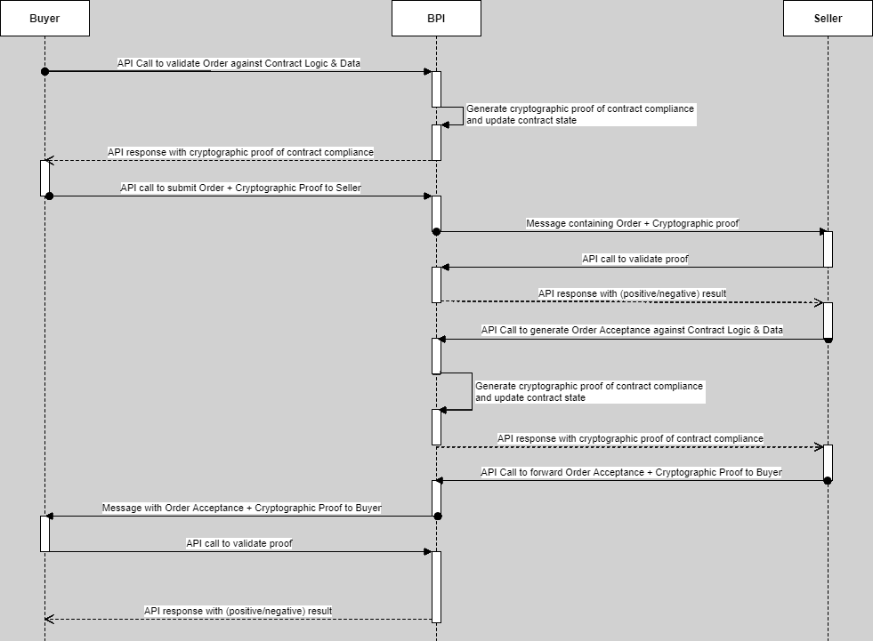
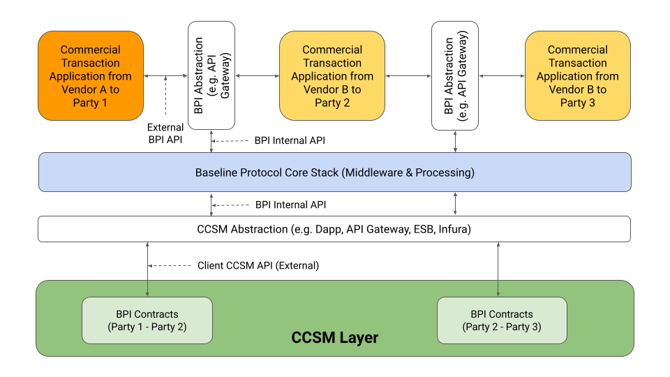
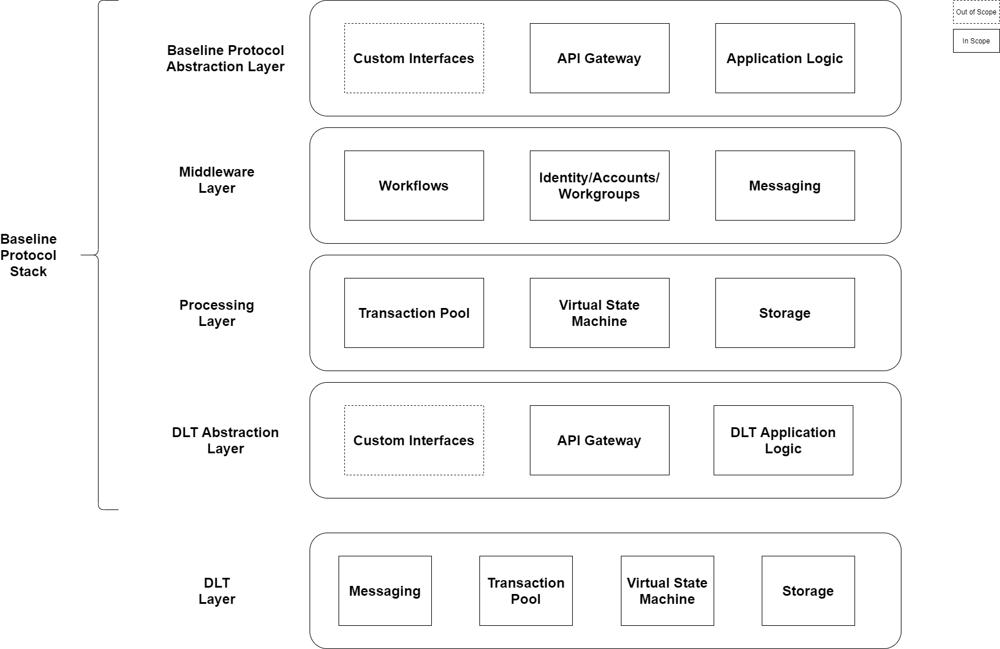
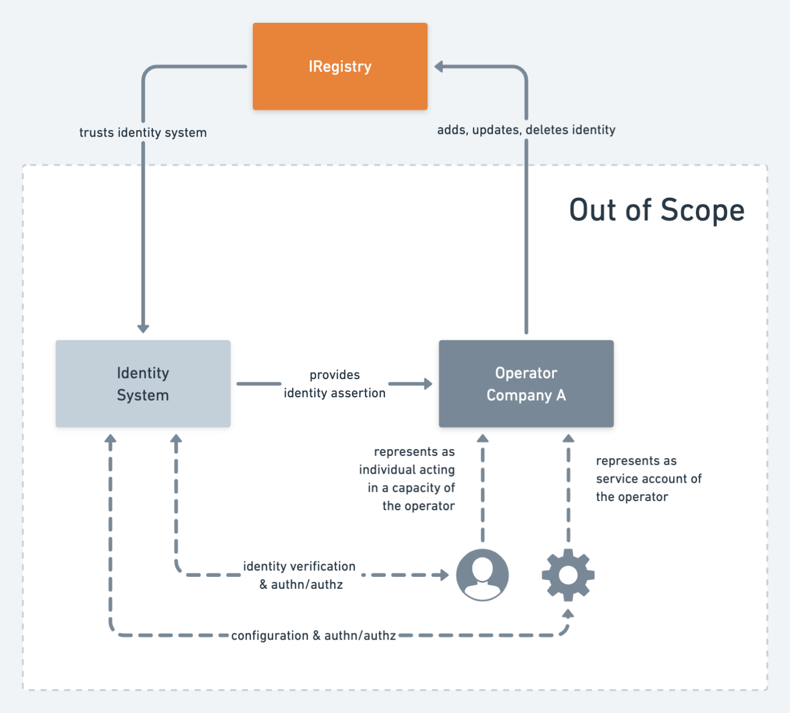
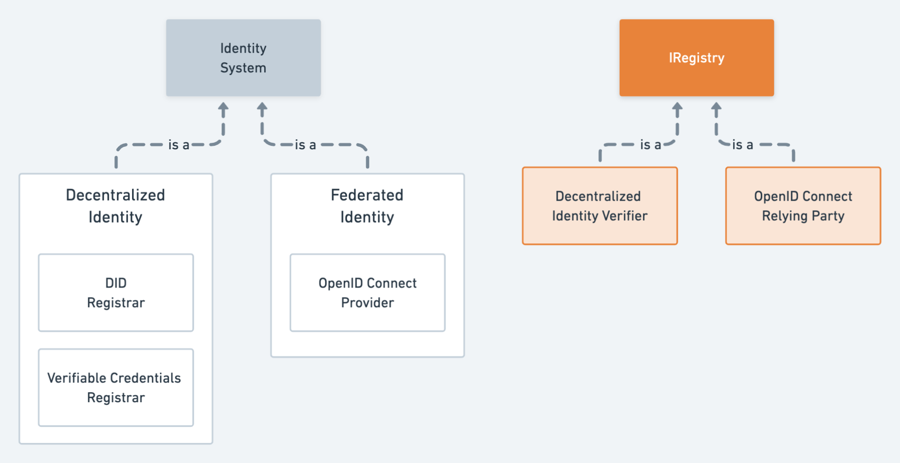
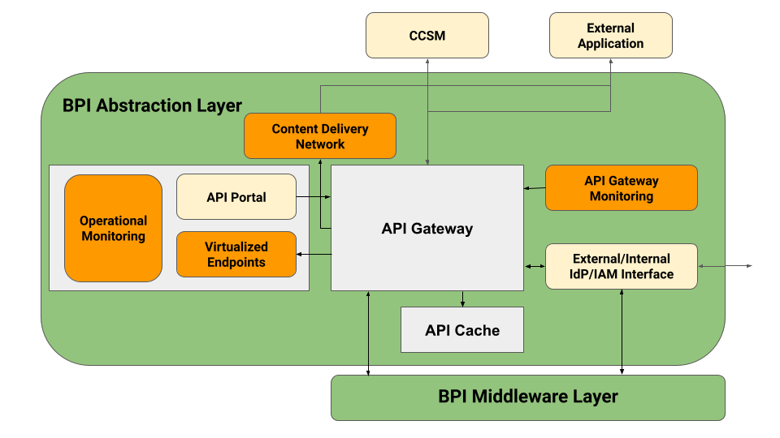
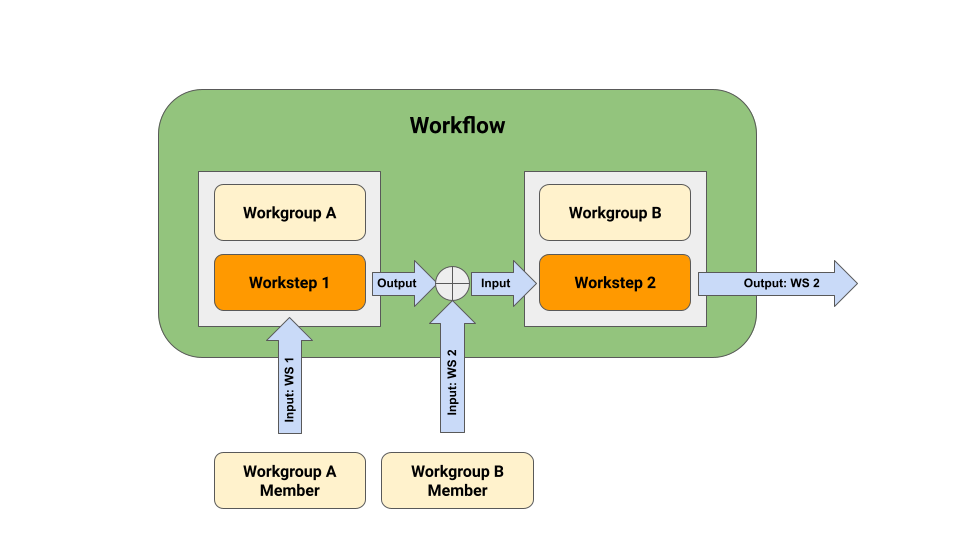

-------

# Baseline Core Version 1.0

## Project Specification Working Draft

## 25 June 2021

<!-- URI list start (commented out except during publication by OASIS TC Admin)

#### This stage:
https://docs.oasis-open.org/baseline/baseline-core/v1.0/psd01/baseline-core-v1.0-psd01.md (Authoritative) \
https://docs.oasis-open.org/baseline/baseline-core/v1.0/psd01/baseline-core-v1.0-psd01.html \
https://docs.oasis-open.org/baseline/baseline-core/v1.0/psd01/baseline-core-v1.0-psd01.pdf

#### Previous stage:
N/A

#### Latest stage:
https://docs.oasis-open.org/baseline/baseline-core/v1.0/baseline-core-v1.0.md (Authoritative) \
https://docs.oasis-open.org/baseline/baseline-core/v1.0/baseline-core-v1.0.html \
https://docs.oasis-open.org/baseline/baseline-core/v1.0/baseline-core-v1.0.pdf

URI list end (commented out except during publication by OASIS TC Admin) -->

#### Open Project:
[Baseline, part of the Ethereum OASIS Open Project](https://www.baseline-protocol.org/)

#### Project Chair:
John Wolpert (john.wolpert@mesh.xyz), [ConsenSys](https://consensys.net/) 

#### Editors:
Anais Ofranc (aofranc@consianimis.com), [Consianimis](https://www.consianimis.com/) \
Andreas Freund (a.freundhaskel@gmail.com) \
Brian Chamberlain (brian.chamberlain@consensys.net), [ConsenSys](https://consensys.net/) \
Charles ‘Chaals’ Nevile (charles.nevile@consensys.net), [ConsenSys](https://entethalliance.org/) \
Daniel Norkin (daniel.norkin@envisionblockchain.com), [Envision Blockchain](https://envisionblockchain.com/)

<!--
#### Additional artifacts:
This prose specification is one component of a Work Product that also includes:
* XML schemas: (list file names or directory name)
* Other parts (list titles and/or file names)
* `(Note: Any normative computer language definitions that are part of the Work Product, such as XML instances, schemas and Java(TM) code, including fragments of such, must be (a) well formed and valid, (b) provided in separate plain text files, (c) referenced from the Work Product; and (d) where any definition in these separate files disagrees with the definition found in the specification, the definition in the separate file prevails. Remove this note before submitting for publication.)`
 -->

#### Related work:

<!--
This specification replaces or supersedes:
* _Baseline Protocol Version 1.0_ - 
* Specifications replaced by this specification (include hyperlink, preferably to HTML format)
 -->

This specification is related to: \
_Baseline API and Data Model version 1.0_ - https://github.com/ethereum-oasis/baseline/tree/master/docs/specs/api


#### Abstract:
This document describes the minimal set of business and technical prerequisites, functional and non-functional requirements, together with a reference architecture that when implemented ensures that two or more systems of record can synchronize their system state over a permissionless public Distributed Ledger Technology (CCSM) network.

#### Status:
This document is under active development and implementers are advised against implementing the specification unless they are directly involved with the Baseline TC team.

<!--
was last revised or approved by Baseline, part of the Ethereum OASIS Open Project, on the above date. The level of approval is also listed above. Check the "Latest stage" location noted above for possible later revisions of this document. Any other numbered Versions and other technical work produced by the Open Project (OP) are listed at [TBD].
-->

Comments on this work can be provided by opening issues in the project repository or by sending email to the project’s public comment list baseline@lists.oasis-open-projects.org.


#### Key words:
The key words "MUST", "MUST NOT", "REQUIRED", "SHALL", "SHALL NOT", "SHOULD", "SHOULD NOT", "RECOMMENDED", "NOT RECOMMENDED", "MAY", and "OPTIONAL" in this document are to be interpreted as described in BCP 14 [[RFC2119](#rfc2119)] and [[RFC8174](#rfc8174)] when, and only when, they appear in all capitals, as shown here.

#### Citation format:
When referencing this specification the following citation format should be used:

**[baseline-core-v1.0]**

_Baseline Core Version 1.0_. Edited by Anais Ofranc. 29 September 2020. OASIS Project Specification Draft 01. https://docs.oasis-open.org/baseline/baseline-core/v1.0/psd01/baseline-core-v1.0-psd01.html. Latest stage: https://docs.oasis-open.org/baseline/baseline-core/v1.0/baseline-core-v1.0.html.

-------

## Notices
Copyright © OASIS Open 2021. All Rights Reserved.

Distributed under the terms of the OASIS [IPR Policy](https://www.oasis-open.org/policies-guidelines/ipr).

For complete copyright information please see the Notices section in the Appendix.

-------

# Table of Contents
[1 Introduction](#1-introduction) \
&nbsp;&nbsp;&nbsp;&nbsp;[1.1 Overview](#11-overview) \
&nbsp;&nbsp;&nbsp;&nbsp;[1.2 Glossary](#12-glossary) \
&nbsp;&nbsp;&nbsp;&nbsp;[1.3 Typographical Conventions](#13-typographical-conventions) \
[2 Design and Architecture](#2-Design-and-Architecture) \
&nbsp;&nbsp;&nbsp;&nbsp;[2.1 Agreement](#21-Agreement) \
&nbsp;&nbsp;&nbsp;&nbsp;[2.2 State Object](#22-State-Object) \
&nbsp;&nbsp;&nbsp;&nbsp;[2.3 Transacting Counterparties](#23-Transacting-Counterparties) \
&nbsp;&nbsp;&nbsp;&nbsp;[2.4 Commercially and Legally Binding Documents](#24-Commercially-and-Legally-Binding-Documents) \
&nbsp;&nbsp;&nbsp;&nbsp;&nbsp;&nbsp;[2.4.1 Contract](#241-Contract) \
&nbsp;&nbsp;&nbsp;&nbsp;&nbsp;&nbsp;[2.4.2 Commercial Documents](#242-Commercial-Documents) \
&nbsp;&nbsp;&nbsp;&nbsp;[2.5 Consensus Controlled State Machine (CCSM)](#25-Consensus-Controlled-State-Machine-(CCSM)) \
&nbsp;&nbsp;&nbsp;&nbsp;[2.6 Baseline Protocol Instance](#26-Baseline-Protocol-Instance) \
&nbsp;&nbsp;&nbsp;&nbsp;[2.7 High-Level Functional Requirements](#27-High-Level-Functional-Requirements) \
&nbsp;&nbsp;&nbsp;&nbsp;&nbsp;&nbsp;[2.7.1 Functional Requirements on commercial counterparties](#271-Functional-Requirements-on-commercial-counterparties) \
&nbsp;&nbsp;&nbsp;&nbsp;&nbsp;&nbsp;[2.7.2 	CCSM-based Lifecycle Processes](#272-CCSM-based-Lifecycle-Processes) \
&nbsp;&nbsp;&nbsp;&nbsp;[2.8 Baseline Protocol Reference Architecture](#28-Baseline-Protocol-Reference-Architecture) \
&nbsp;&nbsp;&nbsp;&nbsp;&nbsp;&nbsp;[2.8.1 (Commercial) State Synchronization](#281-(Commercial)-State-Synchronization) \
&nbsp;&nbsp;&nbsp;&nbsp;&nbsp;&nbsp;[2.8.2 CCSMs and BPI and CCSM Abstraction-Layers](#282-CCSMs-and-BPI-and-CCSM-Abstraction-Layers) \
&nbsp;&nbsp;&nbsp;&nbsp;&nbsp;&nbsp;[2.8.3 External Applications](#283-External-Applications) \
&nbsp;&nbsp;&nbsp;&nbsp;&nbsp;&nbsp;[2.8.4 Baseline Protocol Stack Detailed Reference Architecture Layers and Components](#284-Baseline-Protocol-Stack-Detailed-Reference-Architecture-Layers-and-Components) \
[3 Identifiers, Identity and Credential Management](#3-Identifiers,-Identity-and-Credential-Management) \
&nbsp;&nbsp;&nbsp;&nbsp;[3.1 Introduction](#31-Introduction) \
&nbsp;&nbsp;&nbsp;&nbsp;[3.2 BPI Identifiers, Identities and Credentials, and their Management](#32-BPI-Identifiers,-Identities-and-Credentials,-and-their-Management) \
&nbsp;&nbsp;&nbsp;&nbsp;&nbsp;&nbsp;[3.2.1 BPI Identifiers](#321-BPI-Identifiers) \
&nbsp;&nbsp;&nbsp;&nbsp;&nbsp;&nbsp;[3.2.2 BPI Identities and Credentials](#322-BPI-Identities-and-Credentials) \
[4 BPI Abstraction Layers](#4-BPI-Abstraction-Layers) \
[5  Middleware, Communication and Interoperability](#5-Middleware,-Communication-and-Interoperability) \
[6 Agreement Execution](#6-agreement-execution)  \
&nbsp;&nbsp;&nbsp;&nbsp;[6.1 BPI Workstep](#61-BPI-Workstep) \
&nbsp;&nbsp;&nbsp;&nbsp;[6.2 BPI Workflow](#62-BPI-Workflow) \
&nbsp;&nbsp;&nbsp;&nbsp;[6.3 BPI Workgroup](#63-BPI-Workgroup) \
&nbsp;&nbsp;&nbsp;&nbsp;[6.4 BPI Account](#64-BPI-Account) \
&nbsp;&nbsp;&nbsp;&nbsp;[6.5 BPI Transactions](#65-BPI-Transactions) \
&nbsp;&nbsp;&nbsp;&nbsp;[6.6 BPI Transaction Lifecycle](#66-BPI-Transaction-Lifecycle) \
[7 General BPI Storage Capabilities](#7-General-BPI-Storage-Capabilities) \
&nbsp;&nbsp;&nbsp;&nbsp;[7.1 BPI Storage Security](#71-BPI-Storage-Security) \
&nbsp;&nbsp;&nbsp;&nbsp;[7.2 BPI Storage Privacy](#72-BPI-Storage-Privacy) \
&nbsp;&nbsp;&nbsp;&nbsp;[7.3 BPI Data Orchestration](#73-BPI-Data-Orchestration) \
&nbsp;&nbsp;&nbsp;&nbsp;[7.4 BPI-External Storage: Edge Storage](#74-BPI-External-Storage-Edge-Storage) \
&nbsp;&nbsp;&nbsp;&nbsp;[7.5 BPI-Internal Storage](#75-BPI-Internal-Storage) \
&nbsp;&nbsp;&nbsp;&nbsp;&nbsp;&nbsp;[7.5.1 BPI Storage: Centralized Deployment](#751-BPI-Storage-Centralized-Deployment) \
&nbsp;&nbsp;&nbsp;&nbsp;&nbsp;&nbsp;[7.5.2 BPI Storage: Decentralized Deployment](#752-BPI-Storage-Decentralized-Deployment) \
[8 Conformance](#8-conformance) \
&nbsp;&nbsp;&nbsp;&nbsp;[8.1 Conformance Targets](#81-conformance-targets) \
&nbsp;&nbsp;&nbsp;&nbsp;[8.2 Conformance Levels](#82-Conformance-Levels)\
[Appendix A.        Acknowledgments]()\
[Appendix B.        Revision History]()

 

-------

# 1 Introduction

The Baseline Protocol is an open source initiative that combines advances in cryptography, messaging, and consensus controlled state machines, often referred to as blockchains or distributed ledger technology (DLT) to deliver secure and private business processes at low cost -- event ordering, data consistency and workflow integrity. The Baseline Protocol provides a framework that allows Baseline Protocol Implementations (BPIs) to establish a common (business) frame of reference enabling confidential and complex (business) collaborations between enterprises without moving any sensitive data between traditional Systems of Record. The work is governed by the [Ethereum-Oasis Project](https://github.com/ethereum/oasis-open-project), which is managed by [OASIS](https://oasis-open-projects.org/).

## 1.1 Overview

An illustrative example of the use of a BPI is a Buyer placing an order to a Seller. Normally a Buyer system creates an order and transmits it to the Seller system through some preestablished messaging system without providing any proof that the Order created is correct, forcing the Seller systems to validate the order, and more often than not, finding data inconsistencies between the Seller system and the Order. This then leads to a time consuming and often expensive back and forth between Seller and Buyer to rectify the issue. 

In the case a BPI is used, the Buyer action of creating an order and submitting it to the BPI creates a cryptographic proof on the BPI that the order conforms (or not) to the agreed upon commercial contract terms and current contract state between Buyer and Seller stored on the BPI, whereupon verification, the commercial contract state is on the BPI updated based on the order details. Subsequently, the cryptographic proof of order correctness is attached to the order and sent to the Seller using either established integrations or the BPI. The Seller can then directly validate the proof without having to check the correctness of the order against its own System of Record anymore. A valid cryptographic proof ensures that the order will be correctly formulated the first time avoiding errors, and thus saving time and money -- a more detailed example is provided in [Section 2.8.1](#281-(Commercial)-State-Synchronization). A BPI, therefore, enforces the synchronization of Systems of Record between Buyer and Seller. 


At a high-level a BPI's benefits and characteristics can be summarized as follows:
* BPI usage avoids rework between contract counterparties due to improperly applied business logic because cryptographic proofs of correctness ensure that Systems of Record remain synchronized, and that rework is minimized, or even completely avoided.
* Existing integrations can continue to be used with only minimal augmentation of cryptographic proofs that contractual business logic and data such as discounts are properly applied. 
* Service request validation such as that of an order against the service request receiver's System of Record is no longer unnecessary.

In the following, this document lays out the requirements on a BPI to achieve above described benefits and characteristics in several sections:
* **Section 2: Design and Architecture** with definitions, key concepts, and overviews of the components of a complaint Baseline Protocol Implementation as delineated in the following subsections:
    * Agreement
    * State Object
    * Transacting Counterparties
    * Commercially and Legally Binding Documents
    * Contract
    * Commercial Documents
    * Consensus Controlled State Machine (CCSM)
    * Baseline Protocol Instance
    * High-Level Functional Requirements
    * Baseline Protocol Reference Architecture
* **Section 3: Identifiers, Identity and Credential Management** with definitions, key concepts, and overviews of identifiers, identities and credentials necessary in a complaint Baseline Protocol Implementation as delineated in the following subsections 
    * Introduction and high-level Requirements
    * BPI Identifiers, Identities and Credentials, and their Management 
* **Section 4: BPI Abstraction Layers** with definitions, concepts, scope and security considerations for BPI Abstraction Layers
    * BPI Abstraction Scope and Components
    * BPI Abstraction Layer Security and Integration
* **Section 5: Middleware, Communication and Interoperability**
* **Section 6: Agreement Execution** with definitions, key concepts, and overviews of the BPI Processing Layer components necessary in a compliant Baseline Protocol Implementation as delineated in the following subsections
    * BPI Workstep
    * BPI Workflow
    * BPI Workgroup
    * BPI Account
    * BPI Transactions
    * BPI Transaction Lifecycle
* **Section 7: General BPI Storage Capabilities** with definitions, key concepts, and overviews of BPI Storage components applicable to all BPI layers and necessary in a compliant Baseline Protocol Implementation as delineated in the following subsections 
    * BPI Storage Security
    * BPI Storage Privacy
    * BPI Data Orchestration
    * BPI-External Storage: Edge Storage
    * BPI-Internal Storage
* **Section 8: Conformance** with specification of conformance 
tests for each requirements and definitions of the different level of conformance of a BPI to this standard.
    * Conformance Targets
    * Conformance Levels

## 1.2 Glossary

**Anti-Money Laundering:**

Anti-money laundering (AML) refers to a set of laws, regulations, and procedures intended to prevent criminals from disguising illegally obtained funds as legitimate income.  

International Monetary Fund, Reference Guide to Anti-Money Laundering and Combating the Financing of Terrorism Second Edition and Supplement on Special Recommendation IX, 2006

**Baseline Protocol:**

The Baseline Protocol is a set of methods that enable two or more state machines to achieve and maintain data consistency, and workflow continuity by using a network as a common frame of reference. 

**Baseline-Bridge:**

A mechanism for one Workflow to use the proof generated by a different Workflow.
to use a proof generated in a Workflow executed by Workgroup A as input to a Workflow executed by Workgroup B.

**Baseline-Connector:**

Proposed: An interface connecting and synchronizing a baseline stack and system of record.

**Byzantine Fault Tolerant (BFT):**

Given a network or system of n components, t of which are dishonest, and assuming only point-to-point channels between all the components, then whenever a component A tries to broadcast a value x such as a block of transactions, the other components are permit-ted to discuss with each other and verify the consistency of A's broadcast, and eventually settle on a common value y. The system is then considered to resist Byzantine faults if a component A can broadcast a value x, and then:
* If A is honest, then all honest components agree on the value x.
* If A is dishonest, all honest components agree on the common value y.

"The Byzantine Generals Problem", Leslie Lamport, Robert E. Shostak, Marshall Pease, ACM Transactions on Programming Languages and Systems, 1982

**Circuit Breaker:**

The ability of a Party to immediately cease all their active Workflows across all of their Workgroups within a Baseline-compliant implementation, and, if required, exit a Baseline-compliant implementation with all their data without any 3rd party being able to prevent the exit.

**Common Frame of Reference:**

A Common Frame of Reference as used in this document refers to achieving and maintaining data consistency between two or more Systems of Record using a consensus controlled state machine. This enables workflow and data continuity and integrity between two or more counterparties.

**Consensus Controlled State Machine:**

A Consensus Controlled State Machine is a network of replicated, shared, and synchronized digital data spread across multiple sites connected by a peer-to-peer and utilizing a consensus algorithm. There is no central administrator or centralized data storage.

**Electronic Record:**

Information captured through electronic means, and which may or may not have a pa-per record to back it up.

Bulletin of the American Society for Information Science and Technology, Electron-ic Records Research Working Meeting: A Report from the Archives Community, May 28‐30, 1997.

**Identity:**

The condition of being the same with something described or asserted, per Merriam-Webster Dictionary.

A concretization of the above used in this document: Identity is the combination of one or more unique identifiers with data associated with this/these identifier(s). Identity associated data consists of signed certificates or credentials such as verifiable credentials and other unsigned, non-verifiable data objects generated by or on be-half of the unique identifier(s).

Merriam-Webster Dictionary, https://www.merriam-webster.com/dictionary/idntity

**Interoperability:**

The ability of a Party operating Workflows on a baseline-compliant implementation A to instantiate and operate one or more Workflows with one or more Party on a baseline-compliant implementation B without the Party on either implementation A or B having to know anything of the other Party’s implementation.

**Liveness:**
In concurrent computing, liveness refers to a set of properties of concurrent systems, that require a system to make progress, despite its concurrently executing components ("process-es") may have to "take turns" in critical sections, parts of the program that cannot be simultaneously run by multiple processes. Liveness guarantees are important properties in operating systems and distributed systems.

Alpern B, Schneider FB (1985) Defining liveness. Inf Proc Lett 21:181-185

**Master Services Agreement (MSA):**
A legal contract that defines the general terms and conditions governing the entire scope of products commercially exchanged between the parties to the agreement.

**Non-Repudiable:**
Refers to a situation where a statement's au-thor cannot successfully dispute its authorship or the validity of an associated contract. The term is often seen in a legal setting when the authenticity of a signature is being challenged. In such an instance, the authenticity is being "repudiated".

**Party:**

A set of Parties participating in the execution of one or more given Workflows. A Workgroup is set up and managed by one Party that invites other Parties to join as workgroup members. 

**Portability:**

The ability of a Party to migrate and re-baseline its existing Workflows and data from one baseline-compliant implementation to another baseline-compliant implementation without any 3rd party being able to prevent the migration.

**Privacy Assurance Mechanism:**

A way of ensuring the privacy of Workflow data represented on a public Mainnet. - permissionless vs public - to discuss and review.

**Proof of Correctness:**
A Proof of Correctness is a mathematical proof that a computer program or a part thereof will, when executed, yield correct results, i.e. results fulfilling specific requirements. Before proving a program correct, the theorem to be proved must, of course, be formulated. The hypothesis of such a correctness theorem is typically a condition that the relevant program variables must satisfy immediately before the program is executed. This condition is called the precondition. The thesis of the correctness theorem is typically a condition that the relevant program variables must satisfy immediately after execution of the program. This latter condition is called the post-condition. The thesis of a correctness theorem may be a statement that the final values of the program variables are a particular function of their initial values.

"Encyclopedia of Software Engineering",
Print ISBN: 9780471377375| Online ISBN: 9780471028956| DOI: 10.1002/0471028959,
(2002), John Wiley & Sons, Inc.

**System of Record:**

The integrity of the data in data architecture is established by what can be called the “system of record.” The system of record is the one place where the value of data is definitively established. Note that the system of record applies only to detailed granular data. The system of record does not apply to summarized or derived data.

W.H. Inmon, Daniel Linstedt and Mary Levins, "Data Architecture", 2019, Academic Press, ISBN: 978-0-12-816916-2

**Trust Model:**

Collection of entities and processes that Ser-vice Providers rely on to help preserve security, safety, and privacy of data and which is predicated on the use of a CCSM implementation.

Marsh S. (1994). "Formalizing Trust as a Computational Concept". PhD thesis, University of Stirling, Department of Computer Science and Mathematics.

**Verifiably Secure:**

Verifiable computing that can be described as verifiably secure enables a computer to offload the computation of some function to other perhaps untrusted clients, while maintaining verifiable, and thus secure, results. The other clients evaluate the function and return the result with a proof that the computation of the function was carried out correct-ly. The proof is not absolute but is dependent on the validity of the security assumptions used in the proof. For example, a blockchain consensus algorithm where the proof of computation is the nonce of a block. Someone inspecting the block can assume with virtual certainty that the results are correct because the number of computational nodes that agreed on the outcome of the same computation is defined as sufficient for the consensus outcome to be secure in the consensus algorithm’s mathematical proof of security. 

Gennaro, Rosario; Gentry, Craig; Parno, Bryan (31 August 2010). Non-Interactive Verifiable Computing: Outsourcing Computation to Untrusted Workers. CRYPTO 2010. doi:10.1007/978-3-642-14623-7_25 

**Workflow:**

A process made up of a series of Worksteps between all or a subset of Parties in a given Workgroup.

**Workstep:**

A workstep is characterized by an input, the deterministic application of a set of logic rules and data to that input, and the generation of a verifiably deterministic and verifiably correct output.

## 1.3 Typographical Conventions

- Naming conventions
- Font colors and styles
- Typographic conventions

-------

# 2 Design and Architecture

This section provides definitions, key concepts, and overviews of the components of a Baseline Protocol Implementation compliant with the requirements of this document. The intent of this section is to provide implementers with guidance to be able to build and operate implementations of the Baseline Protocol not only in an informal context, but also in a very formal, highly regulated context. The latter context in particulars requires implementers to prove that compliance with this standard not only does not violate regulatory frameworks but rather enables meeting regulatory requirements throughout the entire stack.

## 2.1 Agreement

An agreement is a manifestation of mutual assent by two or more parties to one another see [Cornell Law School](https://www.law.cornell.edu/wex/agreement). An Agreement between two or more Counterparties allows for transactions between them dealing with, for example, commercial items such as products. An Agreement governs and defines all transactions between counterparties.

**[R1]**	Transacting counterparties  MUST have a corresponding agreement.

## 2.2	State Object

A State Object is an item which can be exchanged between counterparties to an agreement, whose state the counterparties have agreed on and which is defined in an agreement. In the context of this standard, a State Object is assumed to be a document derived from an agreement and representing a specific state of either an asset, a product offering or a service offering transacted between counterparties.

Examples include but are not limited to a
* Quote
* Order
* Invoice
referencing for example:
* Digital Services
* Physical Products
* Financial Assets
 
## 2.3 Transacting Counterparties

A transaction counterparty, or simply counterparty, that requests one or more State Objects from another counterparty is the Requester with respect to the State Object.  The Requester can also be the final recipient of one or more State Objects.

A counterparty that provides one or more State Object to another counterparty is the Provider with respect to the provided State Objects. The Provider is accountable to the Requester for all the State Objects it provides to the Requester. 

A Requester may request State Objects from multiple Providers and in the context of a supply chain of State Objects, a Provider of one State Object may also play the role of a Requester of other State Objects.

## 2.4 Commercially and Legally Binding Documents

If Transacting Counterparties, also being referred to as Requester(s) and Provider(s) (“the parties”) in this document, intend to establish a business and operational environment for the purpose of commercial transactions, they will sign one or more agreements that commercially and legally bind the parties, also known as Commercial Agreements. The aforementioned is only to be understood within the context of this document. 

Such legal, commercial documents may be presented as a combination of one or more of the following: 
* Master Services Agreement,
* Specific Terms and Conditions and 
* an Order.

**[R2]**	The parties to a Commercial Agreement MUST sign commercially and legally binding documents with each other.

### 2.4.1	Contract

This section details the prerequisites required to be fulfilled by a legal contract, also referred to as a Commercial Agreement in this document, between the parties, and defines the general terms and conditions in the legal contract governing commercial transactions between these parties. These prerequisites are to be understood only within the context of this document, and are meant to be general in nature and not specific to particular legal and regulatory frameworks.

A contract will typically govern all commercial transactions between its parties and includes, but is not limited to, sections defining the Governing Law, the Legal Jurisdiction, Indemnity, Liability, Force Majeure, Charges and Taxes, Term, Obligations, definitions of commercially relevant elements such as locations, equipment, and products, as well as any other terms and conditions that apply to the entire scope of commercial and legal relations between the parties. Other legal documents, such as an order, typically reference the contract for its general terms and conditions and might contain more specific terms and conditions, such as rates and discounts and other commercial information, relevant for the specific context of the legal document. These specific terms and conditions can expand or override the original contract, and are intentionally not specified in the original contract. The contract is the legal document from which specific commercial documents, such as a Quote or an Order, are derived.

**[R3]**	There MUST be a legally binding contract, however simple and temporary, before a commercial transaction — such as an order — between parties takes place. 

For example, the contract and the order can be combined into a single document for the purposes of a single transaction. However, there must be a legal framework in place to provide context for monies that are exchanged and settled. The functional part of the contract forms the basis of a Baseline Protocol Implementation (BPI) defined in section 2.6. The requirements below are to be understood solely within the context of this document. They are not meant to be generalized beyond this context.

**[D1]**   The contract SHOULD be in an electronic form.

**[D2]**   The functional terms of the contract SHOULD be represented on a BPI between the counterparties.

**[D3]**	 The contract SHOULD be an MSA between the contract parties. 

An MSA is preferable since it allows a proliferation of contract based BPI (commercial) workflows and worksteps between the parties reducing complexity and potential errors.

**[CR1]< [D3]** 	There MUST be only one MSA between a contract parties covering commercial transactions for a given set of products, services or assets to disambiguate which terms cover which part of a commercial relationship between parties.

Specific Terms and Conditions (“Specific T&Cs”) defines the terms and conditions governing a specific product, service or asset or set thereof offered and delivered by Provider(s) to Requester(s).

**[D4]**	Each specific product, service or asset or set thereof offered and delivered by Provider(s) to Requester(s) SHOULD have its own Specific T&C document.

This would allow the fine graining and consistent application of commercial State Object specific business rules and data.

### 2.4.2	Commercial Documents 

Commercial Documents, a category of commercial State Objects, refer to the state of a specific product/service/asset or set thereof, which may or may not be modified from an original offering to meet the Requester requirements and includes operational and commercial details. A commercial document is an abstract construct representing mutual commitments based on a legally binding contract.

**[R4]**	A commercial State Object to be transacted on MUST be based on a specific commercial document.

**[R5]**  A commercial document MUST be derived from a legally binding contract.

**[R6]**	A commercial document MUST be represented as an electronic record.

**[R7]**  A commercial document MUST be represented on a BPI between the counterparties.

**[R8]**	A commercial document MUST be authorized by legal representatives of the parties, or their legal delegates.

**[D4]**	The definition of a commercial document authorization SHOULD be stated in the legal contract underlying the commercial document.

Authorizations for commercial transactions are a foundational element in the context of this document, as they are in paper based agreements. Therefore, any legal authorization agreements relevant to the commercial agreement between commercial counterparties, and thus to commercial transactions between them, are important to be represented in a BPI to ensure mitigating the risk of unauthorized signatures.

**[R9]**	The representatives and their authorized delegates who can perform commercial document authorizations SHOULD be explicitly listed or inferred from the stated legal delegation rules of the counterparties in the contract underlying any commercial document. 

**[R10]**	A commercial document MUST be non-repudiable.

Note that while non-repudiation in the physical world is most often tied to a physical signature of an individual on a legal document, in the digital world a digital signature over a digital legal document such as an Order or an Invoice belonging to a known and verifiable digital identity of a counterparty serves the same purpose.

Example:
A Buyer ("Requester") and Seller ("Provider") may agree that a signed Order requires a signed original paper copy, or a digitally signed electronic Order Form, in addition to an Order being digitally signed and recorded within a BPI.

## 2.5 Consensus Controlled State Machine (CCSM)

A Consensus Controlled State Machine is a network of replicated, shared, and synchronized digital data spread across multiple sites connected by a peer-to-peer and utilizing a consensus algorithm. There is no central administrator or centralized data storage. 

A CCSM with no or limited trust assumptions is the foundational enabler of a BPI.

For specificity, the popular words "Blockchain" or "CCSM" is a particular form of CCSM design.

## 2.6 Baseline Protocol Instance

Baseline Protocol Instances (BPIs) are logical constructs shared between (commercial) counterparties of Requesters and Providers and implemented on a Distributed Ledger. They are used to either validate, or reconcile, (commercial) transactions between Requesters and Providers related to all (commercial) State Objects transacted between them. The nature of bi- or multi-lateral transactions is such that two or more parties may (commercially) transact to/from each other interchangeably. 

Abstractly, a BPI consists of
* the private messaging between Agreement Counterparties about the state, or the requested or finalized state changes, of the (commercial) State Objects between them.
* the representation of a (commercial) agreement and (commercial) documents and their business rules and data as distinct workflows and worksteps between Agreement Counterparties organized into workgroups based on the stipulations of the (commercial) agreement.
* the deterministic processing and finalization of state change requests based on (commercial) documents between the Contract Counterparties as stipulated by the (commercial) agreement.
* the preservation of privacy of all Contract Counterparties and their (commercial) data from other 3rd parties.

BPIs are strongly dependent on the security and privacy capabilities of the CCSM used to implement a BPI.

**[R11]**	A BPI MUST utilize a CCSM.

Security and Privacy requirements of a BPI are key and are strongly dependent on the security and privacy assurances of the CCSM on which the BPI is implemented can provide. BPIs need to take great care to avoid the following two situations:

1. Weaken the security assurances of the underlying CCSM by increasing the CCSM attack surface. Such an expansion of the attack surface can occur through, for example, concentration of value-at-risk in one or more BPIs above the value used to economically secure the underlying CCSM. This situation would provide an economic incentive to attack, and subvert, the underlying CCSM to extract the value in one or more BPIs.
2. Increase the existing attack surface of a CCSM such that the security assurances of the BPI become significantly weaker than the underlying CCSM. An example of such a situation can occur when a commercial State Object such as a Financing contract or an Order in BPI A is dependent on a commercial State Object such as an invoice as collateral in BPI B, and when BPI B has weaker transaction finality assurances than either BPI A or the underlying CCSM. In that scenario, the commercial State Object in BPI A cannot provably rely on the invoice as collateral in BPI B since the invoice might be reverted, and it would then no longer be a suitable collateral.
	
Hence, we enumerate the following requirements below:

**[R12]**	A BPI MUST have the same security assurances as the CCSM it utilizes.

**[R13]**	A BPI MUST support cryptographic algorithms based on commonly used and security-audited libraries.

The usage of cryptographic libraries that successfully passed the US National Institute of Standards and Technology (NIST) Cryptographic Module Verification Program [(CMVP)](####CVMP).

**[R14]**	If a BPI utilizes a Peer-to-Peer (P2P) message protocol, the protocol MUST support end-to-end encryption.

**[R15]**	A BPI MUST support cryptographic key management incl. backup and recovery that adheres to established industry security standards such as the US Federal Information Processing Standard [(FIPS)](####FIPS) or [ISO 27001](####ISO27001).

**[R16]**	(Commercial) State changes of a BPI MUST be verifiable on the CCSM it utilizes.

Verifiable in this context means that a 3rd party can verify, via a cryptographic proof on the CCSM, that a transaction changed the state of a (commercial) State Object in the BPI correctly, based on agreed upon business rules - for example changing the Order status from open to completed.

**[R17]**	A BPI SHOULD have at least the same Liveness properties as the CCSM it utilizes.

Liveness means that if a CCSM does not require (commercial) counterparties to constantly monitor its state to ensure that the state of the CCSM is correct, then the BPI should not require a constant observation of its state either.

**[R18]**	A BPI MUST be censorship resistant.

Censorship resistant means that a (commercial) counterparty can terminate a (commercial) transaction at any time without another counterparty, or any Node of the CCSM used to implement the BPI, being able to stop the termination of the (commercial) transaction.

**[R19]**	A BPI MUST be able to provide privacy of the (commercial) counterparties' data with respect to any party outside of the BPI.

 
## 2.7 High-Level Functional Requirements

This section describes the prerequisites and high-level general operational framework requirements 
* Functional Requirements on commercial counterparties
* CCSM-based Lifecycle Processes

### 2.7.1	Functional Requirements on commercial counterparties 

This section states the commercial and operational functionalities required from commercial counterparties.

**[R20]**	Commercial Counterparties MUST have the ability to meet all required legal, compliance and business reporting requirements. 

This comprises, e.g., fraud or tax audit requirements based on commercial transactions on a BPI.

**[R21]**	Commercial Counterparties MUST support the Reference Architecture defined in this section.

**[R22]**	Commercial Counterparties MUST use the BPI APIs to transact on a commercial State Object.

An ability of a Requester to request products, services or assets, in other words commercial State Objects, through an instance of the Baseline Protocol's APIs does not necessarily imply the ability to provide products, services and assets through an instance of the Baseline Protocol APIs and vice versa.

It is important for commercial counterparties to know the level of conformity other commercial counterparties have with the Baseline Protocol Standard.

**[R23]**	Commercial Counterparties MUST publish their level of conformity (self-declaration or certification) with the Baseline Protocol standard in a publicly accessible manner.

### 2.7.2	CCSM-based Lifecycle Processes

Commercial Counterparties must comply efficiently and effectively with requirements of regulatory frameworks, e.g., Office of Foreign Assets Control ("OFAC") of the US Department of the Treasury when employing new operational and commercial frameworks as laid out in this standard.

**[R24]**	If required to meet particular third party requirements, (e.g., privacy or regulatory frameworks in different jurisdictions), a commercial counterparty MUST record a pseudonymous map of the supply chain that is required to fulfill the provisioning of a requests commercial State Object (products, services or assets) transacted on a BPI.

Note, that in principal every product, service, or asset, or sets thereof has a supply chain. This requirement aims at situations where the product, service, or asset or sets thereof cannot be solely supplied by the Provider without sourcing components from other Providers.

Requesters are only aware of the identity and commercial data of their Provider(s), but not of the other participants in the supply chain. However, Requesters can cryptographically verify that a given set of claims by Providers about the supply chain are true, for example, that all supply chain participants are not located in an embargo country.

Therefore, a pseudonymous map of a supply chain is a cryptographically connected and verifiable list of proofs about the relationships of participants and integrity of supply chain events that does not disclose identifying details of Providers and their commercial data.

This allows enforcement of conformance with regulations, additional legal and technical requirements without disclosure of confidential information.

## 2.8 Baseline Protocol Reference Architecture 

This section describes the components of the Baseline Reference Architecture 
* (Commercial) State Synchronization
* CCSMs and BPI/CCSM Abstraction Layers
* External Applications
* Baseline Protocol Stack Detailed Reference Architecture Layers and Components

### 2.8.1 (Commercial) State Synchronization

A BPI can be used  as a common frame of reference for business processes that can be used in a complementary way to existing System-of-Record integrations.

#### Illustrative High-Level Example

A Master Services Agreement (MSA) between a Requester (Buyer) and a Provider (Seller) is implemented on a BPI and contains billing terms, pricing, discounts, and Seller information such as billing address etc. Once established and agreed upon by Buyer and Seller, the BPI provides state synchronization between Buyer and Seller since the ERP systems for Buyer and Seller can now refer to mutually agreed upon data as a common frame of reference. Based on this mutually agreed upon state in the MSA, the Buyer creates an Order in the business workflow based on the MSA and a cryptographic proof (in zero knowledge) that confirms not only the correct application of business logic but also correct application of commercial data in the Order creation. This proof is submitted together with the Order through the BPI and then validated by the Seller without having to utilize its own System of Record for validation using the BPI. If the proof is validated, the Seller accepts the proposed state change by generating its own cryptographic proof confirming its acceptance of the state change. The Seller then updates the state of the business workflow in the BPI and sends the new proof to the Buyer. 

The figure below visually demonstrates high-level Buyer and Seller Order generation and acceptance assuming that a MSA between Buyer and Seller already exists and is recorded on a BPI, and that the commercial state has been synchronized up to this workstep in the commercial business workflow.

<figure>
  
  <figcaption>Figure 1: Illustrative Example of how the commercial state between Buyer and Seller is synchronized and an Order created.</figcaption>
</figure>


Without a BPI, both Buyer and Seller must assume that the MSA between them and all its values are correctly represented in the other party’s respective Systems-of-Record. If an order is created based upon the MSA but does not comply with the MSA, it will likely result in extensive manual interactions between Seller and Buyer at one stage or another to resolve the problem to their mutual satisfaction.  

**[R25]**	The (commercial) counterparties MUST agree on the business process rules which are represented in the business workflows and worksteps in the BPI. 

**[R26]** 	The (commercial) counterparties MUST validate the correctness of a (commercial) State Object based on a (commercial) state change against the transaction business logic in the applicable BPI workflow and workstep.

**[R27]** 	The (commercial) counterparties MUST generate a Proof of Correctness of a (commercial) State Object based on a (commercial) state change that can be validated against the BPI transaction business logic.

**[R28]** 	Any new (commercial) state between counterparties MUST be recorded on the BPI between them.

**[R29]** 	Any counterparty having received a Proof of Correctness of a (commercial) state change MUST be able to validate that Proof of Correctness against the BPI between the counterparties.

**[R30]** 	A (commercial) counterparty MUST include a Proof of Correctness of the (commercial) State Object generated by the (commercial) state change in the BPI Messages between the transacting counterparties.

### 2.8.2 CCSMs and BPI/CCSM Abstraction Layers

<figure>
  
  <figcaption>Figure 2: CCSM and BPI Abstraction Architecture</figcaption>
</figure>

To maintain modularity in the reference architecture, we introduce the concept of CCSM and BPI Abstraction. A CCSM or BPI Abstraction expressed through a CCSM Abstraction Layer, constitutes technology applications which wrap capabilities of CCSMs and BPIs such that these capabilities can be exposed to applications above the CCSM or BPI Abstraction Layers in a manner that minimizes the dependency of these application on the details of a CCSM and BPI – Figure 2. 

The Client CCSM API as an external BPI API is implementation specific and will not be discussed further.

**[R31]**	CCSMs used in the implementation of a BPI MUST support bilateral and multi-lateral digital representations of legal contracts.

**[R32]**	A CCSM or BPI Abstraction Layer used in a BPI SHOULD support more than one CCSM instance.

**[R33]** A CCSM or BPI Abstraction Layer used in a BPI SHOULD support more than one CCSM type.

This approach avoids lengthy discussions about which CCSM protocol to utilize for a BPI, simplifying the decision making process considerably if most common CCSMs are incorporated.

Note that irrespective of whether one is in a public or private CCSM scenario, the protocol settings such as block time, consensus model, type of execution framework etc. needs to be agreed upon by operating entities in some fashion either informally such as in [Ethereum](https://ethereum.org/en/) or formally such as in the Trade Finance consortium [Komgo](https://www.komgo.io/). 

The agreement on the governance entity, its rules, and its method of achieving interval synchronization consensus, as well as the definition of acceptable governance structures and their rules is beyond the scope of this document.

**[R34]**	The (commercial) counterparties MUST agree on the BPI.

### 2.8.3	External Applications

**[R35]**	Application/s providing (commercial) transaction functionality such as billing to (commercial) counterparties, and are, therefore, external with respect to the BPI, MUST be independent of any BPI.

Note, this requirement is motivated by reducing the dependency of counterparty internal systems on the BPI and vice versa. 

### 2.8.4	Baseline Protocol Stack Detailed Reference Architecture Layers and Components

<figure>
  
  <figcaption>Figure 3: Detailed Baseline Reference Architecture Layers and Components</figcaption>
</figure>

A Baseline Protocol Stack Reference Architecture as depicted above in Figure 3 is comprised of the following layers:
* **Baseline Protocol (BPI) Abstraction Layer**: This layer enables accessing all externally available BPI functions through APIs as defined in the Baseline Protocol API Standards document 
* **Middleware Layer**: This layer manages all counterparties to an agreement and its associated workflows and worksteps with business rules and business data as well as all counterparty delegates. In addition, it manages all messaging between counterparties to an agreement and instantiation of processing layers based on newly created or updated agreements and their workflows, worksteps, business rules and business data.  
* **Processing Layer**: Manages, properly sequences and deterministically processes and finalizes in a privacy-preserving, cryptographically verifiable manner all state change requests from counterparties to all agreements represented in the BPI.  
* **CCSM Abstraction Layer**: This layer enables accessing all required BPI functions implemented on one or more CCSMs through APIs as defined in the Baseline Protocol API Standards document. 
* **CCSM Layer**: This layer manages, properly sequences and deterministically processes in a privacy-preserving, cryptographically verifiable manner all transactions from the Processing Layer as well as either deterministically or probabilistically finalizes on the CCSM all CCSM state transitions based on said transactions.

Below we list and define the components of each layer. The detailed requirements for each component will be discussed in later sections of this document.

* **BPI Abstraction layer**
    * **API Gateway**: An API gateway which exposes all required functionality to the counterparties to an agreement and enforces all necessary authentication and authorization of API calls as well as properly directs the API calls within the Baseline Protocol Stack
    * **Application**: The application logic which manages the pre-processing and routing of all API requests, as well as the enforcement of authentication and authorization protocols and rules.
* **Middleware Layer**
    * **Workflows**: A Business Process Management engine that allows for the definition, management and instantiation of workflows and worksteps and associated business rules and data based on (commercial) agreements between counterparties
    * **Identity/Accounts/Workgroups**: A capability that allows for the identification and management of counterparties and their delegates as well as members of workflows and worksteps organized in workgroups which are derived from the counterparties to an agreement. 
    * **Messaging**: A messaging capability that allows the exchange of secure and privacy-preserving messages between counterparties to an agreement to communicate and coordinate agreement on proposed (commercial) state changes. 
* **Processing Layer**
    * **Transaction Pool**: one or more transaction pools which hold, properly sequence, preprocess and batch for processing by the Virtual State Machine all requested state change transactions of a BPI.
    * **Virtual State Machine**: one or more Virtual State Machines which deterministically processes and finalizes in a privacy-preserving, cryptographically verifiable manner all state change request transactions.
    * **Storage**: A storage system for the cryptographically linked current and historical state of all (commercial) agreements in a BPI.
* **CCSM Abstraction Layer** 
    * **API Gateway**: An API gateway which enables accessing all required BPI functions implemented on one or more CCSMs, and properly directs the requests within the CCSM Abstraction layer to the proper CCSM API application logic
    * **Application**: The CCSM API application logic which manages the pre-processing, as well as the proper usage of the underlying CCSM and BPI authentication and authorization.
*  **CCSM Layer** is comprised of
    * Messaging: A messaging capability that allows the exchange of messages between CCSM nodes that comprise either received transactions or a new proposed CCSM state.
    * Transaction Pool: A transaction pool holds, properly sequences, pre-processes and batches for processing by the CCSM Virtual State Machine all submitted CCSM transactions.
    * Virtual State Machine: A Virtual State Machine deterministically processes in a cryptographically verifiable manner all submitted transactions for CCSM state changes.
    * Storage: A storage system for the cryptographically linked current and historical state of all CCSM State Objects.


# 3 Identifiers, Identity and Credential Management

## 3.1 Introduction and high-level Requirements

Currently 3rd parties such as Domain Name Services (DNS) registrars [put reference], Internet Corporation for Assigned Names and Numbers [(ICANN)](https://www.icann.org/), X.509 Certificate Authorities (CAs), see Reference [[X.509](######-X.509)] and Reference [[CA](######-CA)], or social media companies are responsible for the creation and management of online identifiers and the secure communication between them. 

As evidenced over the last 20+ years, this design has demonstrated serious usability and security shortcomings.

When DNS and X.509 Public Key Infrastructure (PKIX) [[NIST SP 800-32](#####-NIST-SP-800-32)] was designed, the internet did not have a way to agree upon the state of a registry (or database) in a reliable manner with no trust assumptions. Consequently, standard bodies designated trusted 3rd parties (TTP) to manage identifiers and public keys. Today, virtually all Internet software relies on these authorities. These trusted 3rd parties, however, are central points of failure, where each is capable of compromising the integrity and security of large portions the Internet. Therefore, once a TTP has been compromised, the usability of the identifiers it manages is also compromised. 

As a result, companies spend significant resources fighting security breaches caused by CAs, and public internet communications that are both truly secure and user-friendly are still out of reach for most.

Given the above, the Baseline Protocol Standard identity approach is as follows: Every identity is controlled by its Principal owner and not by a 3rd party, unless the Principal Owner has delegated control to a 3rd party. 

A Principal Owner is defined as the entity controlling the public key(s) which control the identity and its identifiers upon inception of the identity.

The Baseline Protocol Standard defines identity in the context of this document to mean the following:

```
Identity = <Identifier(s)> + <associated data>
```
where associated data refers to data describing the characteristics of the identity that is associated with the identifier(s). An example of such associated could be an X.509 issues by a CA. 

This approach requires a decentralized, or at least strongly federated, infrastructure as expressed in the requirements below. 

**[D5]**	The Public Key Infrastructure (PKI)  of a BPI SHOULD be decentralized.

Decentralized in this context means that there is no single point of failure in the PKI where possibly no participants are known to one another.

**[R36]**	The PKI of a BPI MUST be strongly federated.

Strongly federated in this context means that there is a known, finite number of participants, without a single point of failure in the PKI. However, a collusion of a limited number of participants in the federated infrastructure may still lead to a compromised PKI. The consensus thresholds required for a change in the infrastructure is out of scope for this document. 

**[R37]**	The identifiers and identity utilized in a BPI MUST be controlled by its Principal Owner.

For a BPI to properly operate communication must be trusted and secure. Communications are secured through the safe delivery of public keys tied to identities. The Principal Owner of the identity uses a corresponding secret private key to both decrypt messages sent to them, and to prove they sent a message by signing it with its private key.

PKI systems are responsible for the secure delivery of public keys. However, the commonly used X.509 PKI (PKIX) undermines both the creation and the secure delivery of these keys.

In PKIX services are secured through the creation of keys signed by CAs. However, the complexity of generating and managing keys and certificates in PKIX have caused companies to manage the creation and signing of these keys themselves, rather than leaving it to their clients. This creates major security concerns from the outset, as it results in the accumulation of private keys at a central point of failure, making it possible for anyone with access to that repository of keys to compromise the security of connections in a way that is virtually undetectable.

The design of X.509 PKIX also permits any of the thousands of CAs to impersonate any website or web service. Therefore, entities cannot be certain that their communications are not being compromised by a fraudulent certificate allowing a PITM (Person-in-the-Middle) attack. While workarounds have been proposed, good ones do not exist.

Decentralized Public Key Infrastructure (DPKI) has been proposed as a secure alternative. The goal of DPKI is to ensure that, unlike PKIX, no single third-party can compromise the integrity and security of a system employing DPKI as a whole. 

Within DPKI, a Principal Owner can be given direct control and ownership of a globally readable identifier by registering the identifier for example in a CCSM. Simultaneously, CCSMs allow for the assignment of arbitrary data such as public keys to these identifiers and permit those values to be globally readable in a secure manner that is not vulnerable to the PITM attacks that are possible in PKIX. This is done by linking an identifier’s lookup value to the latest and most correct public keys for that identifier. In this design, control over the identifier is returned to the Principal Owner. 

Within this design, it is no longer trivial for any one entity to undermine the security of the entire DKPI system or to compromise an identifier that is not theirs overcoming the challenges of typical PKI.

Furthermore, DPKI requires a public registry of identifiers and their associated public keys that can be read by anyone but cannot be compromised. As long as this registration remains valid and the Principal Owner is able to maintain control of their private key, no 3rd party can take ownership of that identifier without resorting to direct coercion of the Principal Owner.

**[D6]** A BPI SHOULD utilize a DPKI.

**[CR1]>[D6]**	Any Principal Owner in a DPKI system utilized by a BPI MUST be able to broadcast a message if it is well-formed within the context of the DPKI.

Other peers in the system do not require admission control. This implies a decentralized consensus mechanism naturally leading to the utilization of systems such as CCSMs.

**[CR2]>[D6]**	Given two or more histories of updates, any Principal Owner within a BPI MUST be able to determine which one is preferred due to security by inspection.

This implies the existence of a method of ascertaining the level of resources backing a DPKI history such as the hash power in Bitcoin based on difficulty level and nonce.

Requirements of Identifier registration in DPKI is handled differently from DNS. Although registrars may exist in DPKI, these registrars must adhere to several requirements that ensure that identities belong to the entities they represent. This is achieved the following way:

**[CR3]>[D6]**	Private keys utilized in a BPI MUST be generated in a manner that ensures they remain under the Principal Owner’s control. 

**[CR4]>[D6]** Generating key pairs in a BPI on behalf of Principal Owner MUST NOT be allowed.

**[CR5]>[D6]**	Principals Owners in a BPI MUST always be in control of their identifiers and the corresponding public keys. 

**[O1]**	Principal Owners MAY extend control of their identifier to third parties.

For example for recovery purposes.

**[CR6]<[O1]** Extension of control of identifiers to 3rd parties in a BPI MUST be an explicit, informed decision by the Principal of such identifier.

**[R38]**	Private keys MUST be stored and/or transmitted in a secure manner.

No mechanism should exist that would allow a single entity to deprive a Principal Owner of their identifier without their consent. This implies that:

**[CR7]<[D6]**	Once a namespace is created within the context of a BPI, it MUST NOT be possible to destroy it.

**[CR8]<[D6]**	Namespaces in a DPKI utilized by a BPI MUST NOT contain blacklisting mechanisms that would allow anyone to invalidate identifiers that do not belong to them.

**[CR9]<[D6]**	The rules for registering and renewing identifiers in a DPKI utilized by a BPI MUST be transparent and expressed in simple terms.

**[R39]**	If registration is used as security to an expiration policy, the Principal Owner MUST be explicitly and timely warned that failure to renew the registration on time could result in the Principal Owner losing control of the identifier.

**[CR10]>[D6]**	Once set, namespace rules within a DPKI utilized by a BPI MUST NOT be altered to introduce any new restrictions for renewing or updating identifiers.

Otherwise, it would be possible to take control of identifiers away from Principals Owners without their consent.

**[CR11]>[D6]**	Within a DPKI utilized by a BPI, processes for renewing or updating identifiers MUST NOT be modified to introduce new restrictions for updating or renewing an identifier, once issued.

**[CR12]>[D6]**	Within a DPKI utilized by a BPI, all network communications for creating, updating, renewing, or deleting identifiers MUST be sent via a non-centralized mechanism.

This is necessary to ensure that a single entity cannot prevent identifiers from being updated or renewed.

## 3.2 BPI Identifiers, Identities and Credentials, and their Management

Building of the requirements in [Section 3.1](##31-Introduction), this section focuses on identifiers, identities and credentials used within a BPI or a network of BPIs. Note that BPI interoperability which will be discussed in [Section 5](##5-Middleware,-Communication-and-Interoperability) is predicated on known, discoverable and identifiable approaches to how identifiers and credentials are created, updated, revoked, and deleted and how standardized identity frameworks are related to those identifiers and credentials utilized in one or more BPIs.

In the following, we will use Requester and Provider as established in this document to refer to the entities making and those receiving requests. 

### 3.2.1 BPI Identifiers

Uniqueness and security of BPI identifiers is very important to unambiguously identify entities interacting with and through one or more BPIs and keep those interaction secure. Furthermore, to facilitate automation and real time interactions within and through a BPI, discovery of identifiers and an ability to resolve them to the underlying public keys that secure them is also critical. 

**[R40]** Requester and Provider interacting with and through a BPI as well as any BPI Operator MUST each have a unique identifier.

**[R41]** Any unique identifier utilized within a BPI MUST be associated with a set of public keys.

**[R42]** Any unique identifier utilized within a BPI MUST be discoverable by any 3rd party within said BPI.

**[R43]** Any unique identifier utilized within a BPI MUST be resolvable to its associated public keys used for cryptographic authentication of the unique identifier.

**[R44]** A unique identifier utilized within a BPI MUST be resolvable to an endpoint as a URI that identifies the Baseline Protocol Standard as a supported protocol including the supported version(s).

**[R45]** A unique identifier utilized within a BPI MUST be resolvable to an endpoint as a URI that allows for BPI messaging.

**[D7]** Any unique identifier utilized within a BPI SHOULD follow the W3C DID Core specification [[W3C DID](#####-W3C-DID)].

### 3.2.2 BPI Identities and Credentials

After having discussed the minimal set of requirements on identifiers utilized in a BPI, it is important to discuss how these relate to identity and claims about facts relevant to Requester, Provider and BPI Operator, also called credentials. 

Before we can discuss requirements we need to establish the scope of identity and credential management within the context of a BPI.

In the figure below, we establish the context and scope of identity and credential management for a BPI.

<figure>
  
  <figcaption>Figure 4: Delineation of the Identity and Credential scope of a BPI</figcaption>
</figure>

As depicted, identities and credentials are established outside of the context, and, therefore, scope of a BPI. Hence, it is incumbent on BPI participants -- Requesters, Providers and, if distinct, Operators -- to establish the trust context of acceptable identities and credentials for a BPI. This statement also applies to a network of BPIs which are to interoperate with one another.

**[D8]** A unique identifier utilized within one or more BPIs SHOULD be linked to an (Legal) Entity accepted by BPI participants through a cryptographically signed, cryptographically verifiable, and cryptographically revocable credential based on the public keys associated with the unique identifier of the credential issuer.

Note that credentials utilized within one ore more BPIs may be self-issued. The acceptance of self-issued credentials is up to the BPI participants that need to  rely on the claim(s) within a self-issued credential.

**[R46]** The unique identifier of the (Legal) Entity MUST be the subject of the credential.

**[R47]** The unique identifier of the issuer of the (Legal) Entity credential utilized in one or more BPIS MUST have a credential linking the unique identifier of the issuer to an (Legal) Entity accepted by the participants within aforementioned BPIs.

**[D9]** A credential utilized within one or more BPIs SHOULD follow the W3C Verifiable Credential specification [[W3C VC](#####-W3C-VC)].

**[R48]** A credential utilized within one or more BPIs MUST have a unique and resolvable identifier.

**[R49]** If present, the status of a credential utilized within one or more BPIs MUST be discoverable by any 3rd party.

**[D10]** A credential utilized within one or more BPIs SHOULD be discoverable by any 3rd party.

**[R50]** The presentation of a credential utilized within one or more BPIs MUST be cryptographically signed by the presenter of the credential, also known as the credential holder.

**[R51]** If a credential holder is a BPI participant, the holder MUST have a unique identifier that has been established within the BPI context the holder operates in.

As discussed in [Section 3.1](##31-Introduction), BPIs require either decentralized or strongly federated identifier/identity providers that have been agreed to by the participants in a BPI context of one or more BPIs.  

<figure>
  
  <figcaption>Figure 5: Delineation of the Identity and Credential issuing authorities used in a BPI and their management within a BPI using Decentralized Identity Verifiers and OpenID Connect Relying Party as examples</figcaption>
</figure>

As depicted in Figure 5 above, the accepted Entity identity credentials or other credentials from Identity providers and presented by a BPI participant need to be verified by the BPI against the issuing providers and subsequently stored in the BPI, and if required, updated from the identity provider once expired, revoked or otherwise changed. 

For a BPI to achieve these objectives, the following requirements need to be met:

**[R52]** A unique identifier utilized in a BPI MUST be stored by the BPI.

**[R53]** The Principal Owner or their delegates MUST prove control over a unique identifier utilized in a BPI every time said unique identifier is used in the BPI by the Principal Owner or their delegates.

**[R54]** Every time a unique identifier utilized in a BPI is used in the BPI by the Principal Owner or their delegates, the BPI MUST verify that the Principal Owner or their delegates are in control of said unique identifier.

Note that proof of control might be performed by a relying party, if authority has been delegated.

**[R55]** A credential utilized in a BPI SHOULD be stored in the BPI.

This avoids re-presentation of the credential after the initial presentation.

**[R56]** A credential holder MUST prove control over a credential utilized in a BPI every time said credential is presented to the BPI or a BPI Participant.

**[R57]** Every time a credentialed utilized in a BPI is used in the BPI by its holder, the BPI MUST verify credential integrity, schema conformance and that the credential holder is in control of said credential.

Note that credential content verification can only be done through the inspection of underlying documentation or through a verification by the issuer such as an [OpenId Connect Identity Provider](https://openid.net/developers/specs/).

We will discuss further, more detailed management requirements in the context of BPI participant account management in [Section 5](##5-Middleware-Communication-and-Interoperability). 

-------

# 4 BPI Abstraction Layers

BPI Abstraction Layers are the critical umbilical cords of a BPI to its underlying CCSM and external applications such as System of Records or other BPIs.

It is, therefore, critical to carefully craft the requirements on these layers of a BPI in such way that allows implementers sufficient flexibility, while leveraging established standards and ensuring interoperability through a well-defined, minimal set of interfaces and capabilities.

Since a BPI has two abstraction layers - the BPI and the CCSM Abstraction Layer -- the document will define a set of common requirements and differentiate between the two where necessary.

## 4.1 BPI Abstraction Scope and Components

The Abstraction layers define common standards and processes such as Information Models, APIs and API formats, Process Flows, Roles, Responsibilities, Events, etc. for exposing and managing all BPI capabilities that represent individual steps of the BPI lifecycle processes. This includes but is not limited to:
1. Specifying BPI functional capabilities aligned with already existing common API definitions.
2.	Onboarding, publishing, upgrading and retiring BPI APIs and BPI capabilities
3.	Coexistence and interoperability with legacy platforms and different BPI stacks.

This document defines an Abstraction Layer within the context of a BPI as a set of functions and procedures allowing the interaction of BPI-enabled applications that access the features or data of an operating system, application, or other service with BPI capabilities.

**[R58]**	BPI Abstraction Layers MUST support 
Operational Monitoring of an API system.

In the context of this document, a BPI operational monitoring system of APIs refers to the practice of monitoring APIs, most commonly in production, to gain visibility into performance, availability and functional correctness. These type of systems are designed to help a BPI operator analyze the performance of BPI application and improve performance. Examples are measurements of how long a service takes to execute, how often it is called, where it is called from, and how much of total time is spent executing the service.

**[R59]**	BPI Abstraction Layers MUST support an API Portal for provisioning.

A BPI API portal in the context of this document is defined as a visual or a programmatic presentation that provides information about an API at every stage of its lifecycle. A BPI API portal allows operators to expose, document, provision access and otherwise enable their APIs, and users API to register applications, reset credentials,  provide API feedback, report bugs etc.

**[R60]**	BPI Abstraction Layers MUST support an API Gateway with a low latency cache where low latency refers to a cache latency that does not impact the overall BPI system latency. 

In the context of this document, an API gateway is an application or software pattern that sits in front of an API or a collection of microservices, facilitating requests and delivery of data and services. Its main function is to act as a single entry point and standardized process for interactions between a BPI and its data and services and external/internal user. An API gateway may perform various other functions to support and manage API usage, from authentication to rate limiting to analytics.

**[D11]**	BPI Abstraction Layers SHOULD support Virtualized APIs.

In the context of this document, virtualized APIs are defined as a production sandbox for continuos integration testing and continuous deployment of APIs.

**[D12]**	A BPI Abstraction Layer SHOULD support a content delivery network (not applicable for a CCSM Abstraction Layer).

In the context of a BPI a content delivery network is a geographically distributed proxy server network providing high availability and delivery performance of content such as large data files or video streams.

**[CR13]>[D12]** A CDN utilized in a BPI Abstraction Layer and operated by a 3rd party MUST support BPI user specific and time based content access control. 

**[CR14]>[D12]** A CDN utilized in a BPI Abstraction Layer and operated by a 3rd party MUST support time based, automated content removal.

**[R61]**	BPI Abstraction Layers MUST support integration with internal, as defined in [Section 5](#5-Middleware-Communication-and-Interoperability), and/or external BPI User identity access management (IAM) or identity provider (IdP) systems. 

See Figure 4 as to the meaning of an IdP in a BPI context, and Figure 5 in this document as to the meaning of external IAM and its interplay with BPI IAM discussed in Section 5(##5-Middleware-Communication-and-Interoperability).

**[R62]**	BPI Abstraction Layers MUST support API delivery utilizing the service orchestration capabilities of the BPI Middleware Layer defined in [Section 5](#5-Middleware-Communication-and-Interoperability)

**[R63]**	BPI Abstraction Layers MUST support facilitating the discovery and negotiation of capabilities and subsequent integration between a BPI and Legacy Systems/other BPIs as defined in [Section 5](#5-Middleware-Communication-and-Interoperability) (for BPI Abstraction Layer only).

**[R64]**	BPI Abstraction Layers MUST support integration of CCSM specific transaction interfaces, transaction crafting, and CCSM specific smart contract management. 

Smart Contract management comprises full lifecycle management from testing, initial deployments, update and deactivation (for CCSM Abstraction Layer only). 

The Figure 6 below shows the reference architecture for a BPI or CCSM Abstraction Layer. 

<figure>
  
  <figcaption>Figure 6: High-Level Reference Architecture of a BPI Layer.</figcaption>
</figure>


## 4.2 BPI Abstraction Layer Security and Integration

The security requirements of this section are distinct from the security requirements of the other BPI layers or any custom APIs because the external systems which are invoking services exposed by the BPI or CCSM Abstraction Layer should not be assumed to be a trusted service without authentication. This is because this standard does not define the operating model of external systems or a BPI or any of the BPI layers, and, therefore, must necessarily prescribe requirements assuming a 100% adversarial environment.

**[R65]**	Abstraction Layers utilized in a BPI MUST be compatible with widely used external authentication services or . 

Non-normative examples of such authentication technologies are [OAUTH](####OAuth-2.0), [SAML](####SAML), [OIDC](####OIDC), [AD/LDAP](####ActiveDirectory).

**[R66]**	Abstraction Layers utilized in a BPI MUST support roles & access management.

**[R67]**	Abstraction Layers utilized in a BPI MUST support policy management.

**[R68]**	Abstraction Layers utilized in a BPI MUST support Single-Sign-On [SSO](####SSO).

**[R69]**	Abstraction Layers utilized in a BPI MUST support multi-factor authentication [MFA](####MFA).

**[R70]**	Abstraction Layers utilized in a BPI MUST support hardware security modules [(HSMs)](####HSM).

-------

# 5 Middleware, Communication and Interoperability


-------

# 6 Agreement Execution

Agreement execution within the context of this document is the deterministic state transition from state A to state B of a state object in a BPI, and where the state object represents a valid agreement state between agreement counterparties. A valid agreement state represents a data set that has been obtained from the correct application by a BPI of the agreement rules and data to a set of input data, the output of which has been agreed upon by the counterparties to the agreement. Agreement execution occurs in the processing layer of the BPI Processing Layer as defined in [Section 2](#2-Design-and-Architecture).

Note that a deterministic state transition in the context of this document is facilitated by the combination of one or more worksteps grouped within a workflow. Also note that a workflow is the execution by the BPI of a series of causally connected and deterministic BPI worksteps and with agreement counterparties grouped into one or more BPI workgroups attached to the worksteps of the workflow. A BPI workstep, a BPI workflow and a BPI workgroup will be referred to as workstep, workflow and workgroup subsequently. See figure 6.1 below for a conceptual view of the relationship between workflow, workgroups and worksteps and BPI processing.

<figure>
  
  <figcaption>Figure 6.1: Conceptual View of Workflow, Workstep and Workgroup</figcaption>
</figure>

## 6.1 BPI Workstep

First, we will discuss the requirements for worksteps which will be implemented in the Virtual State Machine of the BPI Processing Layer. Note that strictly speaking we need to differentiate between the workstep as a logical construct, and its instantiation within a BPI which we call a workstep instance. In the following, and unless required for disambiguation, we shall use workstep also to mean workstep instance. 

**[RXX]** A workstep MUST have an input, one or more process steps and an output.

This is just a well known convention from business process management frameworks.

**[RXX]** The input of a workstep MUST represent a new, proposed state of a state object compliant with the agreement between the agreement counterparties.

**[RXX]** The process steps in a workstep MUST represent a verification system comprised of the set, or subset, of agreement rules and agreement data such that an input can be validated to comply with the agreement rules and agreement data, or not.

**[RXX]** The output of a workstep MUST represent the verifiable validation result of an input into a workstep as a correct new agreement state.

Note that a new agreement state after a correct workstep execution is is defined as 
```
New Agreement State = Old Agreement State + Agreed upon New State Object + Workstep Output 
```

See sections Xx and YY below on BPI accounts associated with state objects and BPI transactions for details.

**[RXX]** A workstep instance MUST be associated with only one BPI workgroup.

**[RXX]** A workstep instance MUST inherit the security and privacy policies of its associated workgroup.

See the details of workgroups and their security and privacy policies below.

**[RXX]** A workstep MUST have a unique identifier within a BPI.

**[RXX]** A workstep MUST be updatable.

**[RXX]** A workstep instance MUST NOT be updated while the workstep is being executed by the BPI.

This ensures that no breaking changes with potentially significant negative business impact are introduced while a workstep instance is being executed.

**[RXX]** A workstep MUST be versioned within a BPI.

Note that versions of the same workstep do not have to be compatible with one another. 

**[RXX]** A workstep MUST be executed by a BPI.

**[RXX]** The input of a workstep MUST be submitted by an authorized member of the workgroup attached to that workstep.

Note, that this allows for delegation of authorization from the authorization bearing Entity A to Entity B, akin to a power-of-attorney. This concept is also known as attenuated authorization.

**[RXX]** A workstep MUST be deterministic.

This means that for a given input, there can be only one valid output from the workstep generated by the BPI.

**[RXX]** The output from a workstep execution MUST be finalized through an agreed upon quorum of cryptographic signatures of the workgroup participants associated with the workstep.

This means that the output of a workstep execution must be verified and agreed upon by a previously defined number of the workgroup participants. This naturally extends to the input as well. 

**[RXX]** The output from a workstep execution MUST be a valid zero-knowledge proof of correctness of the input generated by the BPI executing the workstep (privacy preservation).

A Zero-Knowledge Proof is defined as having to satisfy the following three properties:

* **Completeness:** if the statement is true,  an honest verifier, i.e., an entity following the protocol properly, will be convinced of this fact by an honest prover.
* **Soundness:** if the statement is false, no cheating prover can convince an honest verifier that it is true, except with some small probability.
* **Zero-Knowledge:** if the statement is true, no verifier learns anything other than the fact that the statement is true. In other words, just knowing the statement (not the secret) is sufficient t construct a scenario that shows that the prover knows the secret. This is formalized by showing that every verifier has some simulator that, given only the statement to be proved (and no access to the prover), can produce a transcript that "looks like" an interaction between the honest prover and the verifier.

**[RXX]** A zero-knowledge proof of correctness of an input MUST be non-interactive.

Non-interactive in this context means that there is no interaction between the prover (generating the proof) and the verifier.

**[RXX]** An input that does not represent a new, valid agreement state of a state object MUST NOT generate a valid zero-knowledge proof of correctness of the input. 

**[RXX]** A zero-knowledge proof of correctness of an input MUST be verifiable by any 3rd party in a time at most proportional to the size of the prover system that generated the proof.

The time requirement means that any 3rd party verifier must be able to verify the proof representing a prover system of O(10) in time of O(10) e.g. a Merkle-proof of a Merkle-trie branch of 10 tuples can be verified in 10 computational steps. It also means that the zero-knowledge proof of correctness of an input does not have to be succinct. Succinct means that the proofs are short (smaller than the size of the prover circuit) and that the verification is fast.

**[DXX]** The zero-knowledge proof of correctness of an input SHOULD be succinct.

**[DXX]** The zero-knowledge proof of correctness of an input SHOULD be efficient.

Efficient in this context means that the size of the proof does not grow with the size of the prover system(s). This is a highly desireable feature when it comes to both data on a CCSM and verification time. 

**[DXX]** The zero-knowledge proof of correctness of an input SHOULD be based on modular constructions.

Modular in this context means that the proof system can represent multiple statements, in other words multiple proofs together, in one proof. For example, "I have an invoice with a face value of over $10,000, payable within 30 days, and the payee has never missed a payment in 10 years of doing business with me". This is also highly desireable, especially when having to combine various proofs as in the previous statement.

**[RXX]** A zero-knowledge proof of correctness of an input MUST be committed to the CCSM utilized by the BPI using a compact cryptographic proof after it has been finalized on the BPI.

Such a commitment can represent more than one zero-knowledge proof of correctness of an input. Compact in this context means that the CCSM commitment is smaller in size than the totality of the proof(s) represented by the commitment. This is desireable because it reduces the data footprint of the BPI which should be one of the implementation goals of a BPI.

**[RXX]** The cryptographic proof of the CCSM commitment MUST be verifiable by any 3rd party at any time in a time at most proportional to the size of the prover system. 

Note, that the requirement does not state that the proof has to be verifiable on the CCSM itself, that it does not need to be succinct and that it does not need to be efficient.

**[DXX]** The cryptographic proof of the CCSM commitment SHOULDT be verifiable by any 3rd party at any time on the CCSM utilized by the BPI.

**[DXX]** The cryptographic proof of the CCSM commitment SHOULD be succinct.

**[DXX]** The cryptographic proof of the CCSM commitment SHOULD be efficient.

**[DXX]** The cryptographic proof of the CCSM commitment SHOULD be based on modular constructions.

In specific situations, the above SHOULD requirements become MUST.

**[OXX1]** The zero-knowledge proof of correctness of an input MAY be used in a commercial value-creation or value-exchange event.

This means that the output of a workstep can be used to represent a unit of value accounting such as a token. For example, one or more workstep outputs may be used as (verifiable) collateral in issuing an asset backed security (value-creation).

**[CRXX1]<[OXX1]** The zero-knowledge proof of correctness of an input used in a commercial value-creation MUST be succinct.

**[CRXX2]<[OXX1]** Each zero-knowledge proof of correctness of an input MUST be individually available on the CCSM utilized by the BPI after it has been finalized on the BPI (Liveness).

The zero-knowledge proof of correctness can be a cryptographic aggregator of proofs of workstep input correctness that would allow multiple proofs to be represented and provable within one proof. 

**[CRXX3]<[OXX1]** The zero-knowledge proof of correctness of an input MUST be verifiable by any 3rd party on the CCSM utilized by the BPI (censorship resistant individual proof verifiability). 

**[CRXX4]<[OXX1]** The zero-knowledge proof of correctness of an input MUST NOT be able to be used in more than one commercial value-creation/exchange event at any time.

This requirement is necessary to avoid the usage of the same output as collateral in more than one commercial value-creation event, such as a tokenization, and subsequent usage in value-exchange events, also known as double-pledging.

A workstep output according to **[CRXX4]<[OXX1]** will have to be included into a commitment that the output is pledged in a commercial value-creation event. This will be called an "Output Pledge".

Note that this only restricts the usage of pledged outputs to the CCSM utilized in a given BPI. It is impossible to forsee which CCSMs will be used for the implementation of a BPI. Therefore, for example, a document may be baselined on more than one BPI and CCSM without being able to avoid a double pledge since the individual CCSMs are not synchronized.

**[CRXX5]<[OXX1]** A BPI MUST create an Output Pledge of a workstep output used in a commercial value-creation event as a succinct, efficient, non-interactive zero-knowledge proof of the pledge commitment (privacy preservation of an output pledged in a commercial value-creation event).

Note that an Output Pledge can contain, and usually will, contain more than one workstep output used in a commercial value-creation event.

**[CRXX6]<[OXX1]** The Output Pledge MUST be committed to the CCSM utilized by the BPI (Liveness).

**[CRXX7]<[OXX1]** The Output Pledge MUST be verifiable by any 3rd party on the CCSM utilized by the BPI (censorship resistant proof verifiability).

**[CRXX8]<[OXX1]** The Output Pledge MUST be updatable.

**[CRXX9]<[OXX1]** The Output Pledge MUST only  be updated by the owners of the workstep output used in a commercial value-creation event.

Note that there are many ways this can be achieved. Note, also that the ownership of the output might change and be highly fractionalized if used in a token as collateral. Therefore, there might be the need for a custodianship that is authorized to update the Output Pledge, and only under specific circumstances, such as when the outstanding token number is zero. 

## 6.2 BPI Workflow
After specifying a workstep, we will now turn to a workflow.

**[RXX]** A workflow MUST contain at least one workstep.

**[RXX]** All requirements for a workstep MUST also be applied to a workflow.

This means that requirements such as determinism, updatabillity, versioning, characteristics of zero-knowledge proofs etc. also apply to a workflow.

**[RXX]** If there is more than one workstep in a workflow, the worksteps in a workflow MUST be causally connected.

This means that the output of a workstep in a workflow is a required input into the subsequent workstep. 

**[DXX]** If there is more than one workstep in a workflow, the zero-knowledge proof of correctness of the input to the last workstep in the workflow SHOULD be a proof that accumulates the valid proofs for all previous inputs.

Such proofs are known as inductive proof chains as each proof accumulates the previous proof, with further local inputs, in the causal chain of worksteps. The verifier, therefore, does not have to verify all proofs and hold all inputs but rather only the final one with the final public input to prove the validity of the entire computational chain. 

**[DXX1]** The prover system in a workflow with more than one workstep SHOULD be the same for all worksteps.

**[CRXX1]>[DXX]** The prover system in a workflow MUST be the same for all worksteps.

**[RXX]** A workflow with more than one workstep MUST have a unique identifier within a BPI. 

**[RXX]** A workflow with more than one workstep and a given set of inputs MUST be sequentially executed by a BPI.

This simply means that for a given set of inputs there is only one process path through a given workflow.

## 6.3 BPI Workgroup

We are now discussing the requirements for a BPI workgroup. Note that which BPI users may or may not be able to create a workgroup is up to the individual implementations. However,

**[RXX]** There MUST be at least one BPI user role that has the authorization to create a workgroup.

**[RXX]** A workgroup MUST consist of at least one participant.

Note that a workgroup participant may be a user of another BPI than the BPI the workgroup is defined in. The appropriate authentication and authorization policies to enable such a scenario are up to implementers and beyond the scope of this document.

**[RXX]** A workgroup MUST have at least one administrator.

**[RXX]** A workgroup MUST have at least one security policy.

Note that a security policy consists of authentication and authorization rules for the workgroup participants. Note also that one or more workgroup administrators define the workgroup security policy.

**[RXX]** A workgroup MUST have at least one privacy policy.

A privacy policy the data visibility rules for each participant.

**[RXX]** A workgroup administrator MUST be able to perform at minimum the following functions:
* add or remove one or more participants
* create, update and delete both security and privacy policies.
* delete or archive a workgroup

**[OXX2]** A workgroup MAY have more than one administrator.

**[CRXX]>[OXX2]** There MUST a consensus model for administrative actions.

**[OXX3]** A workgroup MAY be attached to one or more workstep instances. 

**[OXX4]** A Workgroup MAY be attached to one or more workflow instances.

**[CRXX]>[OXX4]** A workgroup attached to a workflow MUST be also attached to each workstep in the workflow.

## 6.4 BPI Account
Before we can move on to the requirements on the individual components in the processing layer required for agreement execution, we need to define and specify the prerequisites. Since we have been defining and discussing state objects in the context of a BPI, we need to define stateful object processing. This necessitates an account based model for both BPI users and BPI state objects. This is analogous to the the Ethereum model using accounts for individual participants and smart contracts -- both are stateful objects.

**[RXX]** Each BPI user MUST be associated with an account.

**[RXX]** Each BPI state object MUST be associated with an account.

An account itself is defined through the following requirements:

**[RXX]** An account MUST have a unique account number.

**[RXX]** An account MUST have at least one account owner.

**[OXX5]** An account MAY have more than one account owner.

**[CRXX1]>[OXX5]** If an account has more than one account owner, the account MUST have an account authorization condition.

An account authorization condition is the condition which have to be met by the account owners to authorize a BPI transaction from that account.

**[RXX]** Account ownership and associated authorizations MUST be cryptographically provable.

This may be achieved through for example a cryptographic digital signature.

**[RXX]** An account MUST have a deterministic nonce.

This ensures that transactions originating from an account are processed in the correct order.

**[DXX3]** An account SHOULD have one or more unit of value-accounting balances.

Also often known as tokens, these units of value-accounting allow the usage of state objects in financial transactions requiring units of accounting.

**[RXX]** The state of an account MUST be represented by a cryptographic vector commitment scheme.

**[RXX]** Account properties consisting of more than one element MUST be represented by the same cryptographic vector commitment scheme as the full account and its state.

These last two requirements ensure the structural integrity and cryptographic verifiability of the account at all times.

**[RXX]** The history of the state of an account MUST be represented by a cryptographic vector commitment.

This is required because not only does each state have to have structural integrity at all times but also its history with the causal connection between states.

**[RXX]** The state of an account MUST be minimally comprised of the following elements:
* Account Number
* Owner(s)
* Authorization Condition (if more than one owner)
* Account Nonce
* Value-Accounting Balance(s)
* State Object Prover System representation (if account is associated with a state object)
* State object storage (if account is associated with a state object)

**[RXX]** The state of a BPI user account MUST only be changed based on a valid transaction originating from the BPI user account owner. 

**[RXX]** The state of a BPI state object account MUST only be changed based on valid a transaction originating from a BPI user account or another BPI state object account.

We will discuss the requirements on a transaction and what constitutes as valid in the next section.

**[OXX6]** An account MAY be associated with the state of a workstep instance.

## 6.5 BPI Transactions
Account states, and therefore, the state of BPI users, BPI state objects, and, thus, agreement states are altered through BPI transactions submitted by requesters of (commercial) state changes from their accounts. In the following we specify requirements for the structure and characteristics of transactions.

**[RXX]** Each transaction MUST have minimally the following identifiers:
* Workflow ID (UID)
* Workflow Instance ID (UID) 
* Workstep ID (UID)
* Workstep Instance ID (UID)
* Transaction ID (UID)

Note that the Workflow ID may be the same as Workstep ID, if the workflow has only one workstep. 

**[RXX]** The Workflow Instance ID MUST be derivable from the Workflow ID.

**[RXX]** The Workstep Instance ID MUST be derivable from the Workstep ID.

**[DXX]** Each Transaction ID SHOULD be generated by the transaction originator/sender.

**[RXX]** Each transaction MUST have a `From` (Sender) and a `To` (Receiver) element each containing the respective Sender and Receiver account numbers.

**[RXX]** Each transaction MUST have a deterministic nonce based on the account of the sender.

**[RXX]** Each transaction MUST contain a representation of the (commercial) document as a state object constituting the suggested new agreement state, such that it can be validated by the prover system associated with the account of the state object representing the agreement state to be altered.  

**[RXX]** If there is more than one prover system associated with the receiver account, the transaction MUST unambiguously identify which prover system the transaction is targeting.

**[RXX]** Each transaction MUST contain the cryptographic digital signature of the owner(s) of the Sender account.

**[RXX]** A transaction MUST be considered invalid if one of the following conditions is met:
* The transaction nonce is not equal to the account nonce plus 1.
* The cryptographic signature of the account owner(s) on the transaction cannot be verified
* The transaction does not have an existing Workflow ID, Workflow Instance ID, Workstep ID, Workstep Instance ID
* The transaction `From` or `To` are not valid account numbers
* The transaction is not well-formed based on the requirements of the chosen prover system of the Receiver Account

Note, that this is only a minimal set of requirements on an invalid transaction. Each BPI can define other requirements not covered above.

In the following, we will discuss the transaction lifecycle and its requirements as it pertains to Agreement Execution.

## 6.6 BPI Transaction Lifecycle

The figure below showcases at a high-level the flow of a transaction through a BPI. In our subsequent discussion on transaction lifecycle characteristics and requirement, we will focus on the BPI Processing Layer and the steps indicated in blue.

<figure>
  
  <figcaption>Figure 6.2: High Level Transaction Lifecycle Flow through the BPI</figcaption>
</figure>

A prerequisite for transaction lifecycle step 4 where the BPI Processing Layer Transaction Pool pulls a transaction from BPI Middleware Layer's Messaging is that there is at least one transaction in the Messaging Capability waiting to be processed by the BPI Processing Layer.

The requirements for the subsequent step (5) are as follows:

**[RXX]** The Transaction Pool MUST be able to validate all transaction requirements for a valid transaction in section [6.5](#65-BPI-Transactions).

**[RXX]** The Transaction Pool MUST order transactions for processing based on the order of their unique messaging ID and their account nonces.

**[RXX]** If the order of two or more transactions from the same account in the Transaction Pool is in contradiction to the order of the deterministic account nonce, the transactions are first ordered by their account nonces and then by their message IDs.

Note, that this is required to avoid a BPI operator ordering transactions in a malicious way, or injecting malicious transactions ahead of other transactions.

**[RXX]** The Transaction Pool MUST create a batch of a fixed number of transactions after a given time period to be processed by the Virtual State Machine.

The number of transactions per batch and the time period covered by each batch while fixed can be freely chosen by an implementer. Recommendations as to batch size and time frame will be given in an implementers guide and is beyond the scope of this document.

**[RXX]** The Transaction Pool MUST process an invalid transaction by assigning the transaction an error code and an easily human readable error message and issuing a message minimally consisting of the tuple `(Sender Account, Error Code, Error Message, Transaction)` to the Messaging Capability of the BPI to inform the sender of the transaction failure and its reason.

In the following, we will discuss the requirements on the Virtual State Machine of the BPI Processing Layer.

Since BPIs are used to verify the correctness of state transitions (see step (6) in Fig. 6.2. above), BPIs will utilize a Virtual State Machine (VSM) for its computations to validate state transitions of state objects; a digital computer running on a physical computer. A VSM requires an architecture and execution rules which together define the Execution Framework. 

**[RXX]**	The Execution Framework of a VSM MUST be deterministic.

Any BPI running the same Execution Framework on the same state object with the same input data needs to arrive at the same result, in other words deterministic outcomes. This is only guaranteed if the Execution Framework either does not allow instructions to be executed in parallel, but only strictly sequential, or if the Execution Framework has methods in place that allow the identification and prevention of transactions that would cause state conflicts, if processed in parallel. 

For example, the Buyer, also known as Requester, proposes a commercial state change of the MSA through Order A which is created at time t, and the Seller, also known as the Provider, has just agreed to a suggested discount rate change in the MSA submitted by the Buyer at time t-1 but not yet processed. This means that if the transaction of the Order A is processed in parallel to the discount change the wrong discount might be applied to Order A depending which transaction is executed first.

**[RXX]**	The Execution Framework of a VSM MUST ensure that state transition validation computations are either completed or abort in finite time, where what is deemed to be a suitable finite time is determined by the (commercially) allowable duration of a (commercial) transaction.

This requirement means that infinite computational loops cannot be allowed in a BPI. 

**[RXX]**	The Execution Framework of a VSM MUST support widely cryptographic primitives for zero knowledge proofs natively, e.g., hashing, commitments, accumulators or zero-knowledge proof verification.

**[DXX]**	The Execution Framework of a VSM SHOULD have a mathematical proof of correctness and security.

**[RXX]**	The Execution Framework of a VSM MUST be Verifiably Secure. 

**[RXX]** If a VSM can generate a valid Proof-of-Correctness for a transaction, it MUST update the state and the state history of the state object the transaction targeted based on the transaction data.

**[RXX]** If a VSM can generate a valid Proof-of-Correctness for a transaction and the targeted state object is not the state object of the complete (commercial) agreement state, it MUST update the state object of the (commercial) agreement and its state history besides the state object and its history targeted by the transaction.

**[RXX]** A VSM MUST store all proofs, state objects, their associated data and their histories in the Storage capability of the BPI Processing Layer.

**[RXX]** The integrity of Proofs, transactions, state objects and their data and histories MUST be cryptographically verifiable by the owners of the accounts associated with the proofs, transactions, state objects and their data and history.

**[RXX]** All updates to an agreement state and their associated accounts by a VSM MUST be communicated to all agreement counterparties through the Message capability in the BPI Middleware layer. 

**[RXX]** The Proof-of-Correctness of a state transition and associated data required for proof verification a VSM generated MUST be communicated to the CCSM Abstraction Layer for subsequent commitment to the CCSM utilized by the BPI through the Message capability in the BPI Middleware layer. 

Note, see the BPI transaction lifecycle management flow in Fig 6.2, in particular step (8).

The following requirements are addressing the operating scenario where a BPI consists of more than one node. This is a perfectly feasible scenario with its own pros and cons beyond the scope of this document to discuss. However, there are certain requirements that need to be met for such a scenario to be operationally viable.

**[OXX7]** A BPI MAY consist of more than one processing node.

We will call this a BPI network.

**[CRXX0]>[OXX7]** If there is a BPI network to execute and finalize transactions, it MUST utilize a consensus algorithm fulfilling all requirements described in the Baseline CCSM Requirements document[add link here].

**[CRXX1]>[OXX7]** If there is a BPI network to execute and finalize transactions, the consensus algorithm employed MUST have a time to consensus that is smaller than the time to consensus of the CCSM utilized by the BPI network.

**[CRXX2]>[OXX7]** If there is a BPI network to execute and finalize transactions, the consensus algorithm employed MUST have a time to finality that is smaller than the time to finality of the CCSM utilized by the BPI network.

These requirements are necessary such that transactions in the BPI cannot be altered after they have been committed to and finalized on the CCSM utilized by the BPI.


**[CRXX3]>[OXX7]** If there is a BPI network and it chooses consensus on the execution of a transaction, there MUST be consensus on both the order and the correct execution of transactions.

**[CRXX4]>[OXX7]** If there is a BPI network and it chooses consensus on the execution of a transaction, it MUST use a common execution framework. 

Note that if more than one execution framework were chosen, no consensus could be reached on the outcome of a transaction because the state representation is execution framework dependent e.g. Ethereum account state vs. a zero-knowledge-proof of account state.

The last capability relevant for the transaction lifecycle management in the BPI processing layer that needs to be specified is the Storage capability.

The key discussion on the Storage capability is full data persistency (write many, read many) versus partial data persistency (write once, read many). An enterprise data base such as MongoDB is an example of the former, and Ethereum is an example of the latter.

In the case of a BPI we need to distinguish between proof, transaction and state data and its history and meta data associated to state objects etc. Given the need to maintain consistency between state data on the CCSM utilized by the BPI and state data in the BPI, the following requirement is key.

**[RXX]** Proof, transaction, and state object data and their histories together with their integrity proofs MUST be stored as partially persistent data in the Storage capability.

**[DXX]** All other data SHOULD be stored as fully persistent data in the Storage capability.

This is a consequence of step (7) in Fig. 6.2 above.

The Storage capability must also meet all requirements defined in [Section 7](#7-General-BPI-Storage-Capabilities)
-------
# 7 General BPI Storage Capabilities

BPI storage is a key enabler to scale BPI stack that are either data-intensive or data sensitive or both.

This document defines BPI data storage -- outside of a CCSM -- as the storing of information in a digital, machine-readable medium where the data stored is relevant for the proper functioning of the BPI stack.

The document defines storage capability requirements in the following areas 
* Security
* Privacy
* Integration
* Data Orchestration
* Partially Persistent Data
* Fully Persistent Data

## 7.1 BPI Storage Security

As has been done throughout this document, there are BPI layer specific security requirements for layers and/or components which are listed below. It is assumed that the BPI Storage capabilities are required to fulfill all BPI security requirements in [Section 2](#2-Design-and-Architecture) 

**[RXX]** Data in transit in a BPI MUST be encrypted.

**[RXX]** Data at rest in a BPI MUST be encrypted.

**[RXX]**	BPI Storage arranged in a network MUST support pairwise key/identity-relationships between storage nodes.

This is also known as secure connection.

**[RXX]**	BPI Storage MUST be compatible with widely used external authentication services or . 

Non-normative examples of such authentication technologies are [OAUTH](####OAuth-2.0), [SAML](####SAML), [OIDC](####OIDC), [AD/LDAP](####ActiveDirectory).

**[RXX]**	BPI Storage MUST support roles & access management.

**[RXX]**	BPI Storage MUST support policy management.

**[RXX]**	BPI Storage MUST support Single-Sign-On [SSO](####SSO).

**[RXX]**	BPI Storage MUST support multi-factor authentication [MFA](####MFA).

**[RXX]**	BPI Storage MUST support hardware security modules [(HSMs)](####HSM).


## 7.2. BPI Storage Privacy

As has been done throughout this document, there are BPI layer specific privacy requirements for layers and/or components which are listed below. It is assumed that the BPI Storage capabilities are required to fulfill all BPI privacy requirements in [Section 2](#2-Design-and-Architecture)

**[RXX]**	Personal Identifiable Information (PII) MUST NOT be stored in a BPI.

**[DXX]**	BPI Storage arranged in a network SHOULD utilize a privacy-preserving P2P message protocols.

## 7.3. BPI Data Orchestration

To accommodate a high-volume, low latency environment with many data changes, BPI Data Orchestration has the following requirements:

**[RXX]**	Data Orchestration utilized in a BPI MUST NOT be a single point of failure.

**[RXX]**	Data Orchestration utilized in a BPI MUST preserve source consistency. 

To avoid subscribers seeing partial and/or inconsistent data, BPI Data Orchestration has the following requirements:

**[RXX]**	Data Orchestration utilized in a BPI MUST implement Transaction boundaries such that a single user's action can trigger atomic updates.

**[RXX]**	Data Orchestration utilized in a BPI MUST Commit the exact order in which operations happened on the primary database.

**[RXX]**	Data Orchestration utilized in a BPI MUST support Consistent state.

**[RXX]**	Data Orchestration utilized in a BPI MUST support User-space processing (perform computation triggered by the data change outside a database).

**[RXX]**	Data Orchestration utilized in a BPI MUST NOT make assumptions about consumer uptime.

**[RXX]**	Data Orchestration utilized in a BPI MUST isolate data source and consumers.

**[RXX]**	Data Orchestration utilized in a BPI MUST support low latency of its pipeline.

Low latency in this context refers to a pipeline latency that does not impact the overall system latency of the BPI.

**[RXX]**	Data Orchestration utilized in a BPI MUST be scalable and highly available such that overall system latency is not impacted when volume meaningfully and rapidly changes.

The BPI Data Orchestration must include the following four logical components:

**[RXX]**	The Data Orchestration Layer utilized in a BPI MUST include a fetcher capability which extracts changes from the data source or another bus component.

**[RXX]**	The Data Orchestration Layer utilized in a BPI MUST include a log store that caches the generated data change stream.

**[RXX]**	The Data Orchestration Layer utilized in a BPI MUST include a snapshot store which stores a moving snapshot of the generated change data stream.

**[RXX]**	The Data Orchestration Layer utilized in a BPI MUST include a subscription client pulling change events seamlessly across various components and servicing them to an application in a BPI.

## 7.4 BPI-External Storage: Edge Storage

There are operating scenarios where it could be necessary that BPI data is replicated outside of a BPI. 

**[RXX]**	BPI Edge Storage MUST ensure eventual consistency between edge storage and BPI under a weak synchrony assumption.

Weak synchrony in this context means, 
* that all messages will eventually reach their intended recipients and 
* that after a certain, yet unknown, time the network will become synchronous again.

**[RXX]**	Replication conflicts MUST be automatically detectable 

**[RXX]** Replication conflict MUST be resolvable either automatically or manually.

**[RXX]**	BPI Edge Storage MUST use a secure and privacy-preserving wire protocol.

**[DXX]**	BPI Edge Storage SHOULD be able to cryptographically sign messages.

**[DXX]**	BPI Edge Storage SHOULD be discoverable by BPI Worgroup members or their delegates within a BPI.

**[RXX]**	BPI Edge Storage MUST support BPI identifiers and identity as define in this document.

**[RXX]**	BPI Edge Storage MUST support Partially Persistent Data and Fully Persistent Data (see [Section 7.5](#75-BPI-Internal-Storage)) requirements for security, privacy, and integration.

## 7.5 BPI-Internal Storage 

There are two storage types BPI storage system can utilize, fully or partially persistent storage.

Fully Persistent Data storage as one possible option for BPI storage can be characterized as Write many, read many. 

Partially Persistent Data storage as one possible option for BPI storage can characterized as Write once, read many.

There are two deployment options -- centralized or distributed/decentralized deployment.

Below we will list the requirements for either option and indicate the differences between partially and fully persistent data storage where required.		

### 7.5.1 BPI Storage: Centralized Deployment

**[RXX]** BPI Storage  MUST support characteristics of commonly utilized enterprise-grade database solutions. 

**[O3]** Centralized BPI Storage MAY be partially persistent. 

**[CRXX]>[O3]** Partially Persistent BPI Storage  MUST be append-only.

Non-normative examples of such data bases are but not limited to OracleDB, MongoDB, PostGres, Cassandra and DynamoDB.

### 7.5.2 BPI Storage: Decentralized Deployment

**[RXX]**	BPI Storage  MUST support authenticated naming systems.

An authenticated naming system in the context of this document is defined ... 

Non-normative examples include but are not limited to certificate authorities or a self-certifying PKI namespace.

**[RXX]**	BPI Storage  MUST support a data exchange protocol that allows for large blocks of data to be replicated. A large data block in this document is defined to be larger than 1MB but less than 128MB. 

**[RXX]**	BPI Storage  MUST support a routing protocol that enables locating data peers and data objects.

Non-normative examples are [libp2p](####libp2p) or distributed hash tables [(DHTs)](####DHT).

**[RXX]**	BPI Storage  MUST support a Network Protocol that handles:
* NAT traversal such as hole punching, port mapping, and relay
* Multiple transport protocols
* Encryption, signing, or clear communications
* Multi-multiplexes such as Multiplex connections, streams, protocols, peers.

**[RXX]**	Fully Persistent BPI Storage  MUST support Generalized Time Stamps.

Non-normative examples are conflict-free replicated data types [(CRDTs)](####[CRDT]) or Interval Tree Clocks [(ITC)](####[ITC]) to ensure eventual consistency.

**[O4]** Decentralized BPI Storage MAY be partially persistent.

**[CRXX]>[O4]**	Partially Persistent BPI Storage  MUST support Generalized Time Stamps or consensus protocols that guarantee eventual consistency.

-------
# 8 Conformance


Describes the conformance clauses and tests required to achieve baseline compliant implementations.

## 8.1 Conformance Targets

Defines entities and implementations subject to conformance.


## 8.2 Conformance Levels

Defines conformance levels and their conformance clauses.

<!--

(Note: The [OASIS TC Process](https://www.oasis-open.org/policies-guidelines/tc-process#wpComponentsConfClause) requires that a specification approved by the OP for public review, or for publication at the Project Specification or OASIS Standard level must include a separate section, listing a set of numbered conformance clauses, to which any implementation of the specification must adhere in order to claim conformance to the specification (or any optional portion thereof). This is done by listing the conformance clauses here.

For the definition of "conformance clause," see [OASIS Defined Terms](https://www.oasis-open.org/policies-guidelines/oasis-defined-terms-2017-05-26#dConformanceClause).

See "Guidelines to Writing Conformance Clauses":  
http://docs.oasis-open.org/templates/TCHandbook/ConformanceGuidelines.html.

Remove this note before submitting for publication.)

-->

-------

# Appendix A. References

This appendix contains the normative and informative references that are used in this document. Any normative work cited in the body of the text as needed to implement the work product must be listed in the Normative References section below. Each reference to a separate document or artifact in this work must be listed here and must be identified as either a Normative or an Informative Reference. Normative references are specific (identified by date of publication and/or edition number or version number) and Informative references are either specific or non-specific.

While any hyperlinks included in this appendix were valid at the time of publication, OASIS cannot guarantee their long-term validity.

(Note - Reference sources:

For references to IETF RFCs, use the approved citation formats at:  
http://docs.oasis-open.org/templates/ietf-rfc-list/ietf-rfc-list.html.

For references to W3C Recommendations, use the approved citation formats at:  
http://docs.oasis-open.org/templates/w3c-recommendations-list/w3c-recommendations-list.html.

Remove this note before submitting for publication.)


## A.1 Normative References

The following documents are referenced in such a way that some or all of their content constitutes requirements of this document.
<!-- 
###### [OpenC2-HTTPS-v1.0]
_Specification for Transfer of OpenC2 Messages via HTTPS Version 1.0_. Edited by David Lemire. Latest stage: http://docs.oasis-open.org/openc2/open-impl-https/v1.0/open-impl-https-v1.0.html
###### [OpenC2-SLPF-v1.0]
_Open Command and Control (OpenC2) Profile for Stateless Packet Filtering Version 1.0_. Edited by Joe Brule, Duncan Sparrell, and Alex Everett. Latest stage: http://docs.oasis-open.org/openc2/oc2slpf/v1.0/oc2slpf-v1.0.html
###### [RFC2119]
Bradner, S., "Key words for use in RFCs to Indicate Requirement Levels", BCP 14, RFC 2119, DOI 10.17487/RFC2119, March 1997, http://www.rfc-editor.org/info/rfc2119.
###### [RFC8174]
Leiba, B., "Ambiguity of Uppercase vs Lowercase in RFC 2119 Key Words", BCP 14, RFC 8174, DOI 10.17487/RFC8174, May 2017, http://www.rfc-editor.org/info/rfc8174. 
-->

## A.2 Informative References

#### [CVMP]
NIST CVMP, https://csrc.nist.gov/projects/cryptographic-module-validation-program

#### [FIPS]
FIPS, https://www.nist.gov/itl/current-fips

#### [ISO27001]
ISO/IEC 27001:2013, https://www.iso.org/standard/54534.html

###### [X.509]
 International Telecommunications Union, October 2019, https://www.itu.int/rec/T-REC-X.509-201910-I/en

##### [CA]
NIST SP 800-56B Rev. 2, March 2019, https://doi.org/10.6028/NIST.SP.800-56Br2

##### [NIST SP 800-32]
NIST SP 800-32, 2001, https://nvlpubs.nist.gov/nistpubs/Legacy/SP/nistspecialpublication800-32.pdf

##### [W3C DID]
W3C Recommended Specification "Decentralized Identifiers (DIDs) v1.0", June 2021, https://www.w3.org/TR/did-core/

##### [W3C VC]
W3C Specification "Verifiable Credentials Data Model 1.0", October 2019, https://www.w3.org/TR/vc-data-model/

#### [ISO/IEC 27033] 
ISO/IEC 27033: Information technology — Security techniques — Network security - Parts 1 through 6 published by ISO

#### [How to Explain Zero-Knowledge Protocols to Your Children]
Quisquater, Jean-Jacques; Guillou, Louis C.; Berson, Thomas A. (1990). "How to Explain Zero-Knowledge Protocols to Your Children". Advances in Cryptology – CRYPTO '89: Proceedings. Lecture Notes in Computer Science. 435. pp. 628–631. doi:10.1007/0-387-34805-0_60. ISBN 978-0-387-97317-3.

#### [The Byzantine Generals Problem]
"The Byzantine Generals Problem", Leslie Lamport, Robert E. Shostak, Marshall Pease, ACM Transactions on Programming Languages and Systems, 1982

#### [OAuth 2.0]
Aaron Parecki, (2020), “OAuth 2.0 Simplified”, ISBN-13: 978-1387751518

#### [SAML]
J. Hughes et al. Profiles for the OASIS Security Assertion Markup Language (SAML) V2.0. OASIS Standard, March 2005. Document identifier: saml-profiles-2.0-os

#### [OIDC]
OpenID Connect Federation 1.0, (2019) 

#### [ActiveDirectory]
“Directory System Agent". MSDN Library. Microsoft. (2018). 

#### [SSO]
Single Sign On, NIST SP 800-95, https://nvlpubs.nist.gov/nistpubs/Legacy/SP/nistspecialpublication800-95.pdf

#### [HSM]
Ramakrishnan, Vignesh; Venugopal, Prasanth; Mukherjee, Tuhin (2015). Proceedings of the International Conference on Information Engineering, Management and Security 2015: ICIEMS 2015. Association of Scientists, Developers and Faculties (ASDF). p. 9. ISBN 9788192974279.

#### [libp2p]
libp2p, https://docs.ipfs.io/concepts/libp2p/

#### [CRDT]
Shapiro, Marc; Preguiça, Nuno; Baquero, Carlos; Zawirski, Marek (2011), "Conflict-Free Replicated Data Types", Lecture Notes in Computer Science, 6976, Grenoble, France: Springer Berlin Heidelberg, pp. 386–400, doi:10.1007/978-3-642-24550-3_29

#### [ITC]
Almeida P.S., Baquero C., Fonte V. (2008) Interval Tree Clocks. In: Baker T.P., Bui A., Tixeuil S. (eds) Principles of Distributed Systems. OPODIS 2008. Lecture Notes in Computer Science, vol 5401. Springer, Berlin, Heidelberg. https://doi.org/10.1007/978-3-540-92221-6_18

#### [DHT]
Liz, Crowcroft; et al. (2005). "A survey and comparison of peer-to-peer overlay network schemes" (PDF). IEEE Communications Surveys & Tutorials. 7 (2): 72–93. doi:10.1109/COMST.2005.1610546

-------

# Appendix B. Security Considerations


Describes security topics that should be important in Baseline implementations but that are NOT requirements. 

## B.1 Data Privacy

Provides a list of considerations related to data privacy.

The standard does not set any requirements for compliance to jurisdiction legislation/regulations, responsibility of the implementer to comply to applicable data privacy laws.

## B.2 Production Readiness

Provides a list of considerations related to the use of underlying protocols/applications/tools etc. 

The standard does not set any requirements for the use of specific applications/tools/libraries etc.
Examples included in standard to be non-normative.
The implementer should perform due diligence when selecting tools, libraries etc.


<!--

(Note: OASIS strongly recommends that Open Projects consider issues that might affect safety, security, privacy, and/or data protection in implementations of their specification and document them for implementers and adopters. For some purposes, you may find it required, e.g. if you apply for IANA registration.

While it may not be immediately obvious how your specification might make systems vulnerable to attack, most specifications, because they involve communications between systems, message formats, or system settings, open potential channels for exploit. For example, IETF [[RFC3552](#rfc3552)] lists “eavesdropping, replay, message insertion, deletion, modification, and man-in-the-middle” as well as potential denial of service attacks as threats that must be considered and, if appropriate, addressed in IETF RFCs.

In addition to considering and describing foreseeable risks, this section should include guidance on how implementers and adopters can protect against these risks.

We encourage editors and OP members concerned with this subject to read _Guidelines for Writing RFC Text on Security Considerations_, IETF [[RFC3552](#rfc3552)], for more information.

-->

-------

# Appendix C. Acknowledgments
<!--
`(Note: A Work Product approved by the OP should include a list of people who participated in the development of the Work Product. This is generally done by collecting the list of names in this appendix. This list should be initially compiled by the Chair, and any Member of the OP may add or remove their names from the list by request. Remove this note before submitting for publication.)`
-->
## C.1 Special Thanks

<!-- This is an optional subsection to call out contributions from OP members. If a OP wants to thank non-OP members then they should avoid using the term "contribution" and instead thank them for their "expertise" or "assistance". -->

Substantial contributions to this document from the following individuals are gratefully acknowledged:

Participant Name, Affiliation or "Individual Member"

## C.2 Participants

<!-- An OP can determine who they list here. It is common practice for OPs to list everyone that was part of the OP during the creation of the document, but this is ultimately an OP decision on who they want to list and not list. -->

The following individuals have participated in the creation of this specification and are gratefully acknowledged:

**Project-name OP Members:**

| First Name | Last Name | Company |
| :--- | :--- | :--- |
x | x | Something Networks
x | x | Company B
x | x | Mini Micro
x | x | Big Networks

-------

# Appendix D. Revision History

Revisions made since the initial stage of this numbered Version of this document may be tracked here.

If revision tracking is handled in another system like github, provide a link to it instead of using this table, if desired.

| Revision | Date | Editor | Changes Made |
| :--- | :--- | :--- | :--- |
| baseline-core-v1.0-psd01 | 2020-09-29 | Anais Ofranc | Initial working draft |

-------

# Appendix F. Notices

<!-- This required section should not be altered, except to modify the license information in the second paragraph -->


Copyright © OASIS Open 2021. All Rights Reserved.

All capitalized terms in the following text have the meanings assigned to them in the OASIS Intellectual Property Rights Policy (the "OASIS IPR Policy"). The full [Policy](https://www.oasis-open.org/policies-guidelines/ipr) may be found at the OASIS website.

This specification is published under the [CC0 1.0 Universal (CC0 1.0)](http://creativecommons.org/publicdomain/zero/1.0/) license. Portions of this specification are also provided under the [Apache License 2.0](https://www.apache.org/licenses/LICENSE-2.0).

All contributions made to this project have been made under the [OASIS Contributor License Agreement (CLA)](https://www.oasis-open.org/policies-guidelines/open-projects-process#individual-cla-exhibit).

For information on whether any patents have been disclosed that may be essential to implementing this specification, and any offers of patent licensing terms, please refer to the [Open Projects IPR Statements](https://github.com/oasis-open-projects/administration/blob/master/IPR_STATEMENTS.md) page.

This document and translations of it may be copied and furnished to others, and derivative works that comment on or otherwise explain it or assist in its implementation may be prepared, copied, published, and distributed, in whole or in part, without restriction of any kind, provided that the above copyright notice and this section are included on all such copies and derivative works. However, this document itself may not be modified in any way, including by removing the copyright notice or references to OASIS, except as needed for the purpose of developing any document or deliverable produced by an OASIS Open Project (in which case the rules applicable to copyrights, as set forth in the OASIS IPR Policy, must be followed) or as required to translate it into languages other than English.

The limited permissions granted above are perpetual and will not be revoked by OASIS or its successors or assigns.

This document and the information contained herein is provided on an "AS IS" basis and OASIS DISCLAIMS ALL WARRANTIES, EXPRESS OR IMPLIED, INCLUDING BUT NOT LIMITED TO ANY WARRANTY THAT THE USE OF THE INFORMATION HEREIN WILL NOT INFRINGE ANY OWNERSHIP RIGHTS OR ANY IMPLIED WARRANTIES OF MERCHANTABILITY OR FITNESS FOR A PARTICULAR PURPOSE. OASIS AND ITS MEMBERS WILL NOT BE LIABLE FOR ANY DIRECT, INDIRECT, SPECIAL OR CONSEQUENTIAL DAMAGES ARISING OUT OF ANY USE OF THIS DOCUMENT OR ANY PART THEREOF.

As stated in the OASIS IPR Policy, the following three paragraphs in brackets apply to OASIS Standards Final Deliverable documents (Project Specifications, OASIS Standards, or Approved Errata).

\[OASIS requests that any OASIS Party or any other party that believes it has patent claims that would necessarily be infringed by implementations of this OASIS Standards Final Deliverable, to notify OASIS TC Administrator and provide an indication of its willingness to grant patent licenses to such patent claims in a manner consistent with the IPR Mode of the OASIS Open Project that produced this deliverable.\]

\[OASIS invites any party to contact the OASIS TC Administrator if it is aware of a claim of ownership of any patent claims that would necessarily be infringed by implementations of this OASIS Standards Final Deliverable by a patent holder that is not willing to provide a license to such patent claims in a manner consistent with the IPR Mode of the OASIS Open Project that produced this OASIS Standards Final Deliverable. OASIS may include such claims on its website, but disclaims any obligation to do so.\]

\[OASIS takes no position regarding the validity or scope of any intellectual property or other rights that might be claimed to pertain to the implementation or use of the technology described in this OASIS Standards Final Deliverable or the extent to which any license under such rights might or might not be available; neither does it represent that it has made any effort to identify any such rights. Information on OASIS' procedures with respect to rights in any document or deliverable produced by an OASIS Open Project can be found on the OASIS website. Copies of claims of rights made available for publication and any assurances of licenses to be made available, or the result of an attempt made to obtain a general license or permission for the use of such proprietary rights by implementers or users of this OASIS Standards Final Deliverable, can be obtained from the OASIS TC Administrator. OASIS makes no representation that any information or list of intellectual property rights will at any time be complete, or that any claims in such list are, in fact, Essential Claims.\]

The name "OASIS" is a trademark of [OASIS](https://www.oasis-open.org/), the owner and developer of this specification, and should be used only to refer to the organization and its official outputs. OASIS welcomes reference to, and implementation and use of, specifications, while reserving the right to enforce its marks against misleading uses. Please see https://www.oasis-open.org/policies-guidelines/trademark for above guidance.